# Computer Network2023

## Lab01-Socket编程

#### 学号：2111408	专业：信息安全	姓名：周钰宸

### 1 实验原理

#### 1.1 TCP\IP 协议

TCP/IP协议是一类网络通信协议集合，它是互联网的基础协议。TCP/IP协议定义了计算机在网络上进行通信的规则和标准，使得不同类型的计算机和设备能够互相通信。**本次实验也是基于TCP/IP协议的三次握手使用socket的三次握手，由此建立连接。因此TCP/IP是本次实验重要的传输层协议。为socket层提供支持。**

#### 1.2 socket编程

 socket编程是一门技术，它主要是在网络通信中经常用到。**也是本次实验的核心原理。**它允许开发者通过创建Socket对象来建立网络连接，并使用该对象进行数据的发送和接收。

Socket编程基于**客户端-服务器模型**，其中客户端和服务器之间通过网络进行通信。在Socket编程中，客户端和服务器分别创建自己的Socket对象，并通过互相发送和接收数据来实现通信。

socket抽象层位于应用程序的传输层和应用层之间，传输层的底一层的服务提供给socket抽象层，socket抽象层再提供给应用层。**其中传输层由TCP/IP协议提供，应用层协议由我们自己定义。**

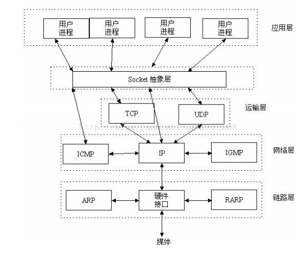

#### 1.3 socket编程常用函数

下图给出了socket编程的常用函数及流程。

* **server**：socket()创建socket，**bind()绑定套接字和端口**，listen()监听端口，accept()接收连接请求;**send()和recv()发送接收数据并进行广播**，close()关闭套接字；
* **client**：socket()创建socket，c**onnect()连接服务器，send()和recv()发送接收数据**，close()关闭套接字；

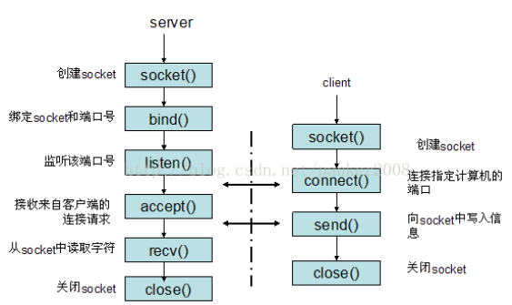

### 2 前期准备

本次实验主要是设计一个由服务器端Server与客户端Client共同组成的聊天室，命名为**WeChatMinus**。**而且包括了一些有趣的额外功能。**为了对所有理想功能进行实现，简单进行了如下的基本前期准备：

#### 2.1 流程熟悉

由于本实验是基于C++语言的Winsock2.x库进行socket编程，因此首先我将课程的第二章应用层党的知识进行了简单的回顾，然后通过查阅资料和各个函数的相关用法，又有了更深层次的理解。

**最后基于我要实现的大部分功能，都有了概念的框架和结构。**

#### 2.2 敏感词收集

作为一个小型的微信聊天程序WeChatMinus，我的目标是让不同的用户可以接入服务器端畅快地进行聊天。

<font size=4, color ="red">但是！网络不是法外之地！</font>

因此绝不能允许有些不怀好意的人说出一些不团结、或者会传播不良信息的话。**（狗头）**

**故添加了重点的额外功能——<font size=4, color="red">敏感词识别</font>。能够检测出用户发出的文字中的敏感词，并进行屏蔽。**

**中国人俗话说得好，“事不过三”。对违反发言规定的人一共给予3次机会，一旦屡教不改，将直接将其踢出群聊。**

首先要对相关敏感词进行收集和定义，通过在网络上搜集信息，我最终找到了fwwdn的仓库sensitive-stop-words，其相关链接如下：

https://github.com/fwwdn/sensitive-stop-words

**在这里再次向该仓库的作者fwwdn做出感谢，为我的敏感词识别功能提供了重点数据。**


**所包含敏感词涵盖广告、政治、色情、涉枪涉爆、网址、肮脏与暴力六个大类。一共15659项，**

### 3 协议设计

本实验需要自主应用层协议，**即应用层实体之间的通信规范。**具体而言，就是使用下层协议（TCP）提供的通讯服务，**定义应用交换的信息和收到信息后采取的行动。**

由于本次实验涉及到的可进行通信的、分布式进程一共就只有Server和Client，**因此他们就是唯二的应用，故需要定义服务器端和客户端发送协议的内容和接收后的行为。**

**因此首先我先对我的协议的所包含的消息类型、语法、语义以及时序进行详解：**

我的消息类型虽然并没有显示定义Struct或者Class类型，但是仍然通过每次发送信息时候的格式对其交换的信息进行了约定。**具体而言，我的消息由以下几部分组成（从上到下为从左到右），规定了基本的协议语法：**

* 消息描述提示开始符："<"

* 聊天室名称："WeChatMinus"

* 分隔符1："::"

* 消息来源：“Server”或者"Client"

* 分隔符2："@"

* **时序信息：**“Week Month Day Time Year”，比如“Wed Oct 18 09:31:15 202”

* 分隔符3：“#”

* **消息类型：**“Message"或者"Notice"或者"Warning"

* 消息描述提示结束符：“>”

* 消息主题开始：“：”

* **消息主体**：**XXX**

因此相对应的**语义**也就十分明显：**这是来自WeChatMinus聊天室的，来自Server或者其它Client的，发布时间为“Week Month Day Time Year”的，“Message"或者"Notice"或者"Warning"类型的消息。消息的具体内容为：XXX。**

#### 3.1 Server发送协议内容：

具体而言，我的Server具备着自由发言（Message消息类），向所有人发送公告（Notice公告类），以及和敏感词识别功能紧密相关警告消息（Warning警告类），以及一些部分的其它类。

**1.Message类：**

* 正常向所有其它人**广播cin发送消息**：<WeChatMinus::**Server** @ Wed Oct 18 09:31:15 2023 # **Message**>：XXX ("XXX"代表着具体的消息内容)

**2.Notice类：**

* 关于广播有新的人**进来**，表示欢迎：<WeChatMinus::**Server** @ Wed Oct 18 09:31:15 2023 # **Notice**>： Welcome < XXX > join the ChatGroup! （“XXX”代表着新加入的用户的用户名）
* 关于广播有用户**自主退出**房屋，公告其余所有人：<WeChatMinus::**Server** @ Wed Oct 18 09:31:15 2023 # **Notice**>： < XXX > left the ChatGroup! （“XXX”代表着自主退出的用户的用户名）
* 关于广播有用户**因为多次触犯敏感词而被踢出群聊**，**明确告诉所有人TA是被踢出去的，杀鸡儆猴：**<WeChatMinus::**Server** @ Wed Oct 18 09:31:15 2023 # **Notice**>：< XXX >  has been kicked out of the ChatGroup.(“XXX”代表着被踢出的用户的用户名）

**3.Warning类：**

* 如果有人的发言中**包含违禁词，对其单独进行提醒**：<WeChatMinus::**Server** @ Wed Oct 18 09:31:15 2023 # **Warning**>：根据互联网相关政策及法律法规要求，您的发言其中含有敏感词，请谨慎发言！

* 对发言中包含违禁词的人的**剩余机会进行提示，给TA改过自新，重新做人的机会：**<WeChatMinus::**Server** @ Wed Oct 18 09:31:15 2023 # **Warning**>：您还有XXX次机会（“XXX”代表着此人剩余的机会）

* 若一个人达到**三次发言包含违禁词，屡教不改，对所有人消息进行**<font size=4, color="red"> **严重警告**</font>：<WeChatMinus::**Server** @ Wed Oct 18 09:31:15 2023 # **Warning**>：网络不是法外之地，在网络上散布不当言论需要承担法律责任。对于在互联网上发布不当言论，扰乱社会秩序，公安机关将坚决依法处理，造成恶劣影响，情节严重的，警方将依法追究其法律责任！

​		每个公民都要对自己的网络言行负责，希望每个公民、网民，自觉抵制不当言论、恶意攻击等		不良信息，不轻信、不转发，请广大网民自觉遵守相关法律法规，共同维护和谐网络环境。

**4.其他类：**

* 在某个用户输入信息之前，**广播发送提示输入的信息**：Please enter
* 为了避免和Please enter可能导致的换行问题和错乱，**广播发送串尾符换行：\0**

#### 3.2 Client发送协议内容：

* **进入房间后，cin输入用户名：**Please enter your name(No more than 255 words):XXX ("XXX"代表着输入的用户名)
* **正常进行聊天，cin输入聊天内容**：Please enter:XXX("XXX")代表着输入的聊天内容，**实际上是发送给服务器端，由服务器端先进行过滤后再广播给其它所有人。**
* **cin输入内容，结束聊天，自主退出群聊：**Please enter:**EXIT**（**EXIT必须全大写，为了避免和其它内容混淆，导致用户错误退出**）

#### 3.3 Server接收消息后的行为：

* Server接收到Client的**用户名：** **创建Client类的一个新的对象**，调用封装好的函数对其的socket，username以及warning_times三个变量进行初始化。并将新生成的Client对象加入到**vector< Client >中进行维护。**
* **Server接收到Client在群聊中发送的信息：**首先对其内容调用封装好的函数filterSensitiveWords进行过滤。**根据函数返回的结果判断其是否违规。**若出现违规现象但不足3次，对其**发送警告**，并维护vector< Client >中的warning_times；若出现违规现象且已经达到3次，对**所有人发送严重警告后，将发言者踢出，维护vector< Client >将用户删除，发送踢出消息。**
  **最后再将过滤后的消息通过广播的形式发送给剩余的的所有人。实际上充当的是中转站的角色**
  
* Server接收到**Client发送的退出请求EXIT：**维护vector< Client >将用户删除，然后公告所有人该用户离开的消息。

#### 3.4 Client接收消息后的行为：

* **用户接收广播来自Server的消息：**首先判断是否是"Please enter:"，若是，直接cout；若是正常内容，cout<<endl。**在命令行中显示。**

### 4 实验过程

这部分主要讲我对**基本功能和全部额外功能的实现，具体内容详见代码，只展示部分核心代码**。

**先简介主体的Client.h定义了客户类,方便进行维护:**

```c++
class Client {
private:
	SOCKET client_socket;
	string name;
	int warning_times;

public:
	//...一些获取函数...
	void setClientName(string na) {
		if (na == "\0") //若输入进来的是串尾符，则没有正常输入名字
			name = "WeChatMinus User" + generateRandomString();//随机生成用户名为：微信用户xxxx
		else
			name = na;
	}
    //...同样是一些获取函数...
	bool operator==(const Client& other) const {//重载==运算符，用于删除client时的查找
		return client_socket == other.client_socket;  // 假设你的SOCKET变量名为socket_member
	}
};
```


#### 4.1 基本功能

##### 4.1.1 服务器端：(WeChatMinus_server.cpp)

**简单来说，main线程用来不断接收新的用户的连接请求；SendMessageThread线程用来发送数据；RecvMessageThread用来为某个用户接收数据。**

**1.连接开始前准备：** **(main函数)**

* 输出欢迎信息
* **加载Winsock2环境，**这里的**环境实际上指的是各种底层资源、参数以及可能的服务提供商的特定实现**，使用Winsock2.0以上版本。**输出相关日志，**若发生错误，调用封装实现的GetLastErrorDetails()的API函数输出详细信息；正常则输出成功日志。
* **套接字创建，**使用socket()函数初始化，**使用AF_INET即IPv4协议，SOCK_STREAM即用TCP协议的流式套接字。**同样输出类似日志。
* **为套接字绑定IP地址和端口：**使用bind函数绑定，**设置端口2333，设置IPv4地址为127.0.0.1即本机localhost。**同样输出日志。
* **开始监听：**使用listen函数，最多可以加入999个人。
* 输出等待信息：
* **创建发送信息线程：**CreateThread后关闭线程句柄，**重定向为自定义线程SendMessageThread**，并绑定套接字serverSocket。

**2.接收到连接后：**

通过While循环**不停接收其它用户的accept请求，**并输出相关日志。每当有个新用户进来，通过CreateThread**创建为该用户准备的个人线程RecvMessageThread**用来接收TA的消息。

```c++
while (true) {
	sockaddr_in addrClient;
	int len = sizeof(addrClient);
	SOCKET cc = accept(serverSocket, (sockaddr*)&addrClient, &len);
	if (cc == INVALID_SOCKET) {
		cout << "Oops!Failed to connect a client" << endl;
		cout << GetLastErrorDetails() << endl;
	}
	//创建接收该Client的线程并释放句柄
	CloseHandle(CreateThread(NULL, 0, RecvMessageThread, (LPVOID)cc, 0, NULL));

}
closesocket(serverSocket);
WSACleanup();
return 0;
}
```

**3.SendMessageThread：**

除非**连接被关闭即log=0或者SOCKET_ERROR再退出，或者通过服务器端输入EXIT自己退出，**否则是使用**do-While**循环，获取时间，cin发送Message。

```c++
DWORD WINAPI SendMessageThread(LPVOID lpParameter) {
SOCKET ss = (SOCKET)lpParameter;

int log;//记录日志
do {
	memset(sendbuf, 0, sizeof(sendbuf)); //输入信息缓冲区重置为0
	cin.getline(sendbuf, 255);//读取一行的内容放入缓冲区
	//服务器端结束
	if (string(sendbuf) == EXIT_WORD) {
		//收到信息就跑路
		closesocket(serverSocket);
		WSACleanup();
		//直接退出整个程序
		exit(0);
	}
	//将系统信息发送给所有人
	// 获取当前时间
	time(&t);
	ctime_s(str_time, sizeof str_time, &t);

	// 从ctime输出中移除尾部换行符
	str_time[strlen(str_time) - 1] = '\0';

	//...省略代码...
} while (log != SOCKET_ERROR && log != 0); //直到连接被关闭即log=0或者SOCKET_ERROR再退出

return 0;
}
```
**4.RecvMessageThread**

**这里只展示核心代码和核心逻辑：**

* 接收用户名，维护vector < Client >。若收到的是"/0"则证明用户没有输入任何就回车了，故给TA随机生成一个用户名；其他正常情况直接赋值。
* 由于**多线程之间同时访问某个全局变量可能会出现数据不一致的情况，因此使用互斥锁在对vector < Client >维护时候使用代码块进行锁定，代码块结束会自动释放。以此来维护多线程的安全。**


  ```c++
  memset(recvbuf, 0, sizeof(recvbuf));//缓冲区重置为0，准备接收用户名
  int log;
  // recv接收信息
  log = recv(cs, recvbuf, 255, 0);//用来接收用户名放入缓冲区并且返回log;
  string username;
  Client c;
  if (recvbuf[0] == '\0') {//如果该用户没有输入用户名，随机生成用户名
  c.setClientSocket(cs);
  c.setClientName("\0");//随机生成
  {	
  	lock_guard<mutex> lock(clients_mutex);//使用clients_mutex保护锁定clients
  	clients.push_back(c);
  }
  username = c.getClientName();
  }
  else {
  	c.setClientSocket(cs);
  	c.setClientName(string(recvbuf));
  	{
  		lock_guard<mutex> lock(clients_mutex);//使用clients_mutex保护锁定clients
  		clients.push_back(c);
  	}
  	username = c.getClientName();
  }
  ```

* **广播发送欢迎信息**

* **使用do...while不停接收客户端的信息：**

使用yellow_flag和red_flag接收处理过滤信息，并维护**vector < Client >。**

```c++
do {
    //..省略了部分...
log = recv(cs, recvbuf, 255, 0);//接收信息

	//若收到用户发送的输入关键词"EXIT"就让它退出聊天程序
	//本质上是跳出循环
	if (!log) {//处理灵异事件
		break;
	}
	//...获取消息...
	yellowflag = false;//是否违规
	redflag = false;//是否违法三次
	string filteredtext = filterSensitiveWords(string(recvbuf), yellowflag);//调用过滤器过滤文字
	if (yellowflag) {//如果是违规了
		c.setWarningTimes(c.getWarningTimes()+1);//警告次数+1
		if (c.getWarningTimes() == 3) {//警告次数达到3次，直接结束对话
			redflag = true;
			break;
		}
		else{
			str = "<WeChatMinus::Server @ " + string(str_time) + " # Warning>: 根据互联网相关政策及法律法规要求，您的发言其中含有敏感词，请谨慎发言！";
			send(c.getClientSocket(), str.data(), 255, 0);//发送言语警告
			int remaining_times = 3 - c.getWarningTimes();
			str = "<WeChatMinus::Server @ " + string(str_time) + " # Warning>: 您还有" + to_string(remaining_times) + "次机会！";
			send(c.getClientSocket(), str.data(), 255, 0);//发送言语警告
		}
	}
	// ...避免和Please enter重行，先发送回车...
	
	// ...广播发送消息连接时间，服务器标签和消息...
	
} while (log != SOCKET_ERROR && log != 0); //直到连接被关闭即log=0或者SOCKET_ERROR再退出
```

* **达到三次，警示踢出群聊**

```c++
if (redflag) {//对所有人发送公告
		// 连接时间，服务器标签和消息
		//...省略部分代码...主要是发送警告消息
    	//使用线程块mutex锁定
    	{
			lock_guard<mutex> lock(clients_mutex);//使用clients_mutex保护锁定clients
			//警告完你再把你踢出去
			//删除Client c
			clients.erase(std::remove(clients.begin(), clients.end(), c), clients.end());
		}
```

##### 4.1.2 客户端：(WeChatMinus_ client.cpp)

**1.main函数**

* **前期准备等：**这里与Server十分相似，流程为加载Winsock2环境——>套接字创建——>**设定客户端地址和端口**——>连接服务器端，其中只有第三部分设定客户端地址和端口与其余不同**，不再需要bind绑定。**

* 简单来说，由于客户端没有需要不断连接的需求，只要一次连接成功即可，因此**main线程用作主线程不断地接收命令行的输入并发送给服务器端，使用do...while循环；**但是还**需要一个线程不断来接收来自服务器端中转的消息，因此还需要额外一个线程作为接收信息的线程。**
```c++
do{
			memset(sendbuf, 0, sizeof(sendbuf));
			cin.getline(sendbuf, 255);//读入一行信息
			//用户端退出方式
			if (string(sendbuf) == EXIT_WORD) {
				exit_flag = true;
				//为了解决退出的灵异“回车”时间，需要对程序退出前进行shutdown，目的是关闭其回车的“遗言”信息
				shutdown(clientSocket, SD_BOTH);
				//再次关闭socket
				closesocket(clientSocket);
				WSACleanup();
				return 0;
			}
			log = send(clientSocket, sendbuf, 255, 0);
		} while (log != SOCKET_ERROR && log != 0);//直到连接被关闭即log=0或者SOCKET_ERROR再退出;
```
**2.RecvMessageThread函数：**

* **RecvMessageThread线程用来接收服务器端发来的信息，也是使用do...while循环：**

```c++
do{
//...其他处理...
log = recv(cc, recvbuf, 255, 0);//使用recv接收信息
///...其他处理...
}while (log != SOCKET_ERROR && log != 0);
```

#### **4.2 随机生成用户名(functions.h)**

```c++
string generateRandomString() {
    srand(time(NULL));
    int length = rand() % 10 + 1;  // 随机生成1到10之间的长度
    const string CHAR_POOL = "abcdefghijklmnopqrstuvwxyzABCDEFGHIJKLMNOPQRSTUVWXYZ0123456789";//随机生成中英文以及数字
    string result;

    for (int i = 0; i < length; ++i) {
        int randomIndex = rand() % CHAR_POOL.size();
        result += CHAR_POOL[randomIndex];
    }

    return result;
}for (int i = 0; i < length; ++i) {
    int randomIndex = rand() % CHAR_POOL.size();
    result += CHAR_POOL[randomIndex];//字符串拼接
}
return result;
}
```

#### 4.3 用户端异常退出，客户端重新连接(WeChatMinus_client.cpp)

1. 当检测到服务器异常关闭时，输出一个提示信息。

2. **使用一个循环来再次尝试连接服务器。通过全局变量reconnect**

```c++
// 添加一个全局变量用于控制是否再次尝试连接
bool reconnect = true;
DWORD WINAPI RecvMessageThread(LPVOID lpParamter) {
    SOCKET cc = (SOCKET)lpParamter;
    int log = 0;
    do
    {
        memset(recvbuf, 0, sizeof(recvbuf));
        log = recv(cc, recvbuf, 255, 0);//核心会是这里报错！！！
        if (log == SOCKET_ERROR) {
            cout << "Server unexpectedly closed. Trying to reconnect..." << endl;
            reconnect = true;
            return 0; // 结束当前线程
        }
        cout << string(recvbuf) << endl;
    } while (log != SOCKET_ERROR && log != 0);
    return 0;
}

int main() {
    // ... 
    do {
        // ... 创建socket、绑定和连接的代码 ...    
   	if (connect(clientSocket, (SOCKADDR*)&clientAddr, sizeof(clientAddr)) == SOCKET_ERROR) {
        cout << "Failed to connect server" << endl;
        cout << GetLastErrorDetails() << endl;
        cout << "Please start over" << endl;
        WSACleanup();
        Sleep(5000); // 等待5秒后再次尝试连接
        continue;  // 返回到循环的开始重新连接
    } else {
        cout << "Successfully connecting server!" << endl;
        reconnect = false; // 设置为false，表示已成功连接，不需要重新连接
    }

    // ... 其他代码 ...

} while (reconnect); // 如果reconnect为true，则会再次尝试连接

// ... 关闭连接和清理资源的代码 ...
return 0;
}
```
#### 4.4 敏感词识别(functions.h)

读入敏感词文件内容，遍历text查找对比，**将其替换为*，并且通过flag判断是否含有敏感词。**

```c++
string filterSensitiveWords(const string& text, bool& flag) {
vector<string> sensitiveWords;//敏感词vector

// ...读取敏感词文件...
// 过滤敏感词
string filteredText = text;
for (const string& word : sensitiveWords) {//for each结构，每次从中读取一个word
	size_t pos = filteredText.find(word);//使用size_t类型来存储字符串的位置
	while (pos != string::npos) {//一直执行，直到pos的值等于string::npos;
		//string::npos是一个特殊的size_t值，表示未找到匹配的子字符串。
		filteredText.replace(pos, word.length(), string(word.length(), '*'));//用*替换
		flag = true;
		pos = filteredText.find(word, pos + 1);
	}
}
//...函数返回....
```

#### 4.5 GetLastErrorDetails(Functions.h)

获取错误代码，并使用FormatMessage输出详细日志信息便于调试。

```c++
string GetLastErrorDetails() {
	int error_code = WSAGetLastError();

	char errorMsg[256] = { 0 };
	FormatMessageA(
		FORMAT_MESSAGE_FROM_SYSTEM | FORMAT_MESSAGE_IGNORE_INSERTS,
		NULL,
		error_code,
		MAKELANGID(LANG_NEUTRAL, SUBLANG_DEFAULT),
		errorMsg,
		sizeof(errorMsg) - 1,
		NULL
	);

	return string("Error code: ") + to_string(error_code) + ", Details: " + errorMsg;
}
```

### 5 实验结果展示

整体来说，由于我的敏感词总量较大，因此如果将其嵌入到代码中，会占用较大的内存空间，故我使用读取文件的形式，每次会在与另外两个cpp同目录下的路径进行读取。**故为了能够正常执行敏感词检测功能，<font size=3, color="red"> 运行时需要将WeChatMinus_ client.cpp，WeChatMinus_ server.cpp以及sensitiveWords三个文件放在同一路径下！</font>**

#### 5.1基础功能及部分特殊功能展示

##### 5.1.1 运行界面展示

**1.服务器端Server：**可以看到在Client连接进来前，有着详细的日志输出来提示；

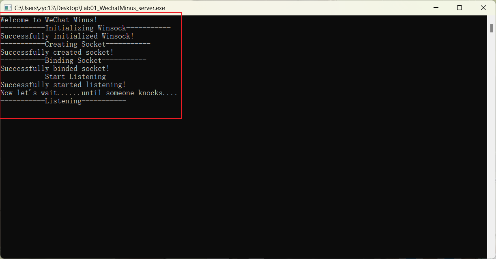

**2.客户端Client：**可以看到同样有明确的日志输出，**但是由于我此时并没有打开服务器端，故调用了我设计的GetLastErrorDetails来输出详细的错误信息。**

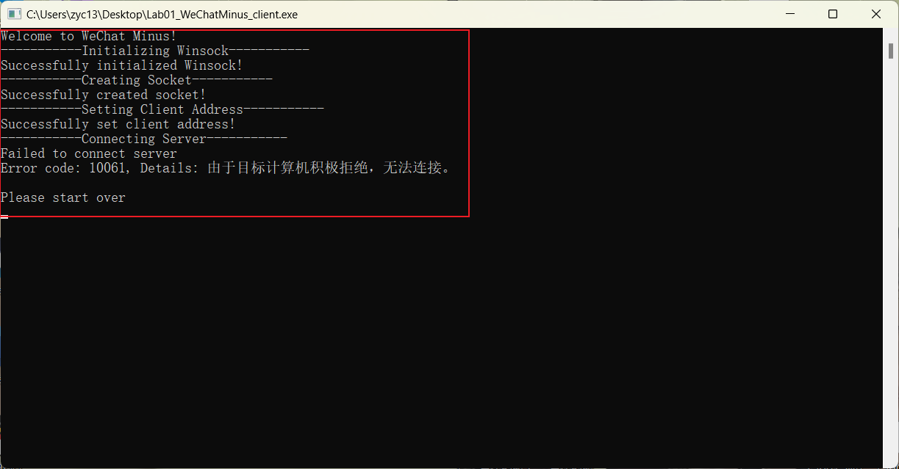

##### 5.1.2 **多人聊天，用户名正常或无输入与中英文聊天：**

可以看到：

* 服务器端和客户端均成功连接，输出成功日志；
* **红框处：**右上角的客户端直接输入回车，**因此随机为其生成用户名“WeChatMinus Usere”即“微信用户e”。**
* **绿框处：**下面两个客户端可以看到能够输入正常用户名，开始聊天；
* **紫框处：**能看到上面的紫框使用英文聊天，下面的紫框使用中文聊天。所有人都会显示信息，**因此支持多人中英文聊天；**
* **黄框处：**从左上角日志可以看到详细的所有信息（**包括时序信息**），**也能看到服务器端也能够正常发言。**

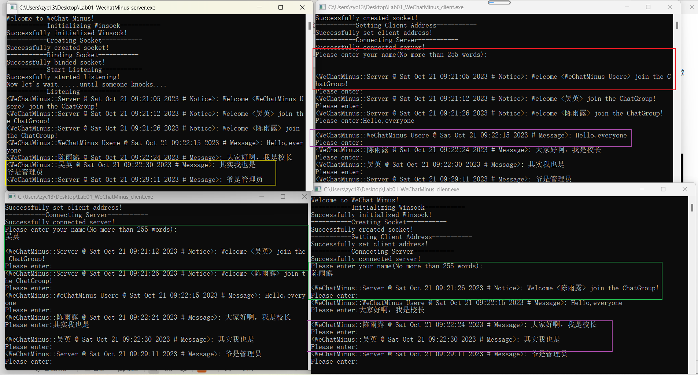

##### 5.1.3 结束运行

**1.客户端主动退出结束运行（命令EXIT）：**

* 可以看到用户**输入全大写命令EXIT**


* 可以看到该用户程序退出，**所有客户端包括管理员都会收到该用户离开的消息；**

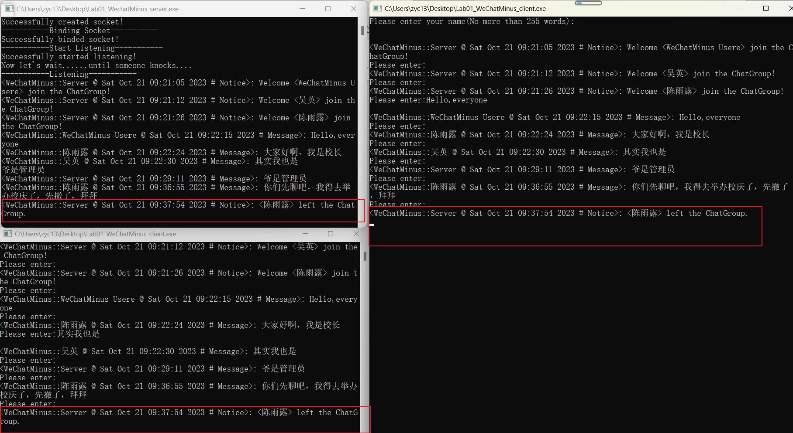

**2.服务器端主动退出结束运行（命令EXIT）：**

* 可以看到服务器端**输入全大写命令EXIT**

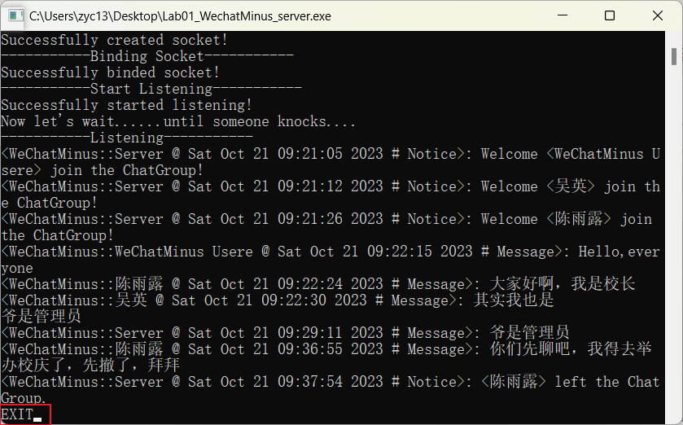

**退出后客户端界面请继续看后面展示：**

**3.服务器端退出后客户端重新连接：**

* 可以看到客户端提示服务端异常关闭，**按下ENTER可以进行重新连接；**

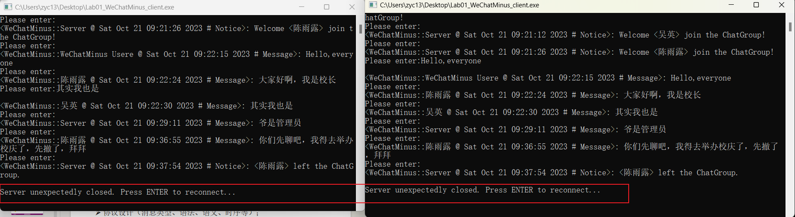

* 此时重新打开一个服务器端，可以看到两个客户端都提示了**重新加载初始化的信息，并且最后能成功连接，并提示再次输入用户名：**

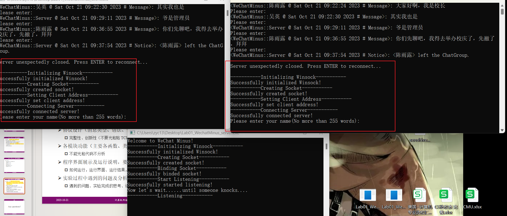

#### 5.2 敏感词功能展示

##### 5.2.1 违规发言，但违规次数还不到3次：

* **红框处：**可以看到左上角输入敏感词后，**这个人单独收到了警告和剩余次数提示，并且敏感词内容被替换为了"*"。**
* **黄框处：**可以看到其它用户都只收到了**被屏蔽后的敏感词结果。**

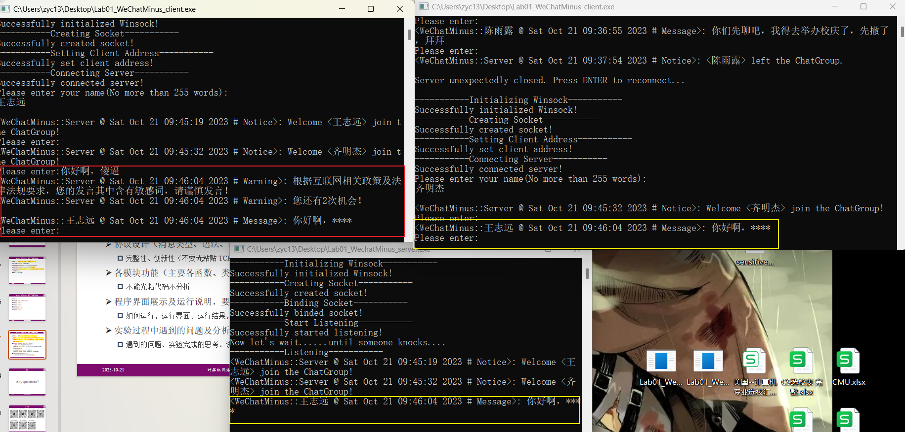

##### 5.2.2 **<font size=3, color= 'red'>违规发言，且屡教不改！踢出群聊并警告所有人：</font>**

* **红框处**：可以看到该用户**在第三次发出敏感词后，被直接踢出群聊。能看到相关警告信息。且其余所有人也都可以收到，杀鸡儆猴。**
* **黄框处：**可以看到**被提出的用户再次发言，已经不会在别人位置显示；并且别人再次发的话TA也无法接收。**

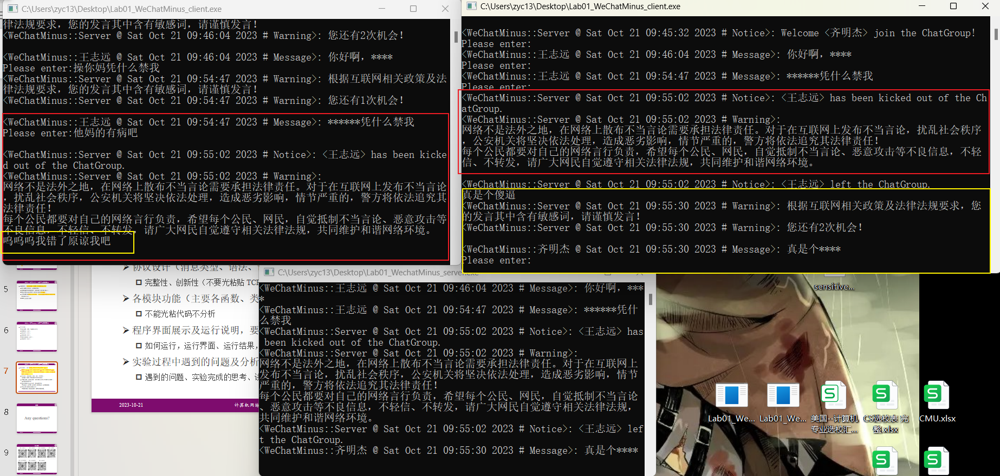

**到此展示结束，可以看到全部基础功能和额外功能都能成功实现运行，并且运行逻辑合理性较强，实现较完整。**

---

**<font size=4, color="red">这部分报告内容为特供，是交了作业后自行补充hhh</font>**

##### **5.2.3 维尼驾到**

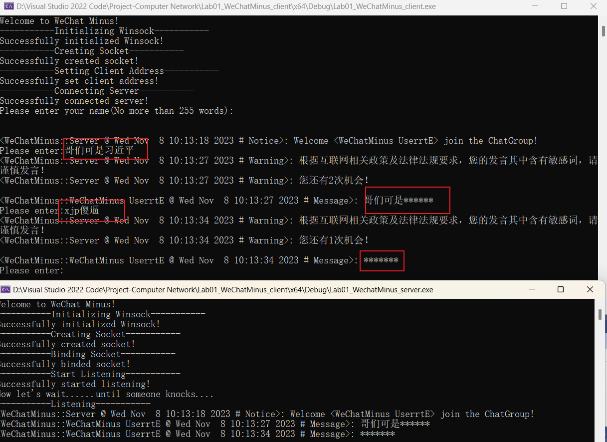

**任何对我们伟大的总书记的诋毁均不能容忍！（狗头）**

##### **5.2.4 兔子政治笑话**


**<font size=3, color="red">对灵感来源不致敬一下怎么行呢？兔子政治笑话复刻成功！</font>**

---


### 6 实验反思与总结

#### 6.1 实验总结

**本次实验通过自主编写协议，使用C++语言和socket编程规范，使用流式套接字和多线程，完成了以下基础功能和额外功能：**

* 程序有**基本的对话界面，**客户端和服务端都有**正常的退出方式；**
* 程序**支持多人聊天，支持英文和中文聊天；**
* 程序**具有必要的日志输出，并且会输出详细的错误信息；**
* 实现了**对输入任何内容的敏感词检测与屏蔽，对违反的人进行提示和警告，对多次违反的人进行踢出和严重警告；**
* 实现了对**未输入用户名的人随机生成用户名；**
* 实现了**服务器端退出后客户端可以不用关闭程序，进而重新连接。**

#### 6.2 实验遇到的问题

1.程序输入EXIT退出后会输出“遗言”即一个空格，像是灵异现象。**最终解决方案：**

* 使用**shutdown(clientSocket, SD_BOTH)**命令提前关闭使得socket无法进行进一步发送以及接受信息；


```c++
//...WeChatMinus_client.cpp的main函数中...
do{
			memset(sendbuf, 0, sizeof(sendbuf));
			cin.getline(sendbuf, 255);//读入一行信息
			//用户端退出方式
			if (string(sendbuf) == EXIT_WORD) {
				exit_flag = true;
				//为了解决退出的灵异“回车”时间，需要对程序退出前进行shutdown，目的是关闭其回车的“遗言”信息
				shutdown(clientSocket, SD_BOTH);
				//再次关闭socket
				closesocket(clientSocket);
				WSACleanup();
				return 0;
			}
			log = send(clientSocket, sendbuf, 255, 0);
		} while (log != SOCKET_ERROR && log != 0);//直到连接被关闭即log=0或者SOCKET_ERROR再退出;
//...后面正常结束程序...
```

* 本质原因是client异常退出后，**服务器端之前recv的命令会出现有异常，对其进行处理。**对日志变量进行判断：
```c++
log = 0;//重置log
	do {
		//...其它处理...
		log = recv(cs, recvbuf, 255, 0);//接收信息

		//若收到用户发送的输入关键词"EXIT"就让它退出聊天程序
		//本质上是跳出循环
		if (!log) {//处理灵异事件
			break;
		}
	while(log != SOCKET_ERROR && log != 0)
//...剩余处理...
```

2.输入提示Please enter广播经常出现的换行不一致问题，本质是线程不统一，单独执行。**解决方案：部分直接优先输出一个换行"\0"。**

#### 6.3 实验思考

* 理解了**socket编程**的流程和规范；
* 自主**设计协议**对协议加深了理解；
* 使用**互斥锁了解了线程的安全问题，**可能导致数据不一致；
* 实现**多线程后对多线程运行**的目的和机制有了深刻认知；
* <font size=3, color="red">**维护网络文明环境，人人有责！（狗头）**</font>

#### 6.4 实验改进方向

##### 6.4.1 互斥锁

这里是在讲解时助教学长向我提出的问题，让我意识到了自己的疏忽。**实际上我在使用互斥锁mutex时，应该对所有全局变量而不只是维护的vector < Client > 进行锁定，包括接收和发送信息的缓冲buf等。**

**在这里再次感谢学长的指点！**

**6.4.2 用户名检测**

实际上我的敏感词检测只设计了对内容的检测，而没有对用户名进行违规查看。**根本上的原因其实是我没时间做了...**

**未来会对此功能进行进一步完善！**

~~其实也可以解释为是如果某些大人物登录了我的程序，我不能他们名字禁了是吧....~~

##### 6.4.3 敏感词检测完善

* 敏感词检测无法检测中间的若干空格等。**暂时仍给了不法分子可乘之机！这是不能允许的！（狗头）**

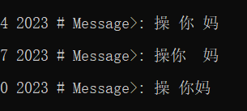

* 因为违规三次被踢出的人实际上若服务器端退出后重连，可以死而复生。**这也是不可接受的！应该对其进行永久禁言，让其永世不得超生！（狗头）**

#### 6.5 实验总结与收获

总的来说，通过亲自实现网络编程的第一次实验，对一些基础知识和应用有了基本的掌握，相信这会我的未来本课程实验打下坚实的基础。**再次感谢助教学长与吴英老师，我会继续努力学习本课程，并在基础上发挥自己的创造力，探索更多可能性。**
