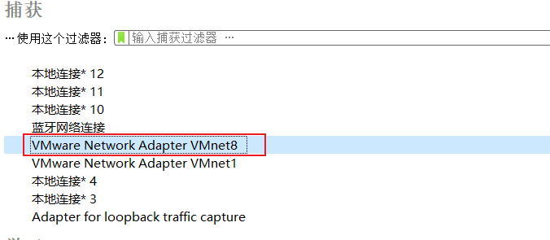
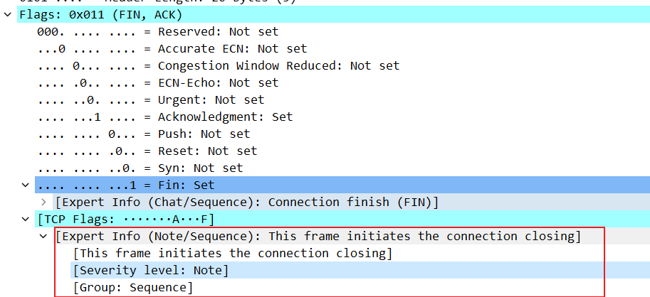
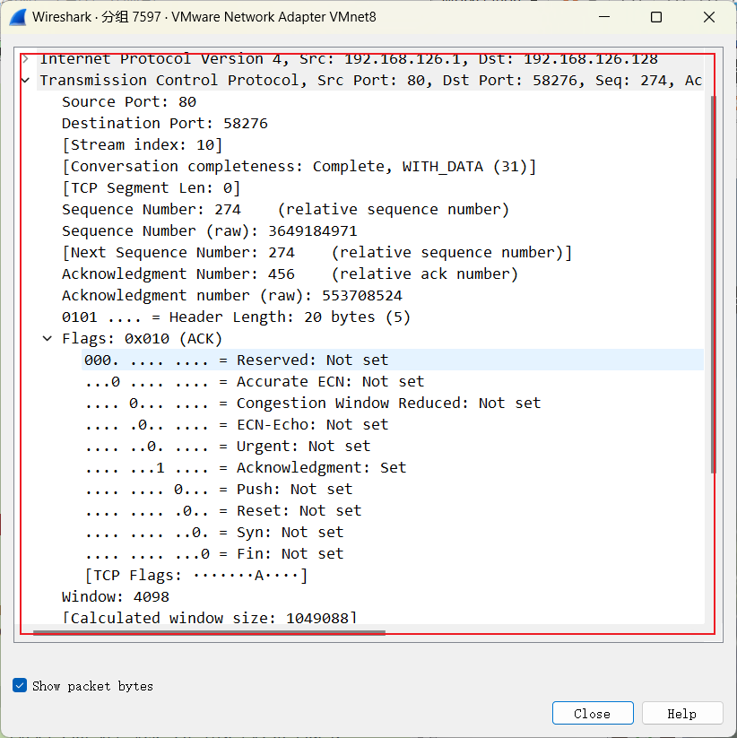

# Computer Network2023

## Lab02-配置Web服务器，编写简单页面，分析交互过程

#### 学号：2111408	专业：信息安全	姓名：周钰宸

### 1 实验原理

#### 1.1 XAMPP与Apache

1. XAMPP是一个**开源的、跨平台的Web服务器软件包，其中包含了Apache HTTP服务器、**MySQL数据库、PHP和Perl编程语言等组件。**XAMPP的目的是让用户能够快速、方便地部署Web应用程序，而不需要进行复杂的配置和安装过程。**
2. Apache HTTP服务器是一个**开源的Web服务器软件，**它是目前世界上最流行的Web服务器之一。Apache支持多种操作系统，包括Windows操作系统等。
3. **XAMPP中包含了Apache HTTP服务器，因此可以说XAMPP是基于Apache的。**XAMPP的优点在于它将Apache、MySQL和PHP等组件打包在一起，用户可以一次性安装所有组件，而不需要分别安装和配置每个组件。此外，XAMPP还提供了一个简单易用的控制面板，可以方便地启动、停止和管理Web服务器。

**本次实验就使用XAMPP和Apache进行实验。**

#### 1.2 HTTP和HTTPS

1. **HTTP**：超文本传输协议，用来在 Internet 上传送超文本。**位于应用层，基于它下面一层的客户端和服务器端请求和应答的标准即传输层协议TCP。**用于从WWW服务器（世界互联网中央服务器）传输超文本到本地浏览器的传输协议，它可以使浏览器更加高效，使网络传输减少。

2. **HTTPS：** **安全超文本传输协议。简单讲是 HTTP 的安全版，即HTTP即应用层和TCP即传输层之间加入了一个安全层命名为SSL层，**HTTPS 的安全基础是 SSL。

3. **HTTP和HTTPS之间的区别：**

   * **HTTPS能够保证数据的加密传输（通过安全层的SSL协议），这需要到 ca 申请证书**，一般免费证书较少，因而需要一定费用。
   * HTTP 和 HTTPS**连接方式完全不同，端口也不一样，HTTP是 80，HTTPS是 443。**
   * **HTTP 的连接很简单，是无状态的。**HTTPS是由SSL+HTTP 构建的可进行加密传输、身份认证的网络协议，**HTTPS更安全。**

   

4. **为什么本次实验使用HTTP而不是HTTPS：**

   在本次实验要求中明确要求了使用HTTP而不是HTTPS，具体原因从上面的分析就可以发现：

   * **HTTPS的握手阶段由于需要进行第三方的安全认证，因此耗费时间更长**，同时也会增加服务器端的耗电，对性能要求更高；
   * **HTTPS的加密传输需要SSL证书来进行第三方认证，但是SSL 证书需要钱**，功能越强大的证书费用越高，个人网站、小网站没有必要一般不会用。**因此本次实验只是为了制作简单的页面并进行抓包分析，没有必要去自己破费额外买一个证书再来进行实验。但当然可以创建一个自签名的证书供测试使用，但毕竟也是麻烦了；**
   * **HTTP的链接简单方便快捷，有助于我们进行实验；**
   * 而实际上HTTPS也有一些别的缺点，比如HTTPS的连接缓存不如HTTP高效；SSL 证书通常需要绑定 IP，不能在同一 IP 上绑定多个域名，IPv4 资源不可能支撑这个消耗；HTTPS 的加密范围也比较有限，仍然有可能受到中间人攻击等。

#### 1.3 WireShark

**Wireshark是使用最广泛的一款开源抓包软件，**常用来检测网络问题、攻击溯源、或者分析底层通信机制。它使用WinPCAP作为接口，直接与网卡进行数据报文交换。

Wireshark使用的环境大致分为两种，一种是电脑直连互联网的单机环境，另外一种就是应用比较多的互联网环境，也就是连接交换机的情况。

* **单机情况下**，Wireshark直接抓取本机网卡的网络流量；
* **交换机情况下**，Wireshark通过端口镜像、ARP欺骗等方式获取局域网中的网络流量。

#### 1.4 三次握手


TCP是一种**面向连接的传输层协议**，用于在计算机之间建立可靠的数据传输连接。TCP连接的建立首先要经历**三次握手的过程。具体而言：**

1. **第一次握手（SYN）**：客户端向服务器发送一个TCP数据包，包含一个**SYN（同步）标志位**。**这表示客户端希望建立连接**，并包括客户端的初始序列号。此时，客户端进入"SYN-SENT"状态。
   * SYN=1
   * SEQ（客户端初始序列号）=x——**告诉服务器端本方可以正常发送数据**。
2. **第二次握手（SYN-ACK）**：服务器收到客户端的SYN数据包后，它会回应一个TCP数据包，包含一个**SYN和ACK（确认）标志位。这表示服务器愿意接受连接，**并确认客户端的初始序列号y。同时，服务器也会为自己选择一个初始序列号。此时，服务器进入"SYN-RECEIVED"状态。
   * ACK Flags=1（该数据包包含确认号ACK Number）
   * SYN=1
   * ACK Number=x（客户端初始序列号）+1——只有接收到数据才知道x，**告诉客户端本方可以接收到发送的数据。**期望下次收到x+1。
   * SEQ（服务器端初始序列号）=y——**告诉客户端可以正常发送数据。**
3. **第三次握手（ACK）**：客户端收到服务器的回应后，它会发送一个TCP数据包，包含一个**ACK标志位。这个数据包表示客户端确认了服务器的确认。**服务器收到这个ACK后，它也确认了客户端的确认，然后连接建立完成，双方可以开始数据传输。此时，**客户端和服务器端都正式进入了"ESTABLISHED"状态。**
   * ACK Flags=1
   * SEQ=x（客户端初始序列号）+1——表示我接收到你的期望了，满足你！
   * ACK Number=y（服务器端初始序列号）+1——只有接收到数据才知道y，**告诉服务器端本方可以接收到发送的数据。**

<font size =3, color=red>**至此，确认了客户端和服务器端双方都可以发送和接收数据。而两次握手并不足够，因为无法确认客户端也能够接收到数据。**</font>


#### 1.5 HTTP协议


由于本次实验中是**使用HTTP协议进行数据信息的传输，**为了方便后面对捕获到的HTTP数据包进行分析，这里先对**HTTP协议通信的协议格式进行介绍。**

##### **1.5.1 HTTP请求报文：**

1. **请求行**：包含了**HTTP请求的方法（通常为GET或POST）、请求的URL**和协议版本。例如，`GET /index.html HTTP/1.1`，其中`GET`是HTTP请求方法，`/index.html`是请求的资源路径，`HTTP/1.1`是HTTP协议版本。

2. **请求头部：包含了请求的元数据，如客户端和服务器之间的通信参数，用户代理信息，所接受的媒体类型等。**请求头通常以键值对的形式表示，每行一个键值对，如`Host: www.example.com`，`User-Agent: Mozilla/5.0`。

3. 空行：请求行和请求头之间由一个空行分隔，用于表示请求头部的结束。

4. **请求体：在一些HTTP请求中**，如POST请求，可能包含请求的实际数据，**如表单数据、JSON数据等。请求体通常用于向服务器传递数据，**不是所有请求都包含请求体。

##### **1.5.2 HTTP响应报文：**

1. **响应行：包含了 HTTP响应的协议版本、状态码和状态消息。**例如，`HTTP/1.1 200 OK`，其中`HTTP/1.1`是HTTP协议版本，`200`是状态码表示成功，`OK`是状态消息。

2. **响应头部**：包含了**响应的元数据，如服务器信息、日期、内容类型等。**响应头部也以键值对的形式表示，如`Server: Apache/2.4.39`，`Date: Sun, 30 Oct 2023 15:45:00 GMT`。

3. 空行：响应行和响应头之间由一个空行分隔，用于表示响应头部的结束。

4. **响应体：**实际的响应数据，如HTML页面、JSON数据等。响应体通常包含了客户端请求的资源内容。

HTTP协议的请求行、请求头、请求体和响应行、响应头、响应体等部分都用于描述通信双方的交互和数据传输，使客户端能够请求资源并服务器能够提供资源或响应请求。**这些部分共同构成了HTTP通信的基础结构。**

#### 1.6 四次挥手


和TCP的三次握手过程类似，为了能够将**TCP连接正式终止，也需要经历一个四次挥手的过程。具体而言：**

1. **第一次挥手（FIN）**：当客户端希望关闭连接时，**它发送一个TCP数据包，包含一个FIN（结束）标志位。**此时，客户端进入"FIN-WAIT-1"状态。
   * **FIN=1**
   * SEQ：与上一次发送TCP数据包的序列号相同。
2. **第二次挥手（ACK）**：**服务器收到客户端的FIN后，它发送一个ACK数据包作为确认。**此时，服务器进入"CLOSE-WAIT"状态，客户端进入"FIN-WAIT-2"状态。**此时主机应用进程得到消息。**
   * **ACK Flags=1**
   * SEQ：上一次服务器端发送的TCP包的序列号+1
   * **ACK Number：设置为客户端的第一次挥手的TCP包序列号+1**（代表我接收到你的第一次挥手的消息了）
3. **第三次挥手（FIN+ACK）**：第二次挥手结束后。**<font size=3, color="red">服务器端会将之前剩余没法的数据发送完毕，然后发送一个FIN和ACK的数据包。(而不能在第二次挥手直接结束，这也是为什么挥手必须有四次的原因)</font>**此时，服务器进入"LAST-ACK"状态。**应用进程释放连接，服务器端不再发送报文。**
   * FIN Flags=1
   * ACK Flags=1
   * SEQ：与上次SEQ相同。
   * ACK Number：设置为客户端的第一次挥手的TCP包序列号+1。
4. **第四次挥手（ACK）**：客户端收到服务器的FIN后，**它发送一个ACK数据包作为确认。**此时，客户端进入"TIME-WAIT"状态，**<font size=3, color="red">等待2MSL（MSL为一个TCP包发送或者接收的时间）后才会完全关闭连接（这是为了确保服务器端收到最终的ACK，服务器若没收到会隔一个MSL发送一个FIN告诉客户端未接收到最终ACK，正好下一个MSL后达到服务器端）</font>**。服务器收到这个ACK后，连接被完全关闭，服务器进入"CLOSED"状态（只是单独针对于这个客户端进入了CLOSED状态，和别的客户端之间状态是独立的）

### 2 实验要求

1. **搭建We服务器**(自由选择系统)。
2. **制作简单的Web页面**，包含简单文本信息(至少包含专业、学号、姓名)、自己的L0G0、自我介绍的言频信息。页面不要太复杂，包含要求的基本信息即可。
3. 通过浏览最获取自己编写的Web页面，使用**Wireshark捕获浏览器与Web服务器的交与过程，并进行简单的分析说明。**
4. **使用HTTP，不要使用HTTPS。**

### 3 前期准备

#### 3.1 相关环境与软件

在进行实验之前，**首先需要准备好相关的环境和服务器端程序。**具体而言：

1. **操作系统：**Windows 11 家庭中文版 22H2
2. **Web服务器：**XAMPP的Apache
3. **主机浏览器：**谷歌浏览器Google Chrome
4. **虚拟机浏览器：**火狐浏览器Firefox Web Browser
5. **抓包：**WireShark 
6. **虚拟机**：VMware Workstation 17 Pro
7. **虚拟操作系统（客户机）**：Ubuntu 20.04.6

#### 3.2 HTML页面素材

本次HTML主页设计正好赶上进击的巨人Attack on Titan最终季完结篇的播出（2023/11/4），因此这里为了纪念其完结，**围绕这部我心目中永远的神作开展。以下简称为AOT。**

1. 背景音乐：进击的巨人混曲之一，Call of Silence x YouSeeBIGGIRL - EYAir
2. 背景图片：Wallpaper Engine中由艺术家哆啦A梦绘制的《绝美的午后》，相关链接：https://steamcommunity.com/sharedfiles/filedetails/?id=1788618333

### 4 实验过程

#### 4.1 Web服务器配置

本次的Web服务器配置，**主要使用XAMPP中集成的Apache服务器，**首先安装好并且配置了相关系统路径后，以管理员身份先运行xampp_start和xampp_control。

在这之后，由于本次实验并不需要HTTPS协议作为应用层协议，而xampp默认会同时监听80和443即HTTP和HTTPS的两个端口，**为了防止使用HTTPS异常访问的情况，先打开Apache的配置文件httpd.conf（HTTP）和httpd-ssl.conf（HTTPS）。然后确保Apache正常监听80，并且将监听443端口的行文注释掉。**

<div style="display: flex;">
  
  
</div>
**实际上直接在浏览器，输入一个IP地址（如10.136.100.242）并访问一个网页时，默认情况下，浏览器会使用HTTP协议进行访问而不是HTTPS。**这是因为HTTP是默认的无加密协议，而HTTPS是加密协议，**如果要使用HTTPS协议，需要显式地写出https://。**

**而后选择Apache旁边的start，开启Apache服务端：**


从上面的启动结果图中可以看到，**此时Apache已经开始监听了80端口，服务器以PID=19288作为进程运行，最下面的状态栏也显示状态改变的信息：**

*Status change detected: running*

**由此成功地配置并启动了服务器端。**

#### 4.2 HTML页面设计

本次实验中HTML设计并不是核心重点，但是也是一个锻炼自己设计前端的过程。本次HTML的个人网页包含以下内容：

* **基本信息：**专业（Major）、学号（Student ID）、姓名（Name）。
* **相关联系方式：**微信（WeChat）、邮箱（Email）、推特（Twitter）、Github等。
* **个人logo：**和我的Github头像相同~~（艾笠党刀里找糖磕...）~~
* **音频信息：**背景音乐，**使用audio control音频控件。**
* **背景图片**：进行了简单的透明化处理，**通过在图片上添加一个半透明的覆盖层。**
* **纪念艾伦离开：Farewell, Eren Jaeger渐变字**，使用WebKit引擎的线性渐变。

#### 4.2.1 源代码

```html
<!DOCTYPE html>
<html lang="en">
<head>
    <meta charset="UTF-8">
    <meta name="viewport" content="width=device-width, initial-scale=1.0">
    <title>ErwinZhou</title>
    <style>
        body{
            text-align: center;
            /* beautiful font */
            .hcqStyle1{color:hsl(184,80%,25%);text-shadow:0 0 1px currentColor,/*highlight*/-1px -1px 1px hsl(184,80%,50%),0 -1px 1px hsl(184,80%,55%),1px -1px 1px hsl(184,80%,50%),/*light shadow*/1px 1px 1px hsl(184,80%,10%),0 1px 1px hsl(184,80%,10%),-1px 1px 1px hsl(184,80%,10%),/*outline*/-2px -2px 1px hsl(184,80%,15%),-1px -2px 1px hsl(184,80%,15%),0 -2px 1px hsl(184,80%,15%),1px -2px 1px hsl(184,80%,15%),2px -2px 1px hsl(184,80%,15%),2px -1px 1px hsl(184,80%,15%),2px 0 1px hsl(184,80%,15%),2px 1px 1px hsl(184,80%,15%),-2px 0 1px hsl(184,80%,15%),-2px -1px 1px hsl(184,80%,15%),-2px 1px 1px hsl(184,80%,15%),/*dark shadow*/2px 2px 2px hsl(184,80%,5%),1px 2px 2px hsl(184,80%,5%),0 2px 2px hsl(184,80%,5%),-1px 2px 2px hsl(184,80%,5%),-2px 2px 2px hsl(184,80%,5%)}
        }
        .profile{
            /* 虚化背景*/
            background: linear-gradient(rgba(255, 255, 255, 0.4), rgba(255, 255, 255, 0.4)), url(src/Farewell.png);
            background-attachment: fixed;
            /* 设置其不重复 */
            background-repeat: no-repeat;
            background-position: center;
            background-size:cover;
            /* 占满屏幕 */
            height: 100vh;
        }
        audio{
            /* 让音频播放器显示在右侧*/
            float: right;
        }
        /* Farewell */
        .text{
            width: 300px;
            height: 200px;
            position: absolute;
            left: 50%;
            margin-left: -150px;
            /* 使用WebKit引擎的线性渐变作为背景图像 */
            background-image: -webkit-linear-gradient(left,blue,#66ffff 10%,#cc00ff 20%,#CC00CC 30%, #CCCCFF 40%, #00FFFF 50%,#CCCCFF 60%,#CC00CC 70%,#CC00FF 80%,#66FFFF 90%,blue 100%);
            /* 将文本填充颜色设置为透明 */
            -webkit-text-fill-color: transparent;
            /* 使用WebKit引擎将背景剪裁到文本。*/
            -webkit-background-clip: text;
            -webkit-background-size: 200% 100%; 
            /* 应用一个名为"masked-animation"的无限循环动画，每次循环持续4秒，速度线性变化 */
            -webkit-animation: masked-animation 4s linear infinite;
            font-size: 30px;
        }

    </style>
</head>
<body>
    <div class="profile">
    <h1 class="hcqStyle1">ErwinZhou</h1>
    
    <div>
    <p><strong>Major: Information Security</strong></p> 
    <p><strong>Student ID: 2111408</strong></p>
    <p><strong>Name: 周钰宸 Zhou Yuchen</strong></p>
    <p><strong>Wechat: fighttillthend</strong><p>
    <p><strong>Email: batman6667@proton.me</strong></p>
    
    <p><strong><a href="https://twitter.com/ErwinZhou_">Twitter: @ErwinZhou_</a></strong></p>
    <p><strong><a href="https://github.com/ErwinZhou">GitHub: ErwinZhou</a></strong></p>
    </div>
    <h2 class="text">Farewell, Eren Jeager</h2>
    <audio controls>
        <source src="src/Music.mp3" type="audio/mpeg">
  
    </audio>
</div>
    
    
</body>
</html>
```


#### 4.2.2 页面效果

首先查看**本机IP：IPv4地址为10.136.100.242。即连接在NKU_WLAN的局域网下的IP地址。**


然后使用**谷歌浏览器（Google Chrome），输入URL：*10.136.100.242:80/CN-LAB02/ErwinZhou.html*访问，结果如下：**


以上是我通过将**ErwinZhou.html放置在XAMPP的htdocs/CN-LAB02下，即本地机器网站的“根”目录。查看的效果，可以发现能够正常访问，验证了Web服务器配置和启动的正确性。**

实际上这里默认是使用了HTTP协议，同时也使用了HTTP的80端口。

#### 4.3 WireShark抓包

接下来为了**模拟其它客户机对主机的服务器访问的过程（即两个不同的ip地址），使用虚拟机实现交互与抓包。此时已经打开了主机的Apache服务器在80端口监听。**

#### 4.3.1 虚拟网络环境

采用的虚拟机为VMware中的Ubuntu的Linux操作系统。**目的是在Ubuntu中通过访问主机服务器实现交互。具体而言：**

1. Ubuntu采用的**网络连接方式为NAT模式，因此对应的虚拟网络环境和网卡为VMNet8，在其上进行的虚拟机和主机互相转发数据。**

   

2. 查看主机和虚拟机在VMnet8中的IPv4地址，如下图所示：

   <div style="display: flex;">
     
    
    </div>

   * **主机：192.168.126.1**
   * **客户机（虚拟机）：192.168.126.128**

#### 4.3.2 WireShark设置

首先需要选择主机和NAT模式的虚拟机所在的网络环境，**即VMware Network Adapter VMnet8。**



使用WireShark进行过滤时，**最重要的就是过滤器，也是Wireshark的核心功能。**因此首先需要编写对应显示过滤器的语法，具体而言针对以下要素：

* **IPv4地址：**主机192.168.126.1和虚拟机192.168.126.128。
* **HTTP端口：**基于TCP的HTTP端口为80，**设置ip.port==80。**
* **三次握手和四次挥手：**由于**TCP协议建立连接时候的三次握手和结束连接时候的四次挥手会是抓包分析的重点，为了能够同时捕获到主机和客户机对彼此发送的数据进行分析，需要让主机和客户机都轮流作为src和dst。**

综上所述，编写显示过滤器语法如下：

```
tcp.port==80&&
((ip.src==192.168.126.1&&ip.host==192.168.126.128)||(ip.src==192.168.126.128&&ip.host==192.168.126.1))
```
**在显示过滤器一栏中输入对应的过滤器语法规则。**接下来在虚拟机中使用**火狐浏览器Firefox Web Browser输入*192.168.126.1:80/CN-LAB02/ErwinZhou.html*，**打开界面如下：


**可以看到此时可以正常访问到页面，证明服务器的启动，以及网络环境的配置成功，能够从虚拟机访问到主机服务器端的数据包。**

**接下来查看此时的WireShark，已经捕获到了部分交互的过程，具体如下图所示：**


**证明了WireShark设置的正确性，接下来进行详细的抓包分析。**

#### 4.3.3  三次握手

**<font size=3, color="red">（后面的分析中为了能找到完整的四次挥手，进行了重新捕获，因此图片和上面的不同，但发现音频消息的捕获传输HTTP包却没有了，这一点会在后面详细分析原因）</font>**


由上图可知，**可以实现将三次握手成功捕获**，接下来依次对三次握手数据包的Transmission Control Protocol即描述TCP协议各种信息的字段进行分析：

1. **第一次握手：由客户端向服务器端发送SYN的TCP数据包**


* 查看**数据包头部信息的Flags字段**：值为0x002(SYN)，**发现SYN为Set为1；**
* 查看**客户端初始序列号：**相对序列号——0（因为是第一次发送消息），**绝对序列号为795772857。**
* 查看ACK字段：ACK字段的Flags=0且ACK Number=0；
* 查看端口信息：源端口为43228（即虚拟机发送第一次握手数据包的端口），目的端口为80（即主机作为服务器端接收信息在监听的端口）；
* 至此，**客户端进入SYN-SENT状态。**

2. **第二次握手：服务器收到SYN报文，回复包含SYN和ACK的报文：**


* 查看**数据包头部信息的Flags字段：**值为0x012（SYN,ACK），SYN和ACK的值都被Set为1;
* 查看**服务器端的初始序列号：**相对序列号为0（因为同样是服务器端第一次发送报文），**绝对序列号为2439665121；**
* **查看ACK字段：**由于之前分析到数据包头部ACK=1，即ACK Number不会为0，包含了ACK的数据，**ACK Number的绝对值为795772858=795772857+1，正好是客户端初始序列号加一，是客户端希望收到的数据，也证明了服务器端可以正确接收到数据和发送数据；**
* 查看端口信息：源端口为80（主机作为服务器端接收信息在发送消息的端口），目的端口为43228（即虚拟机访问的端口）；
* 至此，**服务器端进入SYN-RECIVED状态。**

3. **第三次握手：客户端收到服务器端的SYN+ACK报文，再回应ACK的报文，建立连接：**


* 查看**数据包头部信息的Flags字段**：值为0x010（ACK），ACK的值被Set为1；
* 查看客户端序列后：相对序列号为1（因为这是除了第一次挥手后第二次发送消息），绝对序列号为795772858=795772857+1（同样是因为第二次发送消息）；
* **查看ACK字段：**由于之前分析到的ACK字段为1，因此数据包中应该包含ACK Number的信息，具体而言，**ACK Number的绝对值为2439665122=2439665121+1，正好是服务器端发送的SYN+ACK报文的序列号加一，是服务器端希望接收到的数据，也证明了客户端可以正常接收数据；**
* 查看端口信息：源端口为43228（虚拟机客户端），目的端口为80（主机服务器端）；
* 至此，**服务器端和客户端都进入到了ESTABLISHED状态，完成了三次握手的建立连接。**

**<font size =3, color = "red">可以发现实验结果和理论相同，证明了捕获三次握手实验的正确性。</font>**

#### 4.3.4 HTTP请求和响应


在上面进行了三次握手后，服务器端和客户端正式建立连接，**然后通过HTTP协议的格式，服务器端和客户端将会进行了浏览器页面的传输**，具体分为两个部分**（也就是抓到的第四个和第五个数据包)：**

* 客户端的HTTP请求报文
* 服务器端的HTTP响应报文

针对以上两个部分接下来继续详细分析其HTTP包的内容：

1. **客户端的HTTP请求报文：**


可以看到如下的有关HTTP协议请求报文的信息**（"GET /CN-LAB02/ErwinZhou.html HTTP/1.1"）：**

* **请求行 ("GET /CN-LAB02/ErwinZhou.html HTTP/1.1")，重点分析三个Request：**：
  * **请求方法：** **`GET`，表示客户端请求获取资源。**
  * **请求URI：`/CN-LAB02/ErwinZhou.html`，表示客户端要获取的资源的路径**，即 ErwinZhou.html文件位/CN-LAB02/目录下。而根目录就是XAMPP下的htdocs，即XAMPP服务器端开启后允许外界访问的页面集合。
  * **协议版本：HTTP/1.1，表示客户端和服务器之间的通信使用HTTP 1.1协议。**

* **请求头部 ，重点分析包含的元数据:**
  * **Host：`192.168.126.1` 。指示请求的主机或服务器的IP地址。**在这里，客户端请求的服务器位于IP地址192.168.126.1上，**这正是我们配置的主机服务器在VMNet8中的地址。**
  * **User Agent：**Mozilla/5.0 (X11; **Ubuntu; Linux** x86_64; rv:109.0) Gecko/20100101 **Firefox**/118.0。**表示客户端的用户代理，即客户端使用的浏览器信息。这里使用的是Firefox浏览器在Ubuntu系统上的用户代理。**
  * **Accept：**
    * text/html,application/xhtml+xml,application/xml;q=0.9,image/avif,image/webp,*/*;q=0.8。指示了客户端愿意接受HTML、XML等媒体类型，并给予了不同媒体类型的权重。
    * en-US,en;q=0.5。客户端接受的语言类型。
    * gzip, deflate。客户端所接受的数据压缩方式。这里客户端愿意接受GZIP和DEFLATE压缩方式。
  * **Connection: keep-alive**：这是请求头部中的Connection字段，**表示客户端请求保持长连接，使连接可以被复用而不用每次请求都建立新连接。**
  * **If-Modified-Since: Wed, 01 Nov 2023 08:43:05 GMT**：这是请求头部中的if-Modified-Since字段，**表示客户端希望获取自指定日期后被修改过的资源，以减少不必要的数据传输。如果一直内容保持相同就不用再传来了。**
  * **If-None-Match: "d30-60913428f00aa"**：这是请求头部中的if-None-Match字段，**用于浏览器的缓存控制。**
  * Full Request URL, HTTP request 1/1, Response in frame 17：这里面前面两个分别代表了完成的请求URL，和表示这个数据包是HTTP请求中的第一个也是唯一一个数据包。其中**第三条数据代表了响应包的编号，表示响应数据包在网络帧中的顺序（实际上帧就是最左边的编号）。这个信息有助于将请求和响应相互关联，以便分析网络通信中的数据流。**
* **请求消息主体：本次由于请求是一个简单的GET请求，因此其通常不包含请求主体，**请求消息主体通常在POST请求等情况下才会包含实际的数据。

除此之外，**还能看到很多的\r\n，它们实际上就是前面介绍原理时候提到的CRLF，都代表着换行符和回车符的组合，通常用于表示文本中的换行。**

在网络通信中，特别是在HTTP等协议中，**CRLF 用于分隔不同的请求或响应行，并指示行的结束。这种约定有助于确保在不同系统和平台上的文本文件和网络数据的一致性。**

2. **服务器端的HTTP响应报文：**

   

可以看到如下有关HTTP协议响应报文的信息**("HTTP/1.1 304 NOT MODIFIED")：**

- **响应行**（**HTTP/1.1 304 Not Modified**），包含了以下信息：
    - **Response Version: HTTP/1.1**：HTTP响应的协议版本，表示客户端和服务器之间的通信使用的是HTTP 1.1协议。
    - **Status Code: 304**：状态码，表示服务器的响应状态。状态码是304通过查阅资料可知表示资源未被修改。**这可能因为我没有对浏览器页面进行修改，而是不断在刷新，因此实际上资源一直使用的是浏览器的缓存，所以服务器端判断继续使用缓存，没有再次发送源码。**
    - **Status Code Description: Not Modified**：状态码的描述，表示资源没有被修改。
    - **Response Phrase: Not Modified**：状态码的具体描述。
- **响应头部，重点分析其中的元数据：**
    * Date: Thu, 02 Nov 2023 07:34:13 GMT：这是响应头部中的Date字段，表示服务器响应的日期和时间。
    * **Server: Apache/2.4.56 (Win64) OpenSSL/1.1.1t PHP/8.2.4**：这是响应头部中的Server字段，表示服务器的信息，包括服务器的软件和版本。**可以看到这里与我实际使用Apache在Win64操作系统上相符合，**同时还有服务器的加密库OpenSSL，服务器支持的PHP脚本语言。
    * Last-Modified: Wed, 01 Nov 2023 08:43:05 GMT：表示资源的上次修改日期和时间。可以看到已经很久没修改了。
    * **ETag: "d30-60913428f00aa"**：这是响应头部中的 Etag 字段，表示资源的实体标签（Entity Tag），**和之前提到的请求一起用于缓存控制。**
    * **Keep-Alive: timeout=5, max=100**：这是响应头部中的**Keep Alive**字段，指示服务器的连接保持策略，包括超时时间和最大请求数。
    * **Connection: Keep-Alive**：同样表示服务器希望保持长连接，使连接可以被复用而不用每次请求都建立新连接。
- **空行：响应行和响应头之间由一个空行分隔，用于表示响应头部的结束。这点和之前的原理分析相同，对应\r\n的CRLF。**
- **响应消息主体：**包含了请求和相应的时间间隔，还有请求所在的**帧数为16（可以看到确实在16，同样的之前请求时候说响应在17，现在分析正是第17帧）**以及URL等。

<font size =3, color = "red">**至此分析完了全部的HTTP协议的请求和响应内容，均与理论结果相符合，证明了抓包和实验的正确性。**</font>

#### 4.3.5 四次挥手


由上图可知，**可以实现将四次挥手成功捕获**，接下来依次对四次挥手的数据包的TCP协议各种信息的字段进行分析：

1. **第一次挥手：客户端希望关闭连接，发送FIN的TCP数据包：**


* 查看数据包头部信息的Flags字段：0x011，**后面也提示了同时包含FIN和ACK字段，这点和实际的原理不同（只包含FIN），让我最开始十分困惑，会在结尾进行揣测。**
* 查看序列号：795773312，和上一个ACK的序列号相同；
* 查看ACK字段：发现和上一个ACK的Number值相同，**证明其现象和上面的ACK出现有关，有待进一步探索。**
* 查看专业信息：**这个FIN ACK确实是在初始化连接的关闭（This frame initiates the connection closing），但确实与理论结果不同，多包含了一个ACK标志位。**




**第二次第三次以及最后一次挥手均与理论结果一致。就不再详细赘述。**如下图所示：

<div style="display: flex;">



</div>
**(这里由于错误地关闭了上次WireShark捕获结果，因此内容端口等有些不同，但是仍然捕获到了正确的四次挥手的剩下三次挥手过程)**

可以大体看到剩下的三次挥手过程仍然符合预期的：**服务器ACK+服务器端FIN，ACK+客户端ACK。**但是整体四次挥手的过程却出现了不一致，具体而言：

* **理论结果：客户端FIN**->服务器ACK->服务器端FIN，ACK->客户端ACK；
* **实验抓包结果：客户端FIN，ACK**->服务器ACK->服务器端FIN，ACK->客户端ACK；

**<font size=3, color="red">会在4.3.7分析试图分析原因。</font>**

#### 4.3.6 音频抓包

之前说过，前面为了捕获到完整的四次挥手，多次尝试只有音视频没有被传输的情况下，才能发现挥手，我很好奇其中的原因，并对音视频的数据包内容进行了探索：

1. **音频包传输：**

   

**可以看到传输的HTTP的GET请求的/CN-LAB02/src/Music.mp3，即对视频包的资源请求，**不过没有看到服务器的响应HTTP，**但是发现后面有很多从80到56788，即服务器端到客户端的TCP流，并且还带有TCP segment of a reassembled PDU"的信息，**通过查阅资料可知：

* **"TCP segment of a reassembled PDU"** 表示Wireshark在重新组装这些分段的数据包时所生成的消息。**这些数据包包括服务器端对音频资源的响应，它们在多个TCP数据包中传输，并最终在客户端端被重新组装成完整的音频数据。**这通常是正常的数据包传输过程，用于确保大文件的完整性和正确性。
* 当客户端请求音频资源时，服务器通常会将音频文件**分成多个TCP数据包进行传输，**这些数据包包含音频文件的各个部分。这些部分在传输过程中被分割成多个TCP数据包，然后在客户端重新组装成完整的音频文件。

**因此这些TCP流就是实际上的音频资源服务器端的响应数据。**除此之外，在抓包内容的结尾还发现了：


这个数据包中显示了RST,ACK的标志位，并且查看其内容后，发现其显示了“(Warning/Sequence): Connection reset(RST)”，通过查阅资料后发现：

* 数据包显示了RST, ACK标志位，并且包含了 "(Warning/Sequence): Connection reset (RST)" 的信息，**这意味着某一端设备（可能是服务器或客户端）发送了一个连接重置请求，用于终止当前的连接。**
* 连接重置是一种比正常的挥手过程更突然和强制的方式来关闭连接。在抓包中看到这种情况时，通常表示连接被非正常地中断或重置。
* **其出现在音视频的末尾因此推测：音频传输的过程中发生了异常或连接问题。因为我传输的音乐总长度为8分29秒，**故具体而言推测：
  * **网络问题：**可能是由于网络中断、丢包或其他网络问题导致连接被重置。这可能会导致连接中断，因为某些数据包未能正确到达目的地。
  * **资源耗尽：**服务器端或客户端的资源可能已经用尽，无法继续维护连接，因此它可能选择重置连接以释放资源。

2. **音频播放：重新刷新页面后，音乐开始播放，WireShark抓包结果如下——**


值得一提的是，本次刷新界面后出现了完整的四次挥手过程，**但是点击播放的那一刻，TCP流重新快速出现，然后是上图的一些TCP包：**

* **TCP Window Full**： 这通常表示接收方的TCP窗口已满，无法接收更多数据，因此发送方必须暂停发送数据，等待接收方扩大窗口后继续发送。**这可能是由于网络拥塞、接收方资源限制或其他问题导致的。**
* **TCP ZeroWindow**: 这表示接收方的TCP窗口已经缩小到零，无法接收任何数据。这可能是因为接收方不愿意接收数据，或者**由于资源限制或其他问题导致的。**
* **TCP ZeroWindowProbe**: 这是发送方尝试恢复连接并重新发送数据的迹象，即使接收方的窗口为零。这是TCP协议的一种机制，用于尝试解决窗口问题。发送方发送TCP ZeroWindowProbe以请求接收方更新窗口信息。
* **TCP ZeroWindowProbeACK**: 这是接收方对TCP ZeroWindowProbe的响应，表示接收方已更新窗口信息，可以继续接收数据。

由此实际上验证了之前的猜测，**播放大量音频时候突然出现的这些黑色标志位和消息通常表示这些信息在网络通信中可能具有某种问题或异常情况。**<font size=3, color="red">**大概率是由于音乐包量过大，资源限制导致的，这既有可能和服务器配置有关，也可能和客户端的浏览器配置有关。将在4.3.7进一步探索。**</font>

#### 4.3.7 实验探索与思考

1. **关于四次挥手和音乐资源请求冲突出现的问题：**

   经过之前分析的，当客户端成功向服务器端发送音频的请求HTTP后，伴随着大量的TCP流，没有找到完整的四次挥手过程。而四次挥手过程只出现在没有发生音频GET的请求下。

   经过查阅资料推测：**这可能是由于没有发送音频的GET，导致没有出现结尾的RST,ACK即资源或者网络没有出现问题，因此能够正常结束和挥手。总而言之，一定和音频的传输导致的资源不足有关。**

   **<font size=3, color="red">实际上经过我后续的实验，发现如果将音乐包取消掉，则可以正常观察到四次挥手了，验证了是我的音乐包过大导致的传输连接不稳定等问题。</font>**

2. **关于多出来的ACK包的问题：**

   之前分析时候发现在三次挥手的前面多出现了一个ACK包，实际上推测这可能是**因为HTTP请求后的ACK是客户端对服务器端发来的响应数据包（HTTP响应）的确认。**这个ACK表示客户端已经成功接收到服务器的响应数据，这是为了确保数据不会在传输过程中丢失或损坏。

   同样的道理，在音频的每个TCP包传输中，也可以看到ACK的标志位，可**能是代表着服务器端确定接收到了对音频的请求，对其进行响应。**

3. **关于四次挥手与理论结果不同的问题：**

   之前提到四次挥手的第一次挥手捕获到的结果为客户端会单独传递一个ACK+FIN包，但实际上理论其只需要传输一个FIN包即可。基于上面的分析，推测这可能与音频的传输有关，虽然没有显式地捕获到音频的请求和TCP流，但推测ACK+FIN出现的原因是：

   * **ACK：**代表着客户端拥有者音频资源，或者说是**所有的资源我都已经接收到了**。**但是因为缓存原因，已经保存在了浏览器的缓存中，因此即使没有GET请求音频和接收到发送的消息。**
   * **FIN：**正常的第一次挥手的结束标志位。**但是和ACK放在了同一个包里发送了！可能是为了节省发送的资源等。**

4. **关于音频有时捕获到有时没捕获到的问题：**

   本次实验发现音频有时能够成功捕获，有时却不能，推测其原因：

   * 浏览器缓存：可能是**因为火狐浏览器存有数据的缓存，因此如果某次我在打开页面时候传输成功了，那下一次客户端就不会再请求，由于不仅能够成功听音乐，也能见到四次挥手的结束。**

   **带着对可能性的探索，我打开浏览器，输入URL后实验：**
   

成功发现第一次会请求和接收到对应的音频，但是结尾会报连接错误；之后不关闭页面（保持页面缓存的情况下），刷新页面，**能看到没有再次请求，正常观察到了挥手**（虽然只捕获到了三次挥手，可能也是因为音乐包太大了）。再次刷新又会重现出现TCP流，周而复始。

**这初步验证了我的猜想，这可能和浏览器的缓存最有关系。于是我直接清除缓存后再次实验。**


**可以发现这次不仅第一次请求音频包警告和成功地挥手结束了（虽然还是只有三次挥手），但接下来成功捕获到了完整的四次挥手。验证了我对浏览器缓存的猜想。**

5. **关于连接警告和音频播放时候的错误提示：**
   * 服务器配置：可能和对Apache的配置有关，由于我没有更改太多的配置，因此推测可能是和默认的Apache配置有关。
   * **资源不足：**可能是浏览器的资源不足问题，也许和火狐浏览器有一些关系。**更可能是因为我的音频长度为8分钟过长，导致传输过程中网络不稳定等。**
   * 浏览器缓存：鉴于上面说的缓存清理后，连接也正常恢复了，推测还可能和缓存有关。

6. **关于keep-alive：**

   * keep-alive是HTTP1.1中新加入的机制，代表着长时间的TCP连接，不需要每次HTTP请求都重新进行握手和TCP连接，节省了时间资源；
   * 本次实验我使用Apache，**而Apache默认的keep-alive时间为5秒，意味着5秒如果没有新的HTTP请求，服务器端会自动结束连接，即四次挥手后结束。可以通过修改Apache的配置文件来更改keepalive超时时间。**

7. **关于图片资源为何没有显示的请求HTTP包的捕获结果：**

   实验中还发现了有显式的HTML包的请求和响应和显式的音频包的请求和响应，**但唯独没有图片的请求和响应。**最初推测是和HTML一起传输过来了，后续经过查阅资料发现：

   **HTML中的图片是通过''的外部资源引用的形式传输的，因此HTML的外部资源src引用会单独对图片资源的即URL对服务器端进行请求，而不是由浏览器对服务器端进行请求。**而WireShark默认也不会捕获资源src的请求，因此没有捕获到显式的图片HTTP包。

8. **<font size=3, color="red">关于HTTP1.1和HTTP1.0的区别：</font>**

   * **<font size=3, color="red">缓存的机制：</font>**HTTP1.1对缓存的处理进行了改进，引入了更多的缓存控制策略，如Cache-Control和ETag等，提高了缓存的效率和灵活性。**之前分析的时候也发现了ETag等字段；**
   * **<font size=3, color="red">持久连接：</font>**TTP1.0默认使用短连接，即每次请求都需要建立一个新的TCP连接，请求完成后立即关闭连接。而HTTP1.1引入了持久连接，即在一个TCP连接上可以传输多个请求和响应，减少了连接建立和关闭的开销，提高了性能。**实际上就是keep-alive的机制，实验中也多次截取HTTP包发现了相关设置；**
   * 还有**流水线处理**、**分块处理（音乐包分为多个TCP流传输）**、**Host头字段**（用于指定请求的目标主机，可以在同一个服务器上托管多个域名的网站）和**错误处理**等（即更**多的状态码如OK，Not modified等）**

### **5 实验反思与总结**

#### 5.1 实验总结

**本次实验通过配置Web服务器，编写简单页面，分析交互过程，实现了：**

* 使用**Win64下的XAMPP集成的Apache搭建服务器**，开启80端口的TCP连接监听，**使用HTTP协议；**
* **编写了简单的HTML页面，**其中包含了专业学号姓名、邮箱、推特、Github账号等。还包括自己的logo，音频和简单的背景音乐以及一些美术字（CSS实现）；

* **使用WireShark和虚拟机捕获自己编写的Web页面，对三次握手，HTTP包，四次挥手，音频的交互进行了分析；**
* **对实验中交互抓包过程中产生的一些问题进行了积极的思考和探索，最终通过不断分析得到了解决。**

#### 5.2 实验问题的解决

本次实验中发现了多个与理论结果不同的意料之外的情形，但我没有放弃，而是不断探究原因和反复思考，最终解决了以下诸多问题：

* 关于**四次挥手的捕获成功率不高**的原因——证实了与**音频传输**有关；
* 关于**音频传输警告连接甚至报错**的原因——与**音频信息过大**有关；
* 关于**四次挥手与理论结果不同**的原因——猜测可能是**客户端额外的ACK标明资源已经全部获取到**；
* 关于**音频包有时能够获取有时不能获取**的原因——证实了和**浏览器的缓存**有关，不会反复请求；
* 关于**keep-alive配置**的疑问——**Apache默认自带5秒的keep-alive时间**；
* 关于**图片包没有捕获**的原因——是因为**WireShark不会默认捕获外部图片资源的请求**；

#### 5.3 实验改进方向

本次实验虽然完成了全部的实验要求，并且进行了深度的探索，但具体而言，仍有一些疑问和有待改进的地方：

* **服务器配置的多探索：**Apache配置中我直接使用了默认的配置，实际上可以尝试对HTTP协议版本呢（如1.0），keep-alive配置时间，端口等其它进行深度探索，因此更好地对比加深理解；
* **WireShark捕获包的多探索：**实际上对HTTP包重点分析了HTTP部分，对TCP握手和挥手重点分析的TCP部分，实际上可以对其捕获的包中物理层、链接层、网络层等的数据进行进一步的挖掘的实验；
* **WireShark功能的多探索：**可以尝试WireShark的更多功能，如捕获过滤器，也可以试图修改一些默认配置试图去捕获如图片包等数据；

#### 5.4 实验总结与收获

总的来说，本次实验通过编写简单的HTML页面，让我熟悉了HTML语言的一些基本内容；而实际上的**WireShark抓包过程让我受益匪浅，明白了实际上实验结果很有可能会和理论产生冲突，重要的是去思考和探索，积极地去分析问题背后的原因，并努力尝试去解决。**

通过和助教学长的讨论也让我再次明白了很多，**感谢助教学长与吴英老师，我会继续努力学习本课程，并在基础上发挥自己的创造力，探索更多可能性。**
