# Computer Network2023

## Lab03-01 Stable UDP 面向连接的可靠数据传输

#### 学号：2111408	专业：信息安全	姓名：周钰宸

### 1 实验原理

#### 1.1 UDP

**UDP（用户数据报协议，User Datagram Protocol）**被设计为一种**简单的**、**低开销且快速**的**无连接**的网络协议，主要用于那些**可以容忍一定程度数据丢失的特殊情况。**它具有以下值得关注的特征：

1. **无连接**：UDP不像TCP那样在通信双方之间建立连接。因此，它允许数据包在没有预先设置的通道的情况下发送。<font size=3, color="red">**因此本次实验需要保证其能够具有有效的连接措施。**</font>

2. **不保证可靠性**：UDP是在**基于对下层通道完全可靠的假设上的。**不保证数据包的顺序、完整性或者可靠性。如果数据包在网络中丢失，UDP不会尝试重新发送。<font size=3, color="red">**因此本次实验需要在此基础上实现停等机制、接收确认、超时重传等可靠的数据传输和流量控制机制。**</font>

3. **可选的差错检测：**实际上**UDP协议本身就已经包含了可选的校验和（Checksum）机制。**

   * 在本次实验中创建一个UDP套接字并用它接收数据时，如果接收到的数据包的校验和有问题（即校验和表明数据包在传输过程中可能已经被损坏），那么在大多数实现中，**这个损坏的数据包会被UDP协议栈自动丢弃。**

   * **这个过程是自动发生的**，通常不需要（也无法）在应用程序级别进行干预。如果校验和检查失败，表明数据包内容与发送时不一致，接收端的UDP协议栈会认为这个数据包不可靠，**因此不会将其传递给应用层。从应用程序的角度来看，这个数据包就像是从未被接收一样。**

   因此可以发现本次实验中，实际上通过**UDP套接字传输过来的文件本身是一定经历过了校验和确认无误的文件，否则已经被丢掉了，根本不会被我们的程序接收到。**所以我们是在**<font size=3, color="red">经过校验和的文件上又加了一层人为的校验和</font>**，只是为了亲自实现加深对校验和的理解。~~（有点脱裤子放屁的感觉bushi）~~

4. 复用与分用：

   * 服用：在发送方，复用是指多个应用进程可以使用同一个UDP服务来发送数据。这是通过将每个发送的数据报（datagram）附上一个特定的端口号来实现的。端口号允许UDP协议识别数据报应该被传递给哪个应用进程。
   * 分用：在接收方，分用是指UDP能够根据接收到的数据报中的端口号，将其正确地交付给相应的应用进程。每个数据报包含源端口号和目的端口号，UDP使用这些信息来确保数据的正确路由和交付。

   因此可以发现实际上**UDP是可以基于多线程实现多个发送方向接收方发送数据包，这只需要类似于Lab01中为每个用户开启一个独立的接收线程即可。不过本次实验由于没有要求多用户或者双向传输，暂时没有加入多线程的机制。<font size=3, color="red"> 会在Lab03的后续实验中进一步完善。</font>**

5. **速度优势**：由于缺乏建立连接的过程，UDP的传输速度通常比TCP快。这使得它**非常适合那些对实时性要求高的应用。**

6. 支持组播通信(Multicast)：UDP支持组播通信，这是一种点到多点的通信方式。在组播通信中，数据包从一个发送者发送到多个接收者。这种通信方式在需要**将数据同时发送给多个接收方的应用中非常有用**。

7. 无状态与独立：UDP不跟踪会话的状态信息，每个数据包都是独立的。

#### 1.2 RDT

RDT（Reliable Data Transfer Protocol）是一种**概念性的协议，用于说明如何在不可靠的传输层（如UDP）之上实现可靠的数据传输。**而RDT的不同版本（如RDT 1.0, 2.0, 2.1, 2.2, 3.0等）展示了增加可靠性的逐步演变。**并且使用有限状态机进行简单描述。**

1. **RDT 1.0**：
   
   - 基本假设：**网络层是完全可靠的。（非常天真Naive的想法，类似于朴素贝叶斯中的Naive Bayes天真的贝叶斯假设。）**
   - 特点：只实现了最基本的发送和接收功能。由于假设网络是可靠的，它不包含错误检测和纠正机制。
   - 用途：作为理论基础，展示无需任何额外机制的简单数据传输。
   
2. **RDT 2.0**：
   
   - 基本假设：网络层**可能出现比特错误，但不会丢失数据包。**
   - 特点：引入了**差错检测机制（校验和）和正面确认（ACK）/负面确认（NAK）机制来响应接收的数据包。**
   - 限制：如果ACK或NAK本身损坏，发送方无法区分是数据包还是确认出了问题。此时简单的重传会造成**重复接收问题。**
   
3. **RDT 2.1**：
   - 改进：为了解决**RDT 2.0中ACK/NAK可能损坏和重复接收的问题，引入了分组中序列号Sequence和重传的停等机制。**
   
   - 特点：
     * 发送端在每个分组中**增加序列号（两个即可）**，通过校验字段验证ACK/NAK分组是否损坏。**如果ACK/NAK分组损坏，发送端重传当前的分组。**
     * 接收端**根据序列号判断是否是重复的分组**并在ACK/NAK分组中增加校验字段。<font size=3, color="red">本次实验中使用RDT2.1开始的这种分组的序列号处理。也是两个状态即可。</font>
     * **停等机制：**发送端发送一个分组，然后等待接收端响应。<font size=3, color="red">本次实验中使用RDT2.1的这种停等机制实现流量控制。</font>
     
   - 限制：ACK和NAK功能存在一定的重叠，比较冗余。

  <div style="display: flex;"> 
  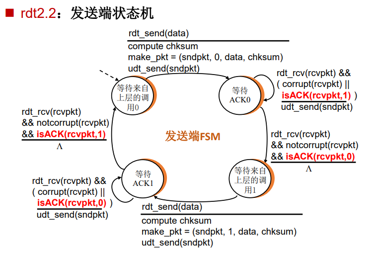
   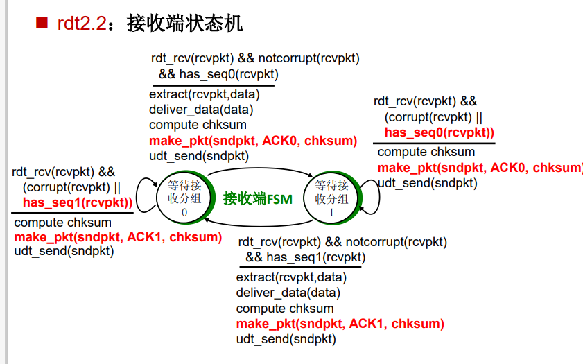
  </div>


4. **RDT 2.2**：
   
   - 改进：消除了NAK，仅使用ACK。**(NAK-free)**
   
   - 特点：
   
     * 接收端通过发送对最后正确收到的分组的ACK代替NAK。**ACK中必须携带所确认分组的序列号。**
     * 发送端接收到重复的ACK，代表对当前分组的NAK，则重传当前的分组。
   
     <font size=3, color="red">本次实验也是基于了RDT2.2的这种ACK中加入分组序列号的形式代替了NAK。</font>
   
   - 优势：通过序列号减少了重复数据包的问题。
   
   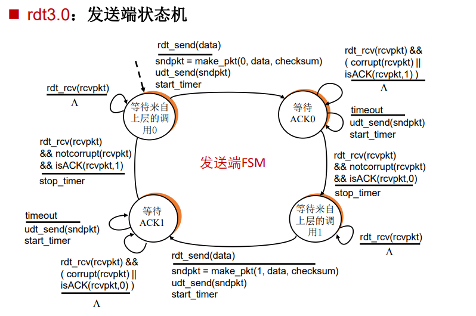
   
5. **RDT 3.0**：
   - 基本假设：下层通道不仅可能出现比特错误，还可能丢失数据包（数据分组或ACK分组）。
   
   - 特点：包括了定时器，以处理数据包丢失的情况。**合理的时间，通常设置为比一个数据包来回RTT多一点。超时重传机制引入。**
   
     * 如果定时器超时，发送方会重传数据包。
     * 如果分组仅仅是被延迟，或是ACK丢失，**会造成接收端重复接收。这一点无法避免。**
     * 接收端需要根据序列号判断重复的分组，并丢弃即可。
   
     <font size=3, color="red">本次是实验也是基于RDT3.0的超时重传机制实现的功能。</font>
   
   - rdt3.0可以实现可靠机制，但存在性能问题。

#### 1.3 面向连接的握手与挥手

本次实验由于需要建立连接和关闭连接，因此建立连接的过程仿照了TCP的四次握手和两次挥手，并进行了适当改进，首先简单回顾一下TCP的握手和挥手：

#### 1.3.1 三次握手

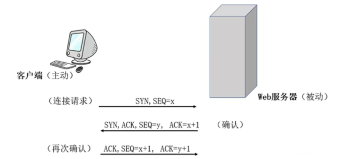

这里不再赘述具体过程，重点提到几个地方：

1. 第三次握手（ACK）：客户端收到服务器的回应后，它会发送一个TCP数据包，包含一个**ACK标志位。这个数据包表示客户端确认了服务器的确认。而两次握手并不足够，因为无法确认客户端也能够接收到数据。**
2. 停等验证机制设置：三次握手过程中第一次客户端向服务器端主动发送的SYN数据包加上了一个随机初始序列号x，之后服务器回复的ack值需要正好是x+1，代表了期望收到的数据。同样生成一个随机序列号y，期望第三次握手收到ack=y+1。**这样的方式保证了收到的包时想要回复刚刚自己的包。避免了位错误导致的突变的SYN和ACK导致的错误握手“误会”。**

#### 1.3.2 四次挥手:

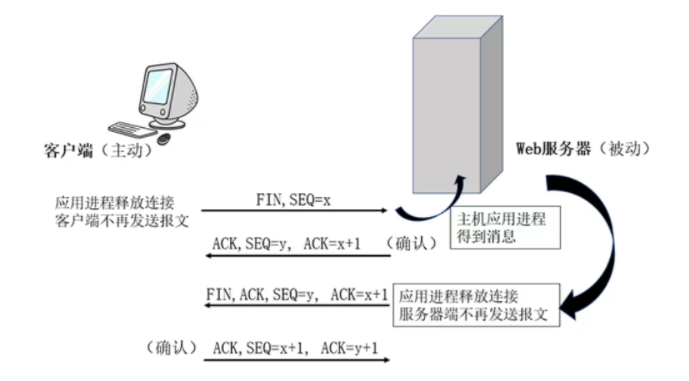

这里具体过程同样也不再赘述，**但有两点需要注意：**

1. **第三次挥手（FIN+ACK）：服务器端会将之前剩余没法的数据发送完毕，**然后发送一个FIN和ACK的数据包。<font size=3, color="red">不过由于本次实验中，发送端和接收端是固定的，服务器不会主动向客户端发送数据，因此这样一步其实并不需要。</font>
2. **第四次挥手（ACK）：客户端收到服务器的FIN后，**它发送一个ACK数据包作为确认。这一步实际上是**我设计的挥手的最后一步，在3.2.3中我会详细说明。**
2. **同样的停等机制验证设置：**同样中间过程使用了随机序列号生成的方式保证了期望收到的ACK是想要的ACK等，避免误会。<font size=3, color="red">我的挥手过程沿用了这一设置。</font>

#### 1.4 Keep-Alive(HTTP)

HTTP1.1中的Keep-Alive机制，**用于在单个TCP连接上发送和接收多个HTTP请求和响应**，而不是为每个请求/响应对打开一个新的连接。这种机制是为了提高HTTP通信的效率而设计的。

1. **连接复用**：
   * 在Keep-Alive模式下，**一个TCP连接可以用于多个HTTP请求和响应，减少了频繁建立和关闭连接的需要。**
   * 频繁地建立和关闭TCP连接需要消耗时间（进行三次握手和四次挥手），使用Keep-Alive可以减少这种延迟，使得页面加载更快。
   * 减少了因建立新连接而产生的网络拥塞和额外的TCP流量，**提高了整体网络效率。**
3. 超时和最大请求数：服务器可以指定连接在空闲状态下保持打开的最长时间以及可以通过该连接发送的最大请求数。
3. **更快的内容加载**：对于包含多个资源（如图片、CSS文件、JavaScript文件）的网页，使用Keep-Alive可以显著提高加载速度。

总的来说，HTTP的Keep-Alive机制通过复用TCP连接来提高HTTP通信的效率，特别适用于那些需要多次请求资源的场景。**在Lab02抓包的过程中，HTTP1.1的Keep-alive的机制对我留下了很深的印象。<font size=3, color="red">因此本次实验在基本的实验要求之上，额外实现了Keep-alive的一次连接建立，多次文件传输的功能，便于后续拓展。</font>**

### 2 实验要求

*利用**数据报套接字**在用户空间实现**面向连接的可靠数据传输**，功能包括：**建立连接、差错检测、接收确认、超时重传**等。流量控制采用**停等机制**，完成给定**测试文件的传输**。*

### 3 前期准备

#### 3.1 UDP报文设计

```
 0              7 0             7 0                            15
+---------------------------------------------------------------+
| 				          Sequence Number                       |
+---------------------------------------------------------------+
|                       Acknowledgment Number                   |
+---------------------------------------------------------------+
|                              Flags   							|
+---------------------------------------------------------------+
|                             Checksum							|
+---------------------------------------------------------------+
|                          	Data  Length                        |
+---------------------------------------------------------------+
|                           Header Length                       |
+---------------------------------------------------------------+
|                                                               |
|							  	                                |
|                               Data                            |
|								                       	        |
|                                                               |
+---------------------------------------------------------------+
```

本次实验的UDP报文由于需要保证16位的对齐和一些数值类型转换，出于时间原因，设计的比较简单。**具体而言：报文由12字节的定长报文首部和变长的数据部分组成。其中首部各字段含义如下：**

1. **Sequence Number：序列号（u_short 16位）。**仿照RDT2.1进行设计的机制。为了避免重传等错误采用。具体而言：
   * 普通传输：正常情况下采用**RDT2.1的单数位序列号0或者1**，两个状态进行轮转即可。
   * 挥手过程：挥手过程中设计使用**随机序列号设计**，即产生一个范围在0-256之间的序列号。
2. **Acknowledgment Number：ACK值（u_short 16位）。**仿照RDT2.2进行的设计。主要由标志位Flags中的ack标志位控制，当Flags标志位被置为1时，**ACK会用来体现最后正确收到的分组的序列号值，由此来替代NAK。**
3. **Flags：标志位（u_short 16位）**，暂时只是仿照了TCP设计了**低五位**，未来会继续拓展。具体而言：
   * **SYN：0x1**，用来建立连接的握手过程中用来建立连接。
   * **ACK：0x2**
     * 用来控制ACK值是否有效；
     * 用来在握手，挥手包括停等机制时，其中一方发送告诉另一方能够正确收到。
   * **FIN：0x4**，用来在挥手过程中客户端告诉服务器端是否结束连接，开始挥手
   * **LAS：0x8，**自行设计，**用来发送方在最后一个数据包中加入告诉服务器端这就是发送的文件最后一段了，发送文件即将结束。**
   * **RST：0x16，**仿照TCP的状态位设计，当**连接需要由于某种原因立即终止时**，一个设备可以发送一个设置了RST位的报文。具体而言：
     * 出现异常连接情况，例如SOCKET_ERROR。
     * **建立连接过程中：服务器端在发送了SYN+ACK后，收到ACK前，如果提前收到了数据包，会担心出现后续事故。提前终止连接。**
4. **Checksum：校验位（u_short 16位）**，具体来说会初始化为0，整个报文补0之后，通过16位的二进制的反码求和计算，将计算结果取反后写入校验和域段。**用来确定接收到的数据报文包括Data和Header是否存在位错误的情况，实现差错重传机制。**
5. **Data  Length：数据段长度（u_short 16位）**，用来记录每次传输的可变数据段的数据长度，
6. **Header Length：报文头部长度（u_short 16位）**，用来记录每次传输的数据包的头部长度。

本次**由于时间不足，数据包格式设计的较简单，一些伪首部和TCP的状态码等均没有体现，会在未来进行不断完善。**

#### 3.2 协议设计

#### 3.2.1 三次握手（建立连接）

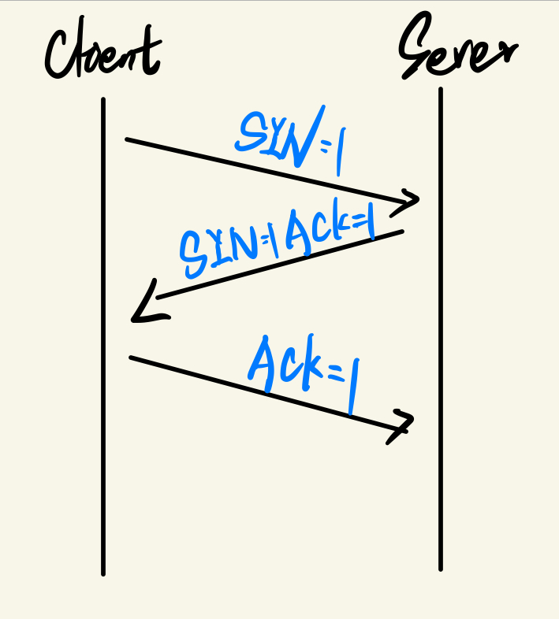

这里建立连接的时候**我采用的就是仿照TCP的三次握手进行设计，**不过没有使用其中随机的客户端和服务器端的数据包序列号生成和ACK=序列号+1的验证机制。未来有待完善。

1. 客户端想要与服务器建立连接, 于是向服务器发**送SYN报文**请求连接。**服务器知道客户端能够发送。**
2. 服务器收到客户端的连接请求之后, 服务器向客户端发送**确认报文ACK及请求连接报文SYN**。**让客户端知道服务器能够接收并且能够发送。**
3. 客户端收到服务器的连接请求, 向服务器发送**确认报文ACK。在服务器接收到ACK之后,服务器知道了客户端能够发送**。

至此实现了客户端和服务器端都确认了彼此可以正常发送和接收数据，然后就可以开始正常通信了。**不过在这个过程中也可能存在超时或者丢包的情况，实际上都进行了多种异常情况的处理，具体处理详解代码讲解部分4.3.2。**

#### 3.2.2 数据传输

1. **接收端和发送端状态机：RDT3.0。同一个文件会分为多个分组进行传输。**
2. **停等级制与接受确认：通过在分组中加入序列号和ACK的序列号实现。**
   * 客户端也就是发送方发送了一个报文后，服务端对该序列号的报文进行正确的确认ACK报文后，才会继续发送下一个。**<font size=3, color="red">但我这里的ACK代表的是我收到的最后一个序列号！而不是期待收到的下一个序列号！这样处理实际上解决了隐藏的问题。详见4.3.7的2，很重要！</font>**
   * 服务器端也就是接收方，接收到数据包后，也会对序列号进行校验，只要序列号确实是期望收到的序列号后才会发送确认的报文。
   * 如果收到了重复的包，接收方直接丢弃，**但仍然需要向发送方发送重复文件的序列号接收报文。这也是RDT3.0仍然存在的重复接收的问题。暂时保留**
3. **超时重传：**通过一个定时器实现对往返的时间，即2MSL进行估计，超过时间就会进行重传。**重传的内容不仅包含数据分组，也包含ACK,FIN,SYN等等握手和挥手中的数据报文。**
4. **差错检测：**不论是发送方还是接收方，都需要进行差错检测，**只有通过了差错检测即checksum位为全0，才会继续下去，不然也会有一定的处理机制。实现了对下层通道位错误情况的特殊处理。**
4. 最后发送方会在最后一个报文中加入**LAS=1的标志位**，告诉接收端发送结束，进入挥手阶段。

#### 3.2.3 两次挥手（关闭连接）

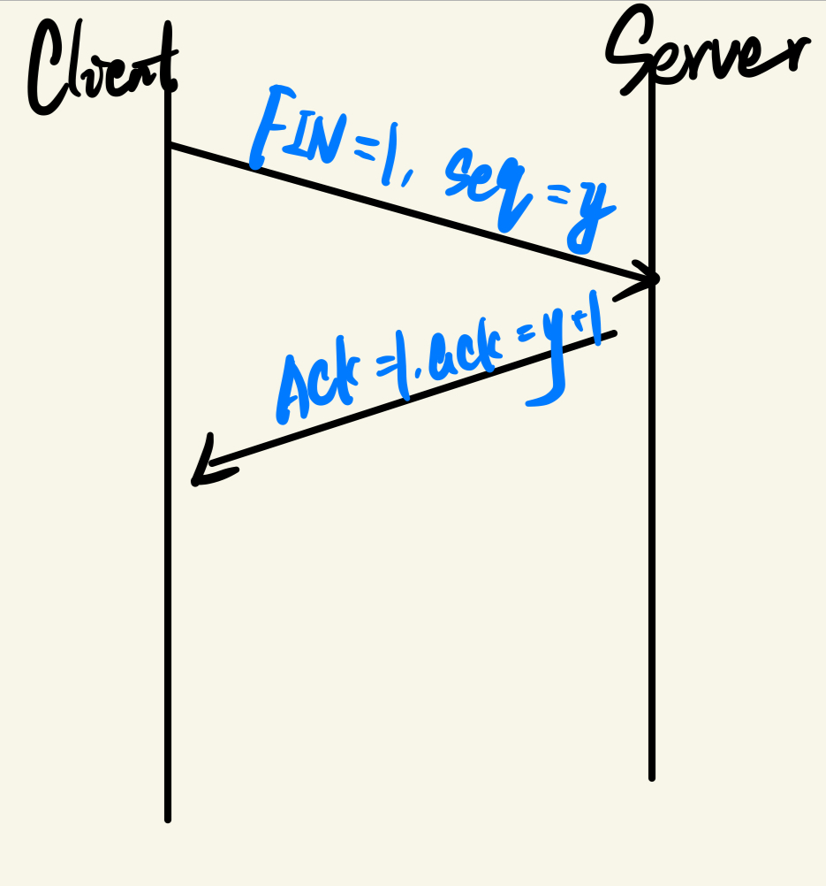

对TCP的四次挥手进行了改进，**只保留了两次挥手**，这是因为：

* TCP第三次挥手的目的是服务器端会把剩余没传输完的数据传完，而如果对于本次实验服务器端本身就不会传输数据的情况，没必要进行第三次挥手；
* 同样TCP第四次挥手是对第三次挥手的ACK，由于根本没有第三次挥手，因此第四次也不需要；

**我这里使用了随机序列号（而不是之间数据传输时候的0或1），而不是单纯的FIN和ACK，是因为了避免对FIN报文进行确认的ACK数据包和对普通数据报文进行确认的ACK数据包混淆。**


#### 3.2.4 Keep-Alive

基于HTTP应用层的Keep-Alive机制，即一次连接多次传输，**本次在实现了UDP基本的可靠传输后额外实现了Keep-Alive机制。具体而言，就是在经历三次握手后，可以一直发送文件，直到客户端主动退出，才会进行挥手，关闭连接。**

### 4 实验过程及代码讲解

#### 4.3.1 头文件

在头文件中，我包含了一些对特殊类和宏常量等的处理，接下来结合代码详细说明：

1. **宏常量：**

   （1）**Flags标志位的对应常量值，只使用低五位。**

```c++
//Flags currently using the last six spots
#define SYN 0x1
#define ACK 0x2
#define FIN 0x4
#define LAS 0x8
#define RST 0x10
```

​		（2）**一些特殊的全局宏常量，**具体而言：

* **MSS：即仿照TCP的数据段的最大长度进行设计，用于分组传输文件。**防止数据段过大，导致网络拥塞

  ​	MSS的值是通过MTU - TCP Header - IP heade的方式计算得出的，即 15000 - 40 = 14600。其中，MTU是 Maximum Transmission Unit 的缩写，意为“最大传输单元”，通常为 15000字节；TCP Header和 IP header分别代表 TCP 头和 IP 头的大小，通常总和为40字节。**因此MSS的值为14600字节，这意味着每个 TCP 数据段的数据部分的最大长度为14600字节。**

* UDP_SHAKE_RETRIES 10：即握手过程中超时重传最大次数，默认为10。

* UDP_WAVE_RETRIES 10：即挥手过程中超时重传的最大次数，默认为10。

* **MSL：即仿照TCP报文的最大生命周期进行设计，**一个来或者回的过程。使用计量单位是**CLOCKS_PER_SEC宏常量，即每秒钟的时钟周期数。**

* MAX_SEQ 256：在挥手过程中采用的序列号，默认最大值是256。

* **PATIENCE** CLOCKS_PER_SEC * 1000：用于客户端出现异常太久没有发来消息不论是挥手还是新的文件数据报文（可能是在输入文件路径）。**为了避免死锁，服务器端主动结束。**

```c++
// Maximum Segment Size
#define MSS 14600 //MSS = MTU-TCP Header - IP header = 15000-40=14600
// Maximum times of retries while shaking hands
#define UDP_SHAKE_RETRIES 10
// MSL estimation of clocks(1 second of clocks one trip to/from)
#define MSL CLOCKS_PER_SEC
// Maxium sequence on package
# define MAX_SEQ 256
// Maximum times of retries while waving hands
#define UDP_WAVE_RETRIES 10
// Patience waiting on sending file
#define PATIENCE CLOCKS_PER_SEC * 1000
```

2. **Header类：**

   具体而言，包含了所有需要用到报文头部的分段，包含构造函数和获取函数等。值得注意的是：

   * **数据部分没有显示地进行保存，而是选择直接保存在发送的缓冲区的后面，**实际上考虑了额外定义Message结构体，并保存在char*类型的数组，有待完善。
   * 最开始考虑到想要定义所有字段为私有，然后采用公访私的方式去访问，不过出了点问题我暂时不清楚原因，会在4.3.7中描述。
   * **所有字段需要保持一个字节（8bit）的对齐**，不然会默认使用4字节即（32bit）填充的方式，这会导致不必要的0出现在报文中。**通过#pragma pack(1)实现**，并定义结束后，回复相关的地址对齐方式。

   ```c++
   #pragma pack(push)
   #pragma pack(1)
   //1Byte align，make it convenient to transfer to char* buffer
   class Header {
   public:
   	u_short seq;
   	u_short ack;
   	u_short flag;
   	u_short checksum;
   	u_short data_length;
   	u_short header_length;
   public:
   	Header() {};
   	Header(u_short seq, u_short ack, u_short flag, u_short checksum, u_short data_length, u_short header_length) :
   		seq(seq), ack(ack), flag(flag), checksum(checksum), data_length(data_length), header_length(header_length) {}
   	u_short get_seq() {
   		return seq;
   	}
   	u_short get_ack() {
   		return ack;
   	}
   	u_short get_flag() {
   		return flag;
   	}
   	u_short get_checksum() {
   		return checksum;
   	}
   	u_short get_data_length() {
   		return data_length;
   	}
   	u_short get_header_length() {
   		return header_length;
   	}
   
   };
   #pragma pack(pop)
   //Resume 4Byte align
   ```

3. **全局变量：**

   * **Client端：**其中值得注意的有：
     * udp_2msl：即估计的一个往返时间RTT，默认使用2MSL，也就是两秒中的时钟周期数。
     * sequence_num：序列状态号，**对应于RDT3.0的两个状态，只有0和1。**
     * **restart：控制Keep-Alive。**

   ```c++
   WSAData wsadata;
   SOCKET clientSocket;
   sockaddr_in clientAddr;
   /*
   * Previously in server, there is no need for a clientAddr, for server just need to receive SYN from client(without keep-alive)
   * But in client, it has to need a serverAddr to send SYN to start shaking hands
   */
   SOCKADDR_IN serverAddr;
   
   
   char* recv_buff;
   char* send_buff;
   int max_retries_times = UDP_SHAKE_RETRIES;
   int udp_2msl = 2 * MSL;//Default:udp2MSL:2 seconds(Clocks)
   int sequence_num = 0;
   
   
   char* file_data_buffer = new char[INT_MAX];//Maxium databuffer
   int file_length = 0;
   bool restart = true;//keep-alive
   ```

   * **Server端**：与Client端类似，不过没有restart，**另外clientAddr可以动态获取。**
   
4. **校验和：**这里直接都一样，就放出来了：

   ```c++
   u_short checksum(char* data, int length) {
   	/*
   	* checksum on message and length
   	* data: char * UDP message
   	* length: bit length on message
   	*/
   	int size = length % 2 ? length + 1 : length;//make sure size is a even number
   	int count = size / 2;
   	char* buf = new char[size];
   	memset(buf, 0, size);//fill with zero
   	memcpy(buf, data, length);
   	u_long sum = 0;//ulong to prevent potential overflow
   	u_short* buf_iterator = (u_short*)buf;//to process buf in 16 bit block
   	while (count--) {
   		sum += *buf_iterator++;
   		if (sum & 0xffff0000) { //Overflow
   			sum &= 0xffff;//
   			sum++;
   		}
   	}
   	delete[]buf;
   	return ~(sum & 0xffff);//clear upper 16 and reverse bits
   }
   ```

   

#### 4.3.2 三次握手

首先是按照正常的流程即3.2.1中设计的代码：

1. **服务器端：int shake_hand()**

   ```c++
   //Initialize
   	max_retries_times = UDP_SHAKE_RETRIES;
   	udp_2msl = 2 * MSL;
   	send_buff = new char[sizeof(Header)];
   	recv_buff = new char[sizeof(Header) + MSS];
   	
   	int addr_client_length = sizeof(sockaddr_in);
   	int log;//recording logs
   while(true){
       /*
       处理握手，接收数据
       */
       Header recv_header;
   	memcpy(&recv_header, recv_buff, sizeof(recv_header));
   	u_short cks = checksum(recv_buff, sizeof(recv_header));
       log = sendto(serverSocket, send_buff, sizeof(send_header), 0, (sockaddr*)&clientAddr, sizeof(sockaddr_in));
   				if (log == SOCKET_ERROR) {
   			/*
   			额外处理一下
   			*/
   				}
       //类似发送数据
       		Header send_header(0, 0, ACK + SYN, 0, 0, sizeof(Header));
   			memcpy(send_buff, (char*)&send_header, sizeof(send_header));
   			u_short cks = checksum(send_buff, sizeof(send_header));
   			((Header*)send_buff)->checksum = cks;
       //以此类推，就不粘帖太多代码了
   }
   ```

   

**<font size=3, color="red">不过这个过程可能会存在一些丢包等问题，为了避免死锁，针对一些情况实现了错误处理机制：</font>**

1. **SYN丢失：**在客户端发送了第一个SYN，**如果客户端迟迟未接收到来自服务器端的SYN+ACK回复，会对SYN包进行超时重传**。并通过额外设定一个参数用来设定最多的超时重传次数。如果超过这个次数，客户端放弃发送，直接结束连接。

   ```c++
   //以下代码在client中：
   clock_t start = clock();
   	// non-block mode, wait for SYN and ACK
   	u_long mode = 1;//设置非阻塞模式，是为了进入下面的while循环中触发超时重传
   	ioctlsocket(clientSocket,FIONBIO, &mode);
   	sockaddr_in tempAddr;
   	int temp_addr_length = sizeof(sockaddr_in);
   	while (true) {
   		//continue to recvfrom wrong
   		while (recvfrom(clientSocket, recv_buff, sizeof(Header), 0, (sockaddr*)&tempAddr, &temp_addr_length) <= 0) {
   			if (clock() - start > 1.2 * udp_2msl) {
   				if (max_retries_times <= 0) {
   					cout << "Reached max times on resending SYN." << endl;
   					cout << "Shaking Hands Failed!" << endl;
   					cout << "-----------Stop Shaking Hands-----------" << endl;
   					//mode = 0;
   					//ioctlsocket(clientSocket, FIONBIO, &mode);
   					return -1;//return failure flag
   				}
   				int times = 5;
   			SendSYN2:
   				log = sendto(clientSocket, send_buff, sizeof(syn_header), 0, (sockaddr*)&serverAddr, sizeof(sockaddr_in));
   				if (log == SOCKET_ERROR) {
   					cout << "Oops!Failed to send SYN to server." << endl;
   					cout << GetLastErrorDetails() << endl;
   					cout << "Please try again later." << endl;
   					
   					if (!times) {
   						//同样如果一直不通过，对面也会一直等，会导致死锁，尝试五次不行，直接退出。
   						cout << "Failed to send SYN pkg to server too many times." << endl;
   						cout << "------------Dismissed connection-----------" << endl;
   						return -1;
   					}
   					//同样努力挽留一下，回到本次重传的开始位置
   					times--;
   					goto SendSYN2;
   				}
   				max_retries_times--;
   				//increase udp_2msl
   				udp_2msl += MSL;
   				start = clock();
   				cout << "Timeout, resent SYN to server." << endl;
   				//此时出现重传一定出现了丢包，
   				cout << "-----Stage 2-----" << endl;
   			}
   ```

   

2. **SYN+ACK包丢失：**如果服务器端发送的SYN+ACK包在传输过程中发生了丢失，客户端会以为是自己的SYN包丢失了还在那超时重传，**服务器端不能坐以待毙一直在那重复接收SYN！服务器端也需要对SYN+ACK包进行超时重传。**同样如果超过了预先设定的最大次数，直接结束连接。

   ```c++
   // non-blocking mode
   			u_long mode = 1;
   			ioctlsocket(serverSocket, FIONBIO, &mode);
   			clock_t start = clock();
   			while (true) {
   				int result;
   				while ((result = recvfrom(serverSocket, recv_buff, sizeof(Header), 0, (sockaddr*)&clientAddr, &addr_client_length)) <= 0) {
   					if (clock() - start > 1.2 * udp_2msl) {
   						if (max_retries_times <= 0) {
   							cout << "Reached max times on resending SYN & ACK." << endl;
   							cout << "Shaking Hands Failed!" << endl;
   							cout << "-----------Stop Shaking Hands-----------" << endl;
   							mode = 0;
   							ioctlsocket(serverSocket, FIONBIO, &mode);
   							return -1;//return failure flag
   						}
   						SendSYNACK2:
   							log = sendto(serverSocket, send_buff, sizeof(send_header), 0, (sockaddr*)&clientAddr, sizeof(sockaddr_in));
   						if (log == SOCKET_ERROR) {
                               //类似处理
                           }
   ```

   

3. **ACK包丢失：**此时客户端已经收到了来自服务器端的SYN+ACK，但是发回的ACK包在传输过程中发生了丢失。**虽然此时客户端已经知道了服务器端可以发送和接收数据，但是服务器端不知道客户端能够正常接收数据（可以正常发送，因为第一次握手发了SYN）。**而此时客户端已经仿照TCP的三次握手结束了三次握手，以为建立成功了连接，开始请求输入文件路径了。

   ​	    所以如果此时服务器端在收到客户端的ACK之前，提前开始接收文件数据是不合理的。**因为可能会导致之后的传输过程中服务器端对客户端的数据包回复的ACK客户端其实一直接收不到。**为了避免这种误会，<font size=3, color="red">如果服务器端在收到客户端的ACK前提前接收到了数据报文，直接发送RST包告诉客户端“异常的连接发生了”，然后提前结束连接。</font>

   ```c++
   else if (cks == 0 && (recv_header.get_flag() == 0)) {//如果提前收到了数据报文，服务器端担心出现事故
   					//发送RST报文后，关闭连接												
   					Header rst_header(0, 0, RST, 0, 0, sizeof(Header));
   					memcpy(send_buff, (char*)&rst_header, sizeof(rst_header));
   					int cks = checksum(send_buff, sizeof(rst_header));
   					((Header*)send_buff)->checksum = cks;
   					SendRST1:
   						log = sendto(serverSocket, send_buff, sizeof(rst_header), 0, (sockaddr*)&clientAddr, sizeof(sockaddr_in));
   					if (log == SOCKET_ERROR) {
   						cout << "Oops!Failed to send RST to client." << endl;
   						cout << GetLastErrorDetails() << endl;
   						cout << "Please try again later." << endl;
   						//确保传过去了
   						goto SendRST1;
   					}
   					cout << "Unexpectedly received data pkg before ACK pkg, RST sent. " << endl;
   					cout << "Shaking Hands Failed!" << endl;
   					cout << "-----------Stop Shaking Hands-----------" << endl;
   					mode = 0;
   					ioctlsocket(serverSocket, FIONBIO, &mode);
   					return -1;//return failure flag
   ```

   

4. **服务器端异常接收数据包：**

   * **接收到SYN前，提前收到了非SYN数据包：**不论是提前收到的ACK还是数据包，都其实是连接过程中某部分进行了丢失和异常，为了保证后面传输过程的正确性，**同样直接发送RST包告诉客户端“异常的连接发生了”，然后提前结束连接。**
   
     ```c++
     {//Fin pkg is corriupted or is not Fin flagged
     			if (!(recv_header.get_flag() & SYN)) {//It is not SYN flagged, unexpected received data or ACK
     												 //Sent RST and close connection
     				Header rst_header(0, 0, RST, 0, 0, sizeof(Header));
     				memcpy(send_buff, (char*)&rst_header, sizeof(rst_header));
     				u_short cks = checksum(send_buff, sizeof(rst_header));
     				((Header*)send_buff)->checksum = cks;
     				int times = 5;
     			SendRST2:
     					log = sendto(serverSocket, send_buff, sizeof(rst_header), 0, (sockaddr*)&clientAddr, sizeof(sockaddr_in));
     ```
   
   * **校验和出现错误：**
     * 如果服务器在收到SYN之前出现了校验和错误：因为客户端会超时重传多次传输SYN，所以服务端只需要回去安心地再等待接收SYN即可。
     
     ```c++
     else {//If it is Fin flagged, then it is corriputed
     				cout << "Oops!Package from client is corriputed." << endl;
     				cout << "Please try again later." << endl;
     				Sleep(3000);
     				continue;
     
     			}
     ```
     
     * 如果服务器端在收到ACK之前出现了校验和错误：这种和上一种不同，此时客户端已经向服务器端发送了ACK（假设，否则情况会更加复杂），如果损坏了，服务器也不会再收到ACK信息了，此后收到的只会是数据包。**因为ACK包不会重发。因此采取的策略是直接结束。避免死锁情况或者其他误会。与ACK包丢失的情况相同。**
     
     ```c++
     else if(cks){//pkg is corriputed
     					cout << "Oops!Package from client is corriputed." << endl;
     					//此时客户端已经向服务器端发送了ACK（假设，否则情况会更加复杂）
     					//如果损坏了，服务器也不会再收到ACK信息了，此后收到的只会是数据包。因为ACK包不会重发
     					//当然也存在收到的是FIN包，不过损坏了。。。
     					//这里暂时采取的策略是直接结束。避免死锁情况或者其他误会。
     					Header rst_header(0, 0, RST, 0, 0, sizeof(Header));
     					memcpy(send_buff, (char*)&rst_header, sizeof(rst_header));
     					u_short cks = checksum(send_buff, sizeof(rst_header));
     					((Header*)send_buff)->checksum = cks;
     ```
     
   * SOCKET_ERROR：这种情况下也进行了类似的处理。**不过用了goto，导致可读性变得很差了。。。。**

#### 4.3.3 数据传输

1. 客户端：

   * void send_data(string file_path)：

     * 接收文件路径，然后通过”？“（实际上不会出现在Windows文件路径中）将文件路径和文件内容传输时候相隔开。
     * 每次只传输一个MSS长度的文件，判断如果是最后一个文件，实现LAS位的赋值。
     * 每个数据包调用rdt_send进行传输；
     * 计算和输出文件传输时间和吞吐率等

     ```c++
     cout << "-----------Start Sending File-----------" << endl;
     	clock_t start = clock();
     	// Send data in MSS Segements
     	int curr_pos = 0;
     	int log;
     
     	while (curr_pos < total_length) {
     		int pkg_length = total_length - curr_pos >= MSS ? MSS : total_length - curr_pos;
     		bool last = total_length - curr_pos <= MSS ? true : false;
     		log = rdt_send(file_data_buffer + curr_pos, pkg_length, last);
     		if (!log) {
     			//如果rdt_send出现问题，只有可能是接收到服务器端主动发送的RST包即服务器端主动结束连接
     			//此时客户端也没有必要再等了，直接退出
     			delete[] file_data_buffer;
     			delete[] send_buff;
     			delete[] recv_buff;
     			closesocket(clientSocket);
     			WSACleanup();
     			exit(0);
     		}
     		curr_pos += MSS;
     	}
     	clock_t end = clock();
     	cout << "-----------Finished Sending File-----------" << endl;
     	cout << "Successfully sent file: " + file_path + " to server!" << endl;
     	cout << "-----------Result Estimation----------" << endl;
     	cout << "Total length sent:" << total_length << " Bytes." << endl;
     	cout << "Total time:" << (end - start) * 1000 / (double)CLOCKS_PER_SEC << " ms." << endl;
     	if (!(end - start))
     		cout << "Flash!Time is too short to compute a throughput." << endl;
     	else
     		cout << "Throughput:" << total_length / ((end - start) * 1000 / (double)CLOCKS_PER_SEC) << "Bytes/ms." << endl;
     ```

* * bool rdt_send(char* data_buff, int pkg_length, bool last_pkg)实现每个单独数据包的传输：

    * **超时重传机制实现方式：u_long mode = 1开启非阻塞模式后，通过recv_from返回值-1进入while循环一直判断。**

    ```c++
    u_long mode = 1;
    	ioctlsocket(clientSocket, FIONBIO, &mode);
    	while (true) {
    		sockaddr_in tempAddr;
    		Header recv_header;
    		int temp_addr_length = sizeof(sockaddr_in);
    		while (recvfrom(
    			clientSocket,
    			recv_buff,
    			sizeof(recv_header),
    			0,
    			(sockaddr*)&tempAddr,
    			&temp_addr_length
    		) <= 0) {
    			if (clock() - start > 1.2 * udp_2msl) {//Timeout without receving ACK
    				log = sendto(
    					clientSocket,
    					send_buff,
    					pkg_length + sizeof(send_header),//total length
    					0,//no flags
    					(sockaddr*)&serverAddr,
    					sizeof(sockaddr_in)
    				);
    				if (log == SOCKET_ERROR) {
    					//重复五次，然后发送RST，结束
    				}
    				cout << "Timeout, resent datagram to server." << endl;
    				start = clock();//restarting clock
    			}
    		}
    ```

    * 接收ACK包，并进行序列号对比，并反转序列号：

      ```c++
      //Receive ACK from server
      		memcpy(&recv_header, recv_buff, sizeof(recv_header));//only header is useful
      		//logs printing
      		cout << "Successfully receive datagram---" << recv_header.get_data_length() + recv_header.get_header_length() << "Bytes in length." << endl;
      		cout << "Header---" << endl;
      		cout << "seq: " << recv_header.get_seq() << " , ack: " << recv_header.get_ack() << ", flag: " << recv_header.get_flag() << ", checksum: " << recv_header.get_checksum() << endl;
      		cout << "header length:" << recv_header.get_header_length() << ", data length:" << recv_header.get_data_length() << endl;
      		u_short cks = checksum(recv_buff, sizeof(recv_header));
      		if (
      			cks == 0 //not corruptied
      			&&
      			(recv_header.get_flag() & ACK) //ACK flag
      			&&
      			(recv_header.get_ack() == sequence_num)// ACK = sequence number RDT3.0
      			) {
      			//udp_2msl = 0.8 * udp_2msl;//延时重发
      			//
      			cout << "Server has acknowleged the datagram." << endl;
      			break;
      		}
      		else if (
      			cks == 0 //not corruptied
      			&&
      			recv_header.get_flag() & RST //server try to close connection
      			) {
      			cout << "Server unexpected closed:Error in connection." << endl;
      			//sequence transfer
      			result = false;
      			break;
      		}
      		else if (
      			cks != 0 //ACK pkg probably corruptied during transmisssion
      			)
      			continue;//continue to send pkg to server
      
      	}
      	mode = 0;
      	ioctlsocket(clientSocket, FIONBIO, &mode);
      	sequence_num ^= 1;
      	return result;
      ```

2. 服务器端：rdt_rcv(char* data_buff, int* curr_pos, bool& waved)：

   * 其中waved参数用来判断是否进行了挥手，用于keep-alive。

   * 大体代码这里不再赘述，只说一个重点的地方：**我是先发送ACK，再进行的序列号对比和反转序列号（如果序列号正确的话）。因为我的ACK代表的是我收到的最后一个序列号！而不是期待收到的下一个序列号！也就是说我收到一个就会发送一个ACK。而不是对比后再发送ACK。这样实际上避免了ACK包丢失带来的死锁问题，详见4.3.7。**
   
   * 同时直接在接收消息地方收到了FIN，**则直接进行挥手，因此把挥手和接收信息实际上合并在了一起。**
   
   * RST包提前收到，结束连接。
   
     ```c++
     while (true) {
     		int result;
     		// MSS + Header this time
     		// recv_buff:  MSS + header
     		while ((result = recvfrom(serverSocket, recv_buff, MSS + sizeof(Header), 0, (sockaddr*)&clientAddr, &addr_Client_length)) <= 0) {
     			if (clock() - start > PATIENCE) {// Not received furthur request
     				cout << "Patience has run out, connection dismissed." << endl;
     				cout << "------------Dismissed connection-----------" << endl;
     				closesocket(serverSocket);
     				WSACleanup();
     				exit(0);
     			}
     		}
     		//Indeed received file
     		memcpy(&recv_header, recv_buff, sizeof(recv_header));
     		//Calculate checksum
     		u_short cks = checksum(recv_buff, result);
         
         
         //检验和出错！！！！！！！
     		if (cks != 0) {
     			//Corruptied
     			cout << "-----New Datagram-----" << endl;
     			cout << "successfully received datagram---" << recv_header.get_data_length() + recv_header.get_header_length() << "bytes in length." << endl;
     			cout << "header---" << endl;
     			cout << "seq: " << recv_header.get_seq() << " , ack: " << recv_header.get_ack() << ", flag: " << recv_header.get_flag() << ", checksum: " << recv_header.get_checksum() << endl;
     			cout << "header length:" << recv_header.get_header_length() << ", data length:" << recv_header.get_data_length() << endl;
     			Header ack_header(0, (sequence_num ^ 1), ACK, 0, 0, sizeof(Header));
     			memcpy(send_buff, (char*)&ack_header, sizeof(ack_header));
     			cks = checksum(send_buff, sizeof(ack_header));
     			((Header*)send_buff)->checksum = cks;
     			int times = 5;
     		SendACK1:
     			log = sendto(serverSocket, send_buff, sizeof(ack_header), 0, (sockaddr*)&clientAddr, sizeof(sockaddr_in));
     			/*
     			处理一些这就不多说了
     			*/
     			cout << "Corruptied Package from client, checksum went wrong!" << endl;
     			cout << "Ack on last package sent." << endl;
     		}
         
         
         
         //开始挥手！！！！！！！！
     		else if (recv_header.get_flag() == FIN) {//wave hands starts
     			cout << "-----------Start Waving Hands-----------" << endl;
     			cout << "-----Stage 1-----" << endl;
     			cout << "Successfully received FIN pkg from client." << endl;
     			cout << "-----Stage 2-----" << endl;
     			Header ack_header(0, (recv_header.get_seq() + 1) % MAX_SEQ, ACK, 0, 0, sizeof(Header));
     			memcpy(send_buff, (char*)&ack_header, sizeof(ack_header));
     			u_short cks = checksum(send_buff, sizeof(ack_header));
     			((Header*)send_buff)->checksum = cks;
     			SendACK2:
     			/*类似处理挥手等*/
     			else
     				cout << "Successfully sent ACK pkg in respond to FIN pkg from client." << endl;
     			
     			cout << "-----------Finished Waving Hands-----------" << endl;
     			waved = true;
     			break;
     		}
         
         	//提前收到挥手结束！！！！
     		else if (recv_header.get_flag() & RST) {
     			cout << "Recieved RST request from client." << endl;
     			cout << "------------Dismissed connection-----------" << endl;
     			closesocket(serverSocket);
     			WSACleanup();
     			exit(0);
     		}
         
         //确实是一个报文！！！！！
     		else {//not corruptied and not FIN, a correct datagram received
     			//ACK on received pkg sequence
     			cout << "-----New Datagram-----" << endl;
     			cout << "successfully received datagram---" << recv_header.get_data_length() + recv_header.get_header_length() << "bytes in length." << endl;
     			cout << "header---" << endl;
     			cout << "seq: " << recv_header.get_seq() << " , ack: " << recv_header.get_ack() << ", flag: " << recv_header.get_flag() << ", checksum: " << recv_header.get_checksum() << endl;
     			cout << "header length:" << recv_header.get_header_length() << ", data length:" << recv_header.get_data_length() << endl;
     
     
     
     			Header ack_header(0, recv_header.get_seq(), ACK, 0, 0, sizeof(Header));
     
     
     			memcpy(send_buff, (char*)&ack_header, sizeof(ack_header));
     			u_short cks = checksum(send_buff, sizeof(ack_header));
     			((Header*)send_buff)->checksum = cks;
     			/*类似处理，这里不再重新写了*/
                 
     			cout << "Successfully sent ACK pkg:" << endl;
     			cout << "seq: " << recv_header.get_seq() << " , ack: " << recv_header.get_ack() << ", flag: " << recv_header.get_flag() << ", checksum: " << recv_header.get_checksum() << endl;
     			cout << "header length:" << recv_header.get_header_length() << ", data length:" << recv_header.get_data_length() << endl;
                 
                 //发送完ACK后再对比序列号！！！！！！！！
                 
                 
     			if (sequence_num == recv_header.get_seq()) {//正好是是想要的包seq,RDT2.1
     				sequence_num ^= 1;//状态转移
     				//从recv_buff的header内容之后，即data内容开始，读取data内容
     				//从data_buff + *len位置开始继续写data_buff
     				memcpy(data_buff + *curr_pos, recv_buff + sizeof(recv_header), recv_header.get_data_length());
     				//后移len
     				*curr_pos += recv_header.get_data_length();
     				cout << "Successfully received Datagram." << endl;
     			}
     			else {
                     //重复序列号的包，丢弃！！！
     				cout << "Received repeated datagram, DROP it away." << endl;
     			}
                 //最后一个包。结束！！！
     			if (recv_header.get_flag() & LAS) {
     				start = clock();
     				cout << "Finished receiving file." << endl;
     				break;
     			}
     		}
     	}
     	mode = 0;//阻塞模式
     	ioctlsocket(serverSocket, FIONBIO, &mode);
     	return;
     ```
   
     * 自主输入输出路径：
   
       ```c++
       				string output_path;
       				cout << "Please input a output path:" << endl;
       				cout << "(An absolute path, or a path relative to D:\\Visual Studio 2022 Code\\Project-Computer Network\\Lab3-1-UDP RDT Server" << endl;
       				cin >> output_path;
       				ofstream file(output_path.c_str(), ofstream::binary);
       				if (!file.is_open()) {
       					cout << "Unable to open file, please start over and chose another output path." << endl;
       					continue;
       				}
       				else {
       					file.write(file_data_buffer + pos + 1, file_length - pos - 1);//在文件名和间隔符号之后
       					file.close();
       					cout << "Successfully output file in path:" + output_path << "." << endl;
       					break;
       				}
       ```
   

#### 4.3.4 两次挥手

**服务器端的挥手实际上就是在接受信息中，刚才已经放过了，这里不再重复展示。说一些客户端。**

**<font size=3, color="red">同样存在一些问题，需要处理：</font>**

1. **FIN包丢失：**

   * 客户端向服务器发送的FIN报文产生了丢失，客户端将迟迟无法接收到来自服务器的ACK报文，其**会对FIN报文进行超时重传**，重传超过一定次数之后会默认此时连接产生了异常，会直接断开连接。

     ```c++
     //non-block mode
     	u_long mode = 1;
     	ioctlsocket(clientSocket, FIONBIO, &mode);
     	sockaddr_in tempAddr;
     	int temp_addr_length = sizeof(sockaddr_in);
     	//Recv
     	Header recv_header;
     	//Start clock
     	clock_t start = clock();
     	//Wait for ACK
     
     	while (true) {
     		while (recvfrom(
     			clientSocket,
     			recv_buff,
     			sizeof(recv_header),
     			0,
     			(sockaddr*)&tempAddr,
     			&temp_addr_length
     		) <= 0) {
     			if (clock() - start > 1.2 * udp_2msl) {
     				if (max_retries_times <= 0) {
     					cout << "Reached max times on resending FIN." << endl;
     					cout << "Waving Hands Failed!" << endl;
     					cout << "-----------Stop Waving Hands-----------" << endl;
     					mode = 0;
     					ioctlsocket(clientSocket, FIONBIO, &mode);
     					return;
     				}
     				log = sendto(
     					clientSocket,
     					send_buff,
     					sizeof(fin_header),
     					0,
     					(sockaddr*)&serverAddr,
     					sizeof(sockaddr_in)
     				);
     				if (log == SOCKET_ERROR) {
     					//
     				}
     				max_retries_times--;
     				//increase udp_2msl by one second
     				udp_2msl += MSL;
     				start = clock();
     				cout << "Timeout, resent FIN pkg to server." << endl;
     				cout << "Sequence Number:" << random_seq << ", expects acknowledge number:" << random_seq + 1 << "." << endl;
     				//同样出问题了一定是丢包或者延时
     				cout << "-----Stage 2-----" << endl;
     
     			}
     		}
     ```

2. **最后ACK丢失：**

   * 服务器端：如果服务器向客户端发送的ACK确认报文产生了丢失，此时服务器已经接收到了来自客户端的FIN报文，**向客户端发送ACK报文后服务器便会断开连接。**

   * 客户端：由于没有接收到ACK报文，**会继续超时重传FIN报文，直到超过最大重传次数。**

     ```c++
     while (recvfrom(
     			clientSocket,
     			recv_buff,
     			sizeof(recv_header),
     			0,
     			(sockaddr*)&tempAddr,
     			&temp_addr_length
     		) <= 0) {
     			if (clock() - start > 1.2 * udp_2msl) {
     				if (max_retries_times <= 0) {
     					cout << "Reached max times on resending FIN." << endl;
     					cout << "Waving Hands Failed!" << endl;
     					cout << "-----------Stop Waving Hands-----------" << endl;
     					mode = 0;
     					ioctlsocket(clientSocket, FIONBIO, &mode);
     					return;
     				}
     				log = sendto(
     					clientSocket,
     					send_buff,
     					sizeof(fin_header),
     					0,
     					(sockaddr*)&serverAddr,
     					sizeof(sockaddr_in)
     				);
     				if (log == SOCKET_ERROR) {
     					//
     				}
     				max_retries_times--;
     				//increase udp_2msl by one second
     				udp_2msl += MSL;
     				start = clock();
     				cout << "Timeout, resent FIN pkg to server." << endl;
     				cout << "Sequence Number:" << random_seq << ", expects acknowledge number:" << random_seq + 1 << "." << endl;
     				//同样出问题了一定是丢包或者延时
     				cout << "-----Stage 2-----" << endl;
     
     			}
     ```

#### 4.3.5 Keep-Alive

1. **服务器端：**只有在接受信息时接收到了FIN完成了挥手，挥手函数的waved才会为true，此时才会跳出循环，**否则一直在main函数中的while(true)中的，rdt_send中的recv_from中返回-1，然后进入循环等待，如果超过PATIENCE没有接受响应**，直接结束。

   ```c++
   //以下是main函数中
   while (true) {
   			char* file_data_buffer = new char[INT_MAX];//Maxium databuffer
   			int file_length = 0;
   			bool waved = false;
   			rdt_rcv(file_data_buffer, &file_length, waved);//curr_pos = file_length开始的位置
   			if (waved == true) {
   				break;
   			}
       //处理文件的。之前放过了
   ```

   ```c++
   //以下是rdt_send中的
   // Keep-alive
   	u_long mode = 1;
   	ioctlsocket(serverSocket, FIONBIO, &mode);
   	clock_t start = clock();
   	cout << "-----------Waiting for File or Waving hands-----------" << endl;
   	while (true) {
   		int result;
   		// MSS + Header this time
   		// recv_buff:  MSS + header
   		while ((result = recvfrom(serverSocket, recv_buff, MSS + sizeof(Header), 0, (sockaddr*)&clientAddr, &addr_Client_length)) <= 0) {
   			if (clock() - start > PATIENCE) {// finished sent file, but not received furthur request
   				cout << "Patience has run out, connection dismissed." << endl;
   				cout << "------------Dismissed connection-----------" << endl;
   				closesocket(serverSocket);
   				WSACleanup();
   				exit(0);
   			}
   		}
   ```

2. **客户端：**同样通过一个restart变量确定是否重来，同时提供给多个选项1代表继续发送，2代表结束**开始挥手此时服务器端也在rdt_recv中等着呢，一接收到FIN，直接开始挥手。**

   ```c++
   while (true) {
   			if (restart == false)
   				break;
   			cout << "-----------Input File-----------" << endl;
   			string input_path;
   			while (true) {
   				cout << "Please input a file path:" << endl;
   				cout << "(An absolute path, or a path relative to D:\\Visual Studio 2022 Code\\Project-Computer Network\\Lab3-1-UDP RDT Server)" << endl;
   				cin >> input_path;
   				ifstream file(input_path.c_str());
   				if (!file.is_open()) {
   					cout << "Unable to open file, please start over and chose another input path." << endl;
   					continue;
   				}
   				file.close();
   				break;
   			}
   			send_data(input_path);
   
   			cout << "-----------Mission Accomplished-----------" << endl;
   			bool flag = false;//不能再用goto了。。。
   			while (true) {
   				if (flag == true)
   					break;
   				cout << "Would you like to send aother file or exit? " << endl;
   				cout << "1:Send another file         2:Exit" << endl;
   				cout << "You choice:";
   				int choice;
   				cin >> choice;
   				if (choice == 1) {
   					restart = true;
   					flag = true;
   				}
   				else if(choice == 2){
   					restart = false;
   					flag = true;
   				}
   				else {
   					cout << "You can only choose 1 or 2, please chose again." << endl;
   				}
   				}
   
   			}
   ```

   

#### 4.3.6 延时与丢包测试

1. **延时部分：**为了模拟网络中的网络延迟，我使用了类似**”相对论“**的形式。即通过每次客户端成功接收到对应的ACK后，将udp_2msl的时间减短，由此实现越来越不耐心，相对地就等于时间越来越长了。

   ```c++
   	if (
   			cks == 0 //not corruptied
   			&&
   			(recv_header.get_flag() & ACK) //ACK flag
   			&&
   			(recv_header.get_ack() == sequence_num)// ACK = sequence number RDT3.0
   			) {
   			udp_2msl = 0.8 * udp_2msl;//延时重发
   			//
   			cout << "Server has acknowleged the datagram." << endl;
   			break;
   		}
   ```

2. **丢包测试：在发送报文和握手挥手都实现了丢包的测试，采用随机数的架构——**

   ```c++
   // 生成随机数
   	int randomNumber = rand() % 1; //确保数字在0范围内
   
   	if (randomNumber == 0) {
   		cout << "------------DROP PACKAGE ON PURPOSE!-----------" << endl;
   	}
   	else {
   	//正常处理。。。
   	}
   ```

#### 4.3.7 实验探索与思考

1. 我最开始设置类class想要实现公访问私，但是出现了checksum赋值直接变为0的情况，不知道为什么。。暂时也没时间探究了，就直接设为了public，估计和数值转换和对齐有关系。

2. **关于学长提到的传输文件过程中的ACK包丢失：**

   **之前学长提到了如果传输过程中的ACK包丢失了，客户端会开始等下一个（假设是2，所以上一个就是1），不过服务器会超时重传上一个（1），然后客户端一直丢因为序列号不对，造成死锁。**

   <font size=3, color="red">**不过这在我的程序中不可能发生，因为我的ACK发送发生在序列号对比之前。因为我的ACK代表的是我收到的最后一个序列号！而不是期待的下一个序列号！并且序列号反转也是发生在对比序列号后。这样就解开了死锁，因为服务器端（期待着2）重新接收到重复的包（1）虽然丢了，但是会发送ACK告诉我收到了你刚刚发送的1。这样如果这次ACK没丢，客户端就会知道重传的1被接收到了。由此解开了死锁！**</font>

   **不过对于传统的TCP的ACK，需要设计服务器端对ACK的重传来解决。**

### 5 实验结果展示

1. 正常传输：
   （1）**进来直接开始握手：可以看到三个阶段成功实现，握手成功！**
   

（2）客户端：**使用图片3进行测试，可以看到完整的数据包长度字段等信息，还有接收到服务器发送的ACK的数据包信息（12Bytes）**

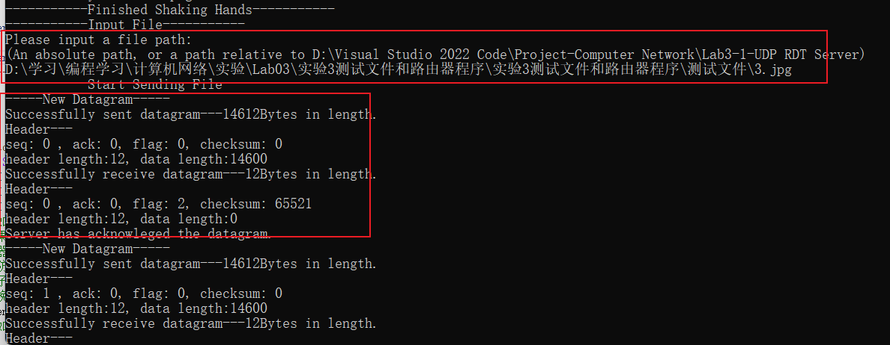

**成功发送后能够看到输出时间和吞吐率等信息，然后询问是否还要继续传输文件：**

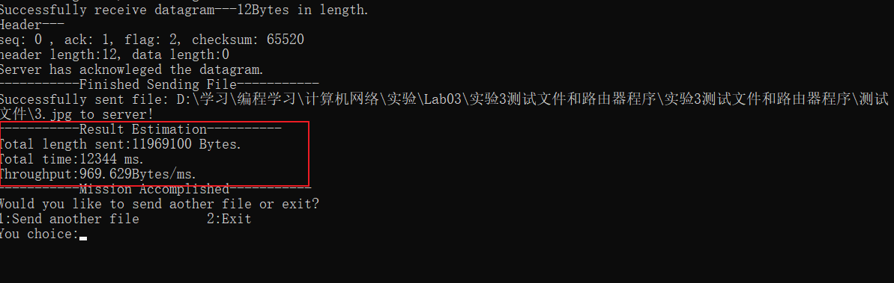

服务器端：**可以看到最后一个数据包和之前的数据包不一样大，成功接收到了文件，然后实现了在一个地址写入在我的本地github仓库下，然后最后开始重新回去等着消息。**
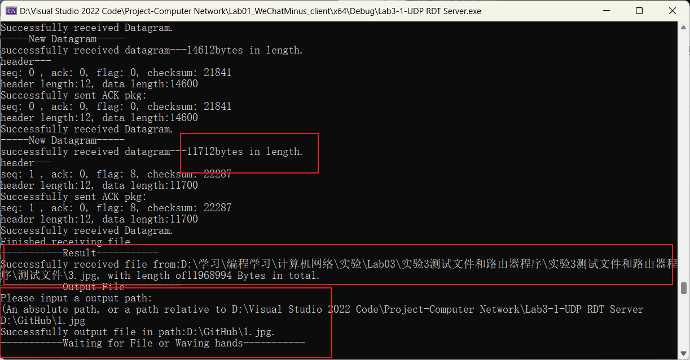

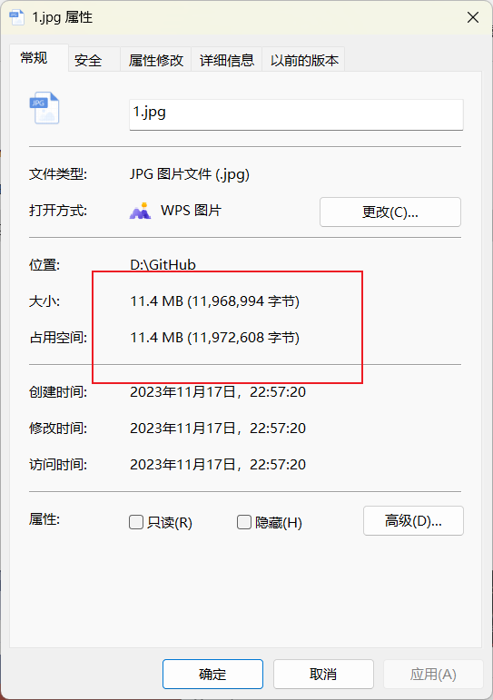


**可以看到文件大小没有变化，成功传输！不过文件名字写错了，其实应该是3.jpg。**

**之后使用helloworld.txt重新传输，一样重新开始了！传输成功，同样放在github路径下查看！**

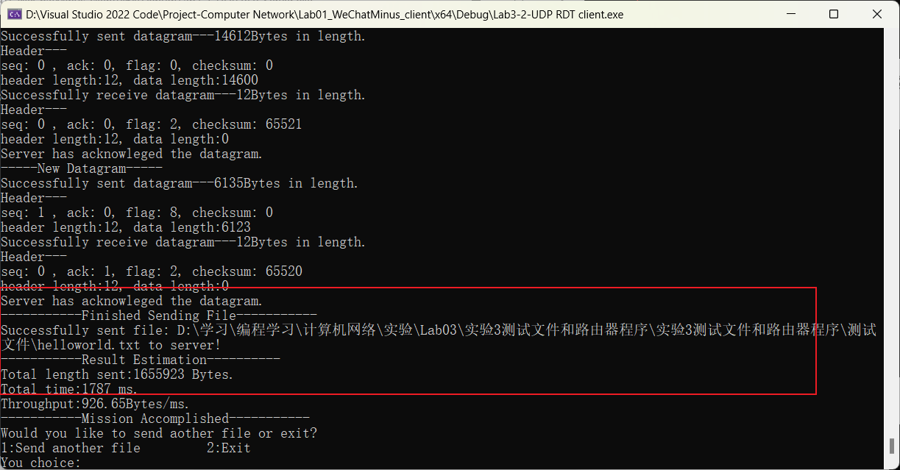

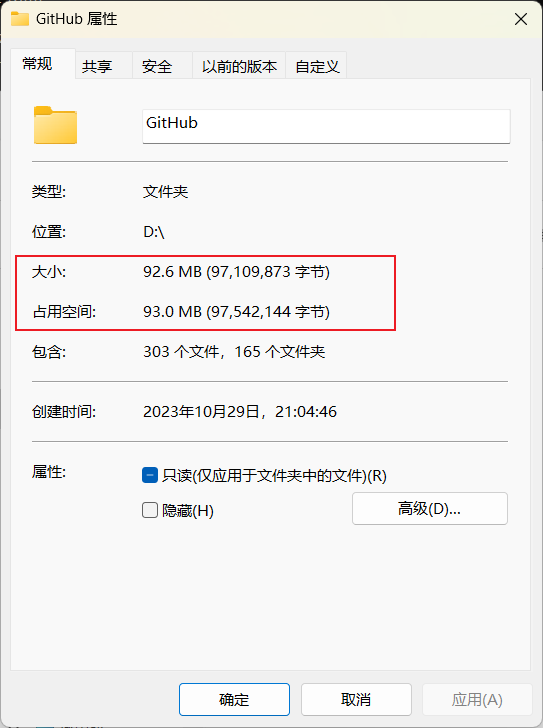

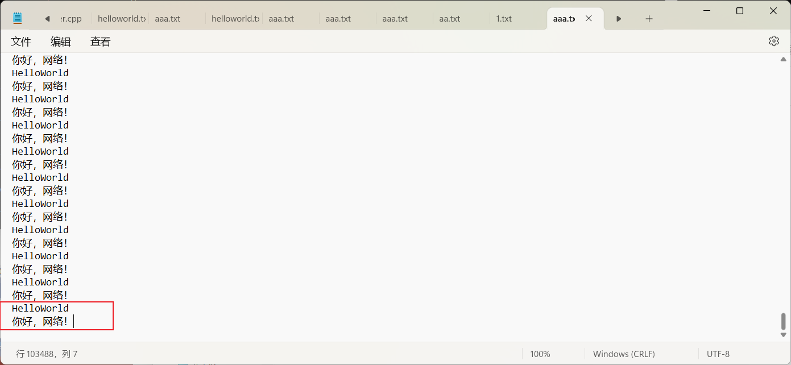

**同样看到大小没变，也能够正常显示中文！**

2.延时传输：通过相对论方法测试——

可以看到客户端重传的信息和服务器端收到的序列号数据包相同后抛弃的行为，仍然传输成功！

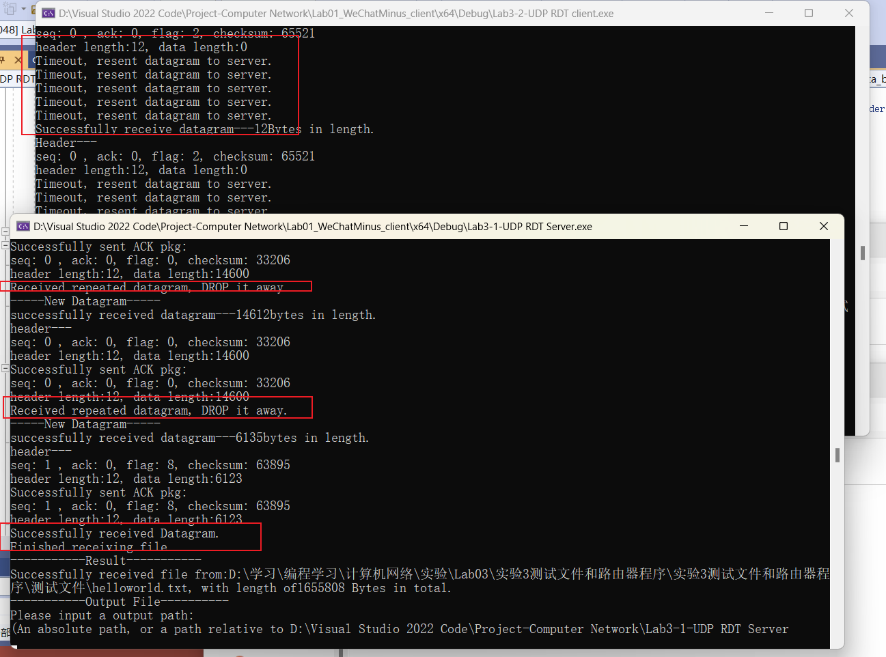

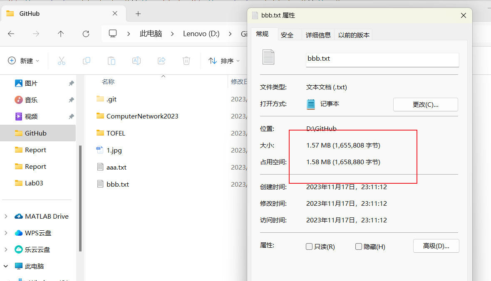

**同样大小内容正确！实现成功！**

**3.丢包：握手，传输和挥手都进行了丢包！**

**可以看到完整的握手丢包过程，仍能够正常握手。**

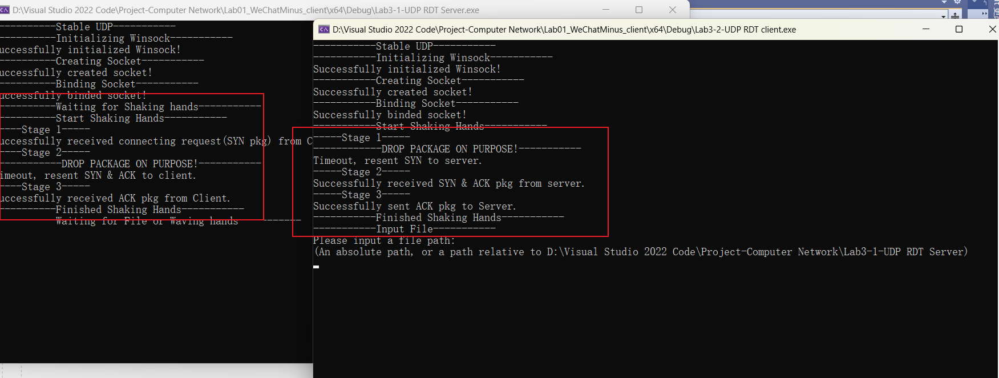

**传输过程使用测试文件2：也能看到正常的丢包和重传！**

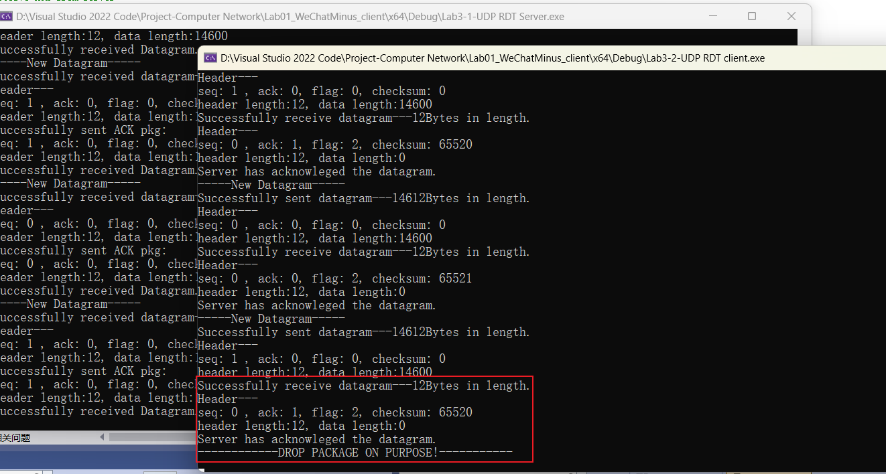

**也能看到文件大小没有变化，正常打开！**

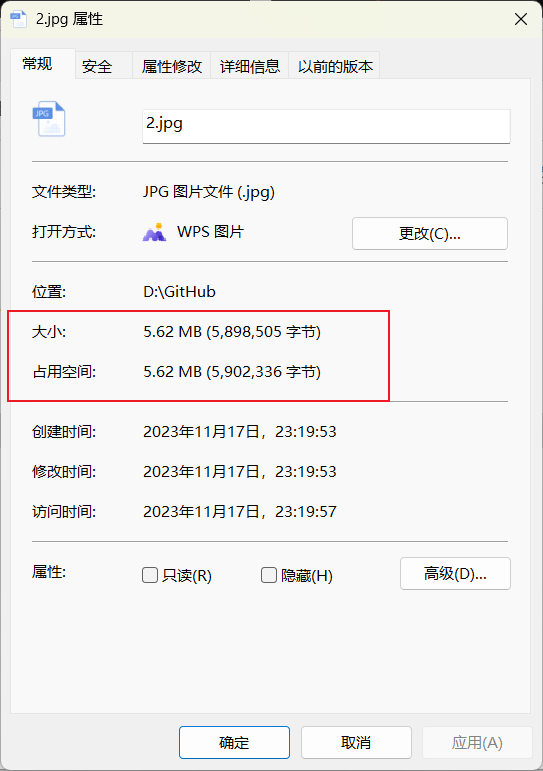


**挥手过程，也能看到对应的丢包和重传。并且完成了挥手。**


**<font size=3, color="red">综上所诉，对所有功能都进行了测验，均证明实现非常成功！</font>**

### **6 实验反思与总结**

#### 6.1 实验总结

**本次实验通过在不可靠的UDP上实现面向连接的可靠单向传输，实现了：**

* **建立连接、差错检测、接收确认、超时重传**
* 流量控制采用**停等机制**

* 日志输出以及延时和丢包测试
* **Keep-Alive**一次握手多次传输

#### 6.2 实验改进方向

本次实验虽然完成了全部的实验要求，并且进行了深度的探索，但具体而言，仍有一些疑问和有待改进的地方：

* 为什么设计成私有类型的checksum在赋值时候会出现错误：至今还没有解决为直接变为0，即使我把数据类型都改为u_short也没有用。
* HTTP协议的状态码：可以考虑加入类似于HTTP1.1中更多的OK那种状态码。
* 数据包格式中加入IP和端口号等。
* Keep-Alive机制必须得服务器端输出完文件后才能进行挥手，否则有问题。
* **和助教学长讨论时候发现，我把序列号按照RDT3.0设计的两个序列号导致了数据连续传输无法区分，后面Lab03-02开始的滑动窗口需要进行修改！**

#### 6.3 实验总结与收获

总的来说，**本次实验通过亲自在不可靠的UDP上实现可靠传输，对其中过程和很多错误处理机制都进行了实现，让我收获颇丰。**

通过和助教学长的讨论也让我再次明白了很多，**感谢助教学长与吴英老师，我会继续努力学习本课程，并在基础上发挥自己的创造力，探索更多可能性。**
