# Computer Network2023

## Lab03-02 **基于滑动窗口的流量控制机制+累计确认**

#### 学号：2111408	专业：信息安全	姓名：周钰宸

### 1 实验原理

​		之前在Lab03-01中我们实现了以RDT3.0为蓝本的可靠数据传输，基于停等机制的实现对于局域网来说够用了，**不过其仍然存在信道容量大时，利用率低的问题。还有0和1的序列号导致的数据顺序错乱等问题**。因此我们**引入由滑动窗口中的流水线协议带来的流量控制机制加上本次实验的累计确认GBN**，来更好地模拟在大的互联网的真实情景中**提高链路利用率的优势和保序传输，带来更加可靠稳定并且高效的传输。**

#### 1.1 滑动窗口

在介绍流水线协议前，先介绍一下**滑动窗口协议，它是一个更为通用的计算机网络协议。**

1. **发送缓冲区：**
   * 形式：内存中的一个区域，**落入缓冲区的分组可以发送**
   * 功能：用于存放已发送，但是没有得到确认的分组
   * 必要性：需要重发时可用
   * **缓冲区大小：**
     * 停等协议：大小为1
     * **流水线协议：大小大于1**，设置合理的值，不能很大，链路利用率不能够超100%
   * **发送缓冲区的分组：**
     * **未发送的（缓冲区中，但不在滑动窗口内部的）**：落入发送缓冲区的分组，可以连续发送出去；
     * **已经发送出去的、等待对方确认的分组（滑动窗口内部的分组）**：发送缓冲区的分组只有得到确认才能删除
   * **发送端的滑动窗口：**发送方维护一个窗口，这个窗口可以根据网络条件进行调整，**以实现流量控制**。其本质是**<font size=3, color="red">发送缓冲区内容的一个子集，那些已发送但是未经确认分组的序号构成的空间。本次实验实现过程也是遵循这个概念，即我的发送缓冲区是有固定大小的，而滑动窗口大小是会变化的。</font>**
     * 发送窗口的最大值<=发送缓冲区的值
     * 一开始：没有发送任何一个分组。即前沿=后沿，之间为发送窗口的尺寸=0。
     * **前沿移动：**每发送一个分组，前沿前移一个单位。发送窗口前沿移动的极限：不能够超过发送缓冲区 。
     * **后沿移动：**
       * **条件：收到老分组的确认**
       * **结果：发送缓冲区罩住新的分组，来了分组可以发送**
       * 移动的极限：不能够超过前沿

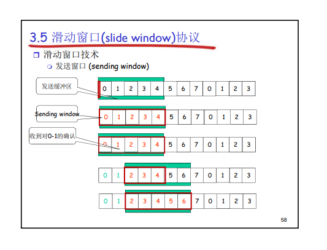

2. **接收缓冲区：**

   * **接收端的滑动窗口：<font size=3, color="red">对于接收者来说，接收缓冲区就等于接收端的滑动窗口。即二者大小一致。</font>**
   * 接收窗口用于控制哪些分组可以接收:只有收到的分组序号落入接收窗口内才允许接收；若序号在接收窗口之外，则丢弃。
     
   * **接收窗口尺寸Wr=1，则只能顺序接收（停等机制与GBN）；接收窗口尺寸Wr>1 ，则可以乱序接收（SR）。但提交给上层的分组，要按序。**
   * **接收端滑动窗口的滑动和发送确认：**
     * 滑动：
       * **低序号的分组到来，接收窗口移动；（停等机制与GBN）**
       * 高序号分组乱序到，**缓存但不交付（因为要实现RDT，不允许失序。即RDT的可靠要保证交付时的有序！），不滑动 （SR）。**
     * 发送确认：
       * **接收窗口尺寸=1 ； 发送连续收到的最大的分组确认（累计确认）。<font size=3, color="red">也是我们本次实验要实现的确认方式。</font>**
       * 接收窗口尺寸>1 ； 收到分组，发送那个分组的确认（非累计确认）
   

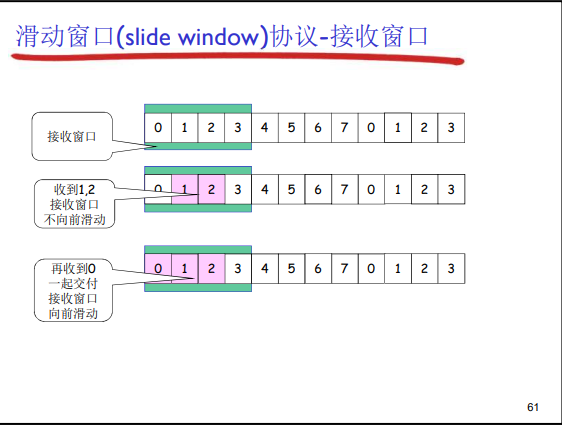

3. 总结：**根据上面所说，计算机网络领域的滑动窗口协议本质上是一个更为通用的协议，而根据发送方和接受方的滑动窗口大小的不同情况，进一步分化出了停等机制、流水线协议（GBN与SR）。**具体而言：

   * SW=1, RW=1:停等机制，RDT3.0；
   * SW>1, RW=1:流水线协议的累积确认GBN；
   * SW>1, RW>1:流水写协议的选择性重发SPR。

   **由于本次实验只涉及实现流水线机制中的GBN，所以后面只先介绍这二者。**

#### 1.2 流水线协议

从上面对滑动窗口协议的通用概念可知，**实际上流水线协议只不过是滑动窗口协议在发送方窗口大于1，接收方窗口等于1时的特例而已。**

1. **流水线：允许发送方在未得到对方确认的情况下一次发送多个分组，允许在发送方和接收方之间并行处理多个数据单元。**实际上**解决的根本问题是提高了链路的利用率，**将原本的RDT3.0中链路利用率不高的瓶颈转移为了链路的带宽本身。

2. **特点：**

   * **多个序列号：**

     * 在流水线协议中，当数据被分成多个阶段并并行处理时，存在可能导致**数据顺序错乱**的问题。通过增加序号的范围，可以确保接收方能够按照正确的顺序重组和处理数据。
     * 由于并行性的存在，可能会导致**某些数据被重复处理**。通过增加序号的范围，可以在接收方检测到重复的数据，并采取相应的措施，例如丢弃重复的数据，以确保数据的一致性。
     * **序号的范围还可以用于实现一些容错机制。**通过使用序号，系统可以更容易地检测和纠正错误，从而提高通信的可靠性。**<font size=3, color="red">具体而言，在传输数据包的过程中，不论是出现发送方发送的数据包丢失的超时重传机制；还是接收方ACK丢失的累积确认机制，都很好地解决了一些问题。我会在3.2.2中详细介绍。</font>**
     * 可以支持累积确认，只有多个序列号才能保证累积确认机制的合理性，由此来实现**保序的功能，进一步保证RDT的可靠性。**

     在Lab03-01中，由于我们只需要停等机制，**而对于停等机制只需两个序列号0和1即可区分。而这实际上具有着数据连续传输无法区分的隐患！因此流水线协议中为了保证RDT的有序性，引入了多个序列号，这也是本次实验为什么要用支持多个序列号的原因。**

   * 在发送方/接收方要有缓冲区：

     * 发送方缓冲：未得到确认，可能需要重传；
     * 接收方缓存：上层用户取用数据的速率≠接收到的数据速率；**接收到的数据可能乱序，排序交付（保证RDT的可靠！）**

3. **两种同样的流水线协议：回退N步(GBN)和选择重传(SR)。**

#### 1.3 GBN（Go-Back-N）累积确认协议

由于**本次实验中是要求实现流水线协议中的GBN**，因此这里就不对另一个流水线协议SR选择重传进行介绍了。具体而言：

1. **发送方：**允许发送端发出N个未得到确认的分组。发送端最多在流水线中有N个未确认的分

   组。

   * 发送方为发送出去的分组**保留副本**，直到来自接收方确认达到。

2. **接收方：**采用**累积确认**，只确认连续正确接收分组的最大序列号。即**<font size=3, color="red">无论收到的分组序列号是大于小于还是等于此时接收端窗口期待的序列号，都只发送连续正确接收分组的最大序列号，这便是累计确认的含义！同时也解决了确认过程中AC丢失的问题，方便了发送方的错误处理机制，详见3.2.2。</font>**

   * 发送方可能接收到重复的ACK。
   * 接收端如果发现gap，不确认新到来的分组。

3. 发送端设置定时器，定时器超时时，**重传所有未确认的分组。而对于GBN，发送端拥有对最老的未确认分组的定时器，实际上就是对发送缓冲区末端也就是发送端滑动窗口后沿的一个针对性定时器。**

   * 只需设置**一个定时器**。
   * 当定时器到时时，**重传所有未确认分组。即所有滑动窗口内容中的分组。**

### 2 实验要求

*在实验3-1的基础上，将停等机制改成**基于滑动窗口的流量控制机制**，支持**累积确认（Go Back N）**。流水线协议采用**多个序列号**。完成给定测试文件的传输。*

### 3 前期准备

#### 3.1 UDP报文设计

```
 0              7 0             7 0                            15
+---------------------------------------------------------------+
| 				          Sequence Number                       |
+---------------------------------------------------------------+
|                       Acknowledgment Number                   |
+---------------------------------------------------------------+
|                              Flags   							|
+---------------------------------------------------------------+
|                             Checksum							|
+---------------------------------------------------------------+
|                          	Data  Length                        |
+---------------------------------------------------------------+
|                           Header Length                       |
+---------------------------------------------------------------+
|                                                               |
|							  	                                |
|                               Data                            |
|								                       	        |
|                                                               |
+---------------------------------------------------------------+
```

本次实验的UDP报文由于需要保证16位的对齐和一些数值类型转换，出于时间原因，设计的比较简单。**具体而言：报文由12字节的定长报文首部和变长的数据部分组成。其中首部各字段含义如下：**

1. **Sequence Number：序列号（u_short 16位）。**仿照RDT2.1进行设计的机制。为了避免重传等错误采用。具体而言：
   * 普通传输：正常情况下采用**RDT2.1的单数位序列号0或者1**，两个状态进行轮转即可。
   * 挥手过程：挥手过程中设计使用**随机序列号设计**，即产生一个范围在0-256之间的序列号。
2. **Acknowledgment Number：ACK值（u_short 16位）。**仿照RDT2.2进行的设计。主要由标志位Flags中的ack标志位控制，当Flags标志位被置为1时，**ACK会用来体现最后正确收到的分组的序列号值，由此来替代NAK。**
3. **Flags：标志位（u_short 16位）**，暂时只是仿照了TCP设计了**低五位**，未来会继续拓展。具体而言：
   * **SYN：0x1**，用来建立连接的握手过程中用来建立连接。
   * **ACK：0x2**
     * 用来控制ACK值是否有效；
     * 用来在握手，挥手包括停等机制时，其中一方发送告诉另一方能够正确收到。
   * **FIN：0x4**，用来在挥手过程中客户端告诉服务器端是否结束连接，开始挥手
   * **LAS：0x8，**自行设计，**用来发送方在最后一个数据包中加入告诉服务器端这就是发送的文件最后一段了，发送文件即将结束。**
   * **RST：0x16，**仿照TCP的状态位设计，当**连接需要由于某种原因立即终止时**，一个设备可以发送一个设置了RST位的报文。具体而言：
     * 出现异常连接情况，例如SOCKET_ERROR。
     * **建立连接过程中：服务器端在发送了SYN+ACK后，收到ACK前，如果提前收到了数据包，会担心出现后续事故。提前终止连接。**
4. **Checksum：校验位（u_short 16位）**，具体来说会初始化为0，整个报文补0之后，通过16位的二进制的反码求和计算，将计算结果取反后写入校验和域段。**用来确定接收到的数据报文包括Data和Header是否存在位错误的情况，实现差错重传机制。**
5. **Data  Length：数据段长度（u_short 16位）**，用来记录每次传输的可变数据段的数据长度，
6. **Header Length：报文头部长度（u_short 16位）**，用来记录每次传输的数据包的头部长度。

本次**由于时间不足，数据包格式设计的较简单，一些伪首部和TCP的状态码等均没有体现，会在未来进行不断完善。**

#### 3.2 协议设计

#### 3.2.1 三次握手（建立连接）

**这里和Lab03-01没有丝毫变化，可以跳过。**


这里建立连接的时候**我采用的就是仿照TCP的三次握手进行设计，**不过没有使用其中随机的客户端和服务器端的数据包序列号生成和ACK=序列号+1的验证机制。未来有待完善。

1. 客户端想要与服务器建立连接, 于是向服务器发送SYN报文请求连接。服务器知道客户端能够发送。
2. 服务器收到客户端的连接请求之后, 服务器向客户端发送确认报文ACK及请求连接报文SYN。让客户端知道服务器能够接收并且能够发送。
3. 客户端收到服务器的连接请求, 向服务器发送确认报文ACK。在服务器接收到ACK之后,服务器知道了客户端能够发送。

至此实现了客户端和服务器端都确认了彼此可以正常发送和接收数据，然后就可以开始正常通信了。**不过在这个过程中也可能存在超时或者丢包的情况，实际上都进行了多种异常情况的处理，具体处理详见我上次报告Lab03-01的4.3.2部分。**

#### 3.2.2 数据传输

这部分是本次修改的重点，通过将**停等机制改为基于滑动窗口的流量控制机制，并支持GBN的支持累积确认。**

1. **滑动窗口：**
   * 客户端（发送方）：客户端的**发送缓冲区大小一次传输过程中固定（4-36）**，而**滑动窗口大小**即sendbase与nextseqnum之前部分，可以变化。
   * 服务器端（接收方）：由于GBN是流水线协议中的接收方窗口（也就是接收端缓冲区）大小为1的特例，**因此本次实现数据传输也是基于此实现，接收方窗口即接收端缓冲区大小为1。**

2. **GBN累积确认：**

   * 客户端（发送方）：**采用GBN的发送方拓展有限状态机。具体流程如下图：**

     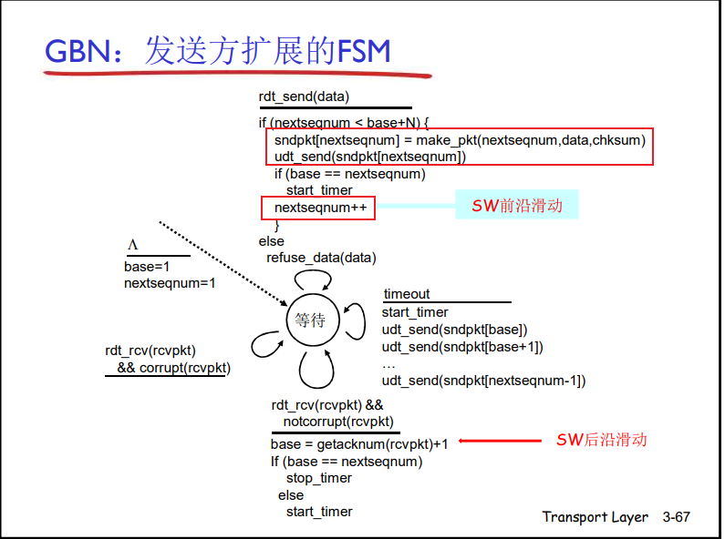

     不过**我在真正实现过程中修改了红框圈出来的两处位置的流程顺序，即我会先通过nextseqnum++和一些容器的变化让接收方的滑动窗口前沿滑动，然后再发送对应的数据包。<font size=3, color="red">这实际上是因为多线程的实现所带来的无法避免的问题之一，不过对整个状态机来说无伤大雅。具体我这么做的原因详见4.5的2。</font>**

   * 服务器端（接收方）：**同样采用接收方拓展的有限状态机。具体流程如下图：**

     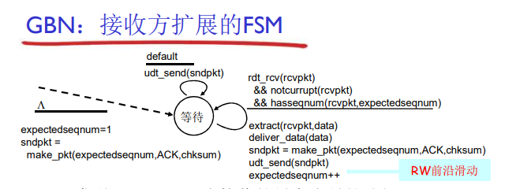

     * **<font size=3, color="red">只发送ACK：对顺序接收的最高序号的分组！</font>**
       * 可能会产生重复的ACK
       * 只需记住expectedseqnum；**只一个变量就可表示接收窗口**
     * **对乱序的分组：**
       * 丢弃（不缓存） 。**在接收方不被缓存！**
       * 对顺序接收的最高序号的分组进行确认-累计确认 。

   * **<font size=4, color="red">错误处理：</font>**在流水线协议的GBN状态机在数据传输过程中，仍然可能**存在一些错误情况的发生，不论是丢包还是延时**。不过实际上多亏于GBN和滑动窗口协议的合作，让**所有错误处理机制都能够顺利完成，不会出现死锁的情况。**具体而言：
     
     * **客户端**发送端，发送过程中**数据报**：
     
       * **丢失**：假如在滑动窗口发送数据报的过程中，其中**某个数据报文发生了丢失**，那么窗口内在其之前的报文都会正确抵达接收端并被接收并回复ack。而**由于中间出现了gap**导致expected_seq_num会停在丢失的分组上，接收端滑动窗口也会停在expected_seq_num之前，**对之后的分组全部丢弃，并仍然只发送ack到expected_seq_num-1。这时发送端可能会收到重复的ack。**
     
         此时由于expected_seq_num之前的分组都被确认了，在发送端对于expected_seq_num之前的滑动窗口分组会被删除，**而对于丢失的分组，会由于一直接收不到对应的ack，最终超时重传全部expected_seq_num及之后的分组！解决问题**。
     
       * **延时**：假如在滑动窗口发送数据报的过程中，其中**某个数据报文发生了延时。**那可能会导致接收端提前收到该报文之后的数据报（这些没被延迟），但是会由于延迟的那个报文没收到而丢弃他们也不ack他们。只发送ack到expected_seq_num-1。当接收端最后收到了，再回复这个ack时候可能也晚了（相当于ack也被延时了）。发送端迟迟接收不到expected_seq_num的ack，**最终超时重传全部expected_seq_num及之后的分组！解决问题**。
     
     * **服务器端**接收端，发送**ack**：
     
       * **<font size=3, color="red">丢失</font>**：假设客户端端一口气发送了2，3，4，5。全部正确达到接收端并被正确收到。**但是此时接收端也就是服务器端回复某个报文的ack丢了，假如是3，但是4和5的ack没丢。**此时对于客户端来说，**他虽然没收到3的ack，但他不会滑动窗口后沿就停止在3**，**因为<font size=3, color="red">累积确认</font>的效果，导致接下来收到4的ack，他知道3一定被正确收到了，不然接收端不可能发送4的ack**（也不可能是位错误，不然校验和会出错）。<font size=3, color="red">**所以他会一口气把滑动窗口后沿中在4之前的（包括即使没收到ack的3）一起删除！**</font>这也就解决了问题。
     
         而如果**极端一点**，3，4，5的ack都丢了，即使现在接收端已经在等6了，不过由于发送端会**超时重传所有的3，4，5**。接收端虽然会丢弃这些3，4，5，**但仍然会回复正确收到的最大分组序列号5的ack，也就让发送端滑动窗口中的分组都一口气能够被删除了。**
     
         **可以看到，累积确认的效果很好地解决了之前RDT3.0中可能因为ack丢失导致的问题。**
     
       * **延时**：假设客户端端一口气发送了2，3，4，5。全部正确达到接收端并被正确收到。此时有某个服务器端回复的ack发生了延时，后面的ack都没有延时到达。**那么实际上和这个ack丢失的情况一样，由于累积确认的效果**，客户端只需要一并删除即可；而如果后面的ack也延时或者丢失了，**导致的结果和上面情况也一样**，最终发送端超时重传所有分组，接收端回复一个最大分组序列号的ack就可以带走他们所有人啦。

3. **<font size=5, color="red">多线程：</font>**

   **<font size=3, color="red">上面的状态机虽然说起来简单，不过具体实现起来必须要采用多线程的机制，</font>**而和上次Lab03-01中停等机制不一样。**具体原因如下：**

   * **RDT3.0的停等机制中**，不论是发送方还是接收方，不论是握手，发送数据还是挥手，任何阶段出现了数据包丢失的情况进行超时重传都**只需要一个while死循环下的非阻塞模式+recv_from即可**。这是因为他们每个人在任何时刻都是**基于停等机制，即发送完一个东西后，只需要接收到新消息才需要再次发送，而不需要在等待接收的时候一直发送。**
   * **但是引入了流水线协议后后则不尽相同！**
     * **接收方**还是与RDT3.0中相同即只需要等待即可，因为他只需要等待接收自己此时窗口正在等待的数据包，**他在等待时候不需要做任何事。换句话说，他所要做的任何事（包括发送ACK）都是在他接受到东西之后，而不是接收到东西的同时。**因此对于接收方节服务器端，其无需多线程，仍然用一个while即可。
     * **<font size=3, color="red">发送方（客户端）则必须使用多线程的机制！这是因为和接收方不同，流水线协议的要求，强调了发送方不能发完一个数据包后就在那傻等，还需要与此同时接着发送数据包，流水线协议本身容许发送方在未得到对方确认的情况下一次发送多个分组。因此它的接收和发送要在同时进行，只使用一个while就不在足够了。必须和Lab1的多人聊天室一样，基于多线程保证能够同时发送和接收消息。</font>**因为如果还是那样while死循环下的非阻塞模式+recv_from，然后在while循环了继续发送，可能导致发送过程中while循环没结束，这时候recv_from已经返回-1了，**此时不会同时接收，就会出现ACK包丢失的情况！**
     * **握手和挥手：对于发送方和接收方，不论是谁，在握手和挥手阶段本质上都是基于的停等机制**，他们在干完一件事后只需要等待对方的回复，回复后再干另一件，因此此处的超时重传之间用while死循环下的非阻塞模式+recv_from即可。
   * 除此之外，**本次实验我还额外引入了一个专门用来打印日志的日志线程，具体详见4的核心代码讲解部分。**
   
4. **<font size=4, color="red">锁机制：</font>**

   **由于本次实验需要涉及多线程，而多线程如果需要进行彼此的通信就一定需要全局变量，而全局变量一旦在多线程中出现，反而又涉及竞争的问题！**即不能同时对其进行读写。因此本次实验中设计采用了锁机制来避免竞争。

   **除了传统定义的全局变量外，实际上还有一个隐式的全局资源，那就是我们的控制台！**在多线程同时向控制台打印日志时候，也会出现混乱的问题，**为了避免此问题，我也引入了锁机制，甚至最后决定使用单独的线程解决。具体我这么做的原因详见4.5的1。**

#### 3.2.3 两次挥手（关闭连接）

**这里和Lab03-01加入了有一些变化，我用黑体加粗。**

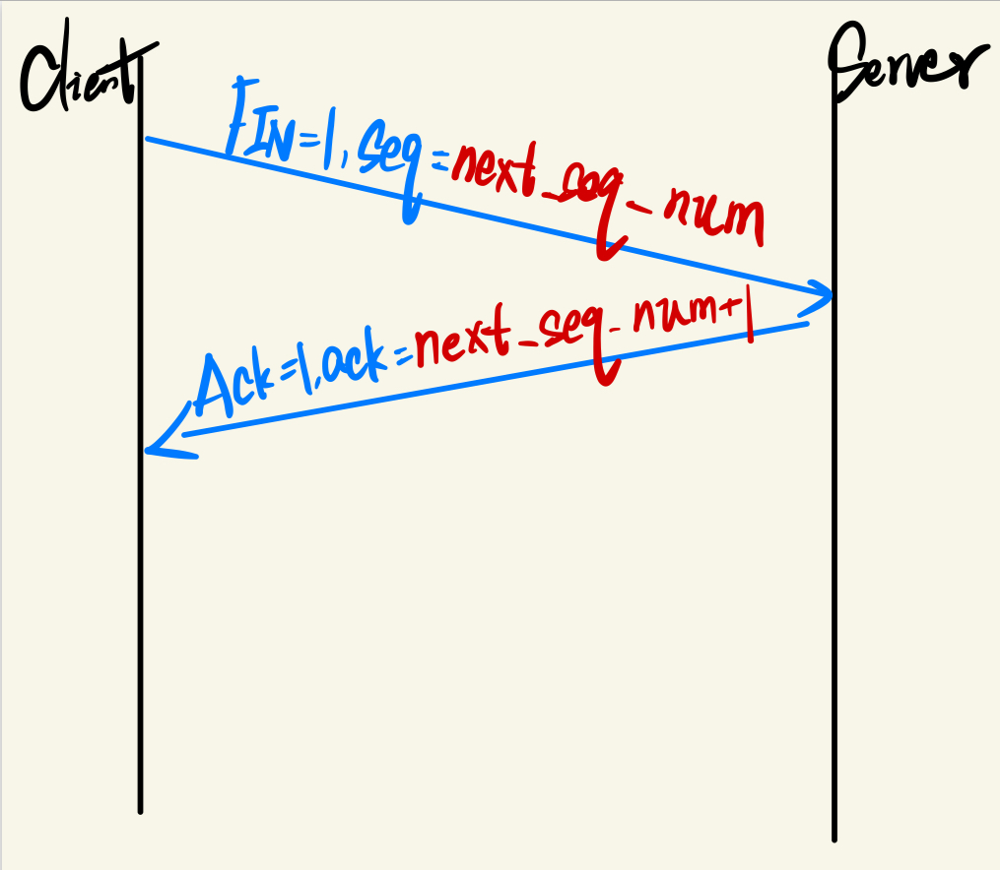

对TCP的四次挥手进行了改进，只保留了两次挥手，这是因为：

* TCP第三次挥手的目的是服务器端会把剩余没传输完的数据传完，而如果对于本次实验服务器端本身就不会传输数据的情况，没必要进行第三次挥手；
* 同样TCP第四次挥手是对第三次挥手的ACK，由于根本没有第三次挥手，因此第四次也不需要；

除此之外，在发送端和接收端都知道发送完毕（接收端通过最后一个包的LAS标志位）准备开始挥手后：

1. **第一次挥手：**客户端（发送方）向服务器端（接收方）**发送FIN=1，seq=nextseqnum的数据包，即“假装”此数据包放在了发送方的滑动窗口的新位置，是最后一个发送的数据包序列号+1；**
2. **第二次挥手：**服务器端（接收方）接收到了客户端（发送方）的FIN报文后，**回复ACK=1，ack=nextseqnum+1的数据包，回应对方自己收到了刚才的FIN报文。**挥手结束。

#### 3.2.4 Keep-Alive

基于HTTP应用层的Keep-Alive机制，即一次连接多次传输，**本次在实现了UDP基本的可靠传输后额外实现了Keep-Alive机制。具体而言，就是在经历三次握手后，可以一直发送文件，直到客户端主动退出，才会进行挥手，关闭连接。**

### 4 实验过程及代码讲解

**<font size=3, color=red>由于Lab03-01已经搭好了大部分的框架，因此本次在此处只重点介绍改动的核心部分（加粗）。</font>**

#### 4.1 头文件

在头文件中，我包含了一些对特殊类和宏常量等的处理，接下来结合代码详细说明，**这里同样只重点说明改动部分：**

1. 宏常量：Flags标志位的对应常量值，只使用低五位。**这里没有变化。**

   ```c++
   //Flags currently using the last six spots
   #define SYN 0x1
   #define ACK 0x2
   #define FIN 0x4
   #define LAS 0x8
   #define RST 0x10
   ```

2. 一些特殊的宏常量，**这里只有一个删减，就不展示代码了。**

   * MSS：即仿照TCP的数据段的最大长度进行设计，用于分组传输文件。MSS的值为14600字节，这意味着每个 TCP 数据段的数据部分的最大长度为14600字节。
   * UDP_SHAKE_RETRIES 10：即握手过程中超时重传最大次数，默认为10。
   * UDP_WAVE_RETRIES 10：即挥手过程中超时重传的最大次数，默认为10。
   * MSL：即仿照TCP报文的最大生命周期进行设计，一个来或者回的过程。使用计量单位是CLOCKS_PER_SEC宏常量，即每秒钟的时钟周期数。
   * PATIENCE CLOCKS_PER_SEC * 1000：用于客户端出现异常太久没有发来消息不论是挥手还是新的文件数据报文（可能是在输入文件路径）。为了避免死锁，服务器端主动结束。

   **删除了MAX_SEQ 256**，原来用处是在挥手过程中采用的序列号，默认最大值是256。**这里挥手改用了next_seq_num，不再采用随机序列号的形式。**

3. Header类：包含了所有需要用到报文头部的分段，包含构造函数和获取函数等。**同样没有变化，直接上代码。**

   ```c++
   #pragma pack(push)
   #pragma pack(1)
   //1Byte align，make it convenient to transfer to char* buffer
   class Header {
   public:
   	u_short seq;
   	u_short ack;
   	u_short flag;
   	u_short checksum;
   	u_short data_length;
   	u_short header_length;
   public:
   	Header() {};
   	Header(u_short seq, u_short ack, u_short flag, u_short checksum, u_short data_length, u_short header_length) :
   		seq(seq), ack(ack), flag(flag), checksum(checksum), data_length(data_length), header_length(header_length) {}
   	u_short get_seq() {
   		return seq;
   	}
   	u_short get_ack() {
   		return ack;
   	}
   	u_short get_flag() {
   		return flag;
   	}
   	u_short get_checksum() {
   		return checksum;
   	}
   	u_short get_data_length() {
   		return data_length;
   	}
   	u_short get_header_length() {
   		return header_length;
   	}
   
   };
   #pragma pack(pop)
   //Resume 4Byte align
   ```

4. **Datagram类：**

   **新加入的类即数据包**，之前在RDT3.0中，由于每次超时重发只需要发还在发送缓冲区send_buff中的一个数据包即可，而无须重发多个数据包，因此当时数据部分没有显示地进行保存，而是选择直接保存在发送的缓冲区的后面。

   **不过引入了流水线机制后，有必要将之前发送的数据包显式保存一个副本，因此定义Datagram数据包类。由Header和data[MSS]即数据内容组成。同样注意需要保持一个字节的对齐。**

   ```c++
   /align 1Byte same as Header
   #pragma pack(push)
   #pragma pack(1)
   //Datagram = Header + data
   class Datagram {
   public:
   	Header header;
   	char data[MSS];
   public:
   	Datagram() {};
   	Datagram(Header header, char* data) :header(header) {
   		memcpy(this->data, data, header.data_length);
   	}
   };
   #pragma pack(pop)
   //Resume 4Byte align
   ```

5. **SendBuffer类：**

   **在发送方（客户端）显式地定义了一个类叫做发送缓冲区类**，用来保存send_base等变量，同时保存滑动窗口，还使用了一个锁，具体而言：

   * 成员变量：
     * **u_short send_base：**即滑动窗口后沿，也是发送缓冲区的后沿。
     * **deque<Datagram*> slide_window：**由于考虑到在发送数据过程中，对于GBN来说，发送端的滑动窗口每次只会在窗口的前沿（这里理解为末尾）添加新的数据报，而如果有新的数据报被ack，那么它一定会从窗口的后沿（这里理解为开头）。**因此正好符合队列FILO的特征，选取双端对列是方便进行遍历。**
     * **u_short next_seq_num：**即滑动窗口后沿的下一个数据报位置。
     * **mutex buffer_lock：由于可能会有多个线程同时对全局变量（实际上是这个SendBuffer的唯一实例里面的成员变量）读或者写，为了避免竞争，对其操作前后进行锁。**

   * 成员函数：

     * Sendbuffer()：**按照状态机，send_base和next_seq_num需要初始化为1。**
     * **back_edge_slide()：滑动窗口后沿滑动，send_base变化，容器pop。**
     * **front_edge_slide(Datagram* datagram)：滑动窗口前沿滑动，next_seq_num变化，容器push。**

     **<font size=3, color="red">以上所有操作前后均需要加锁和解锁。</font>**

   ```c++
   //Sender Buffer
   class Sendbuffer {
   private:
   	u_short send_base;
   	//slide window is between send_base and next_seq_num
   	deque<Datagram*> slide_window;
   	u_short next_seq_num;
   	//usable, not sent data are actully in send_buffer but not stored
   	//because we don't need to store them, it just need to be put in send_buff and send to server,
   	//and then put in slide_window
   	mutex buffer_lock;
   public:
   	Sendbuffer(){
   		send_base = 1;
   		next_seq_num = 1;
   	}
   	u_short get_send_base() {
   		return send_base;
   	}
   	void set_send_base(u_short send_base) {
   		buffer_lock.lock();
   		this->send_base = send_base;
   		buffer_lock.unlock();
   	}
   	void back_edge_slide() {
   		//lock it first
   		buffer_lock.lock();
   		slide_window.pop_front();//dqueue front go out
   		send_base++;
   		buffer_lock.unlock();
   		//send_base = new_base;
   	}
   	void front_edge_slide(Datagram* datagram) {
   		//lock it first
   		buffer_lock.lock();
   		slide_window.push_back(datagram);//put in the queue end
   		next_seq_num++;
   		buffer_lock.unlock();
   		//next_seq_num++;
   	}
   	deque<Datagram*>& get_slide_window() {
   		return slide_window;
   	}
   	u_short get_next_seq_num() {
   		return next_seq_num;
   	}
   	void set_next_seq_num(u_short next_seq_num) {
   		buffer_lock.lock();
   		this->next_seq_num = next_seq_num;
   		buffer_lock.unlock();
   	}
   };
   ```

6. **Timer类：**

   由于本次实验涉及多次对计时器进行开始结束，判断是否超时的操作**，因此定义一个Timer类来封装一些操作，同样是使用一个锁在操作成员变量前加锁和解锁，避免竞争。**内容较简单，唯一值得注意的是**我初始化设定：timeout = 2 * MSL，即一个来回。**

   ```c++
   //Timer
   class Timer {
   private:
   	clock_t start_time;
   	bool started;
   	int timeout;
   	mutex timer_lock;//For case of multi-thread, the same timer could be operated by different threads
   	//So we need to lock it to avoid competition
   public:
   	Timer() {
   		started = false;
   		timeout = 2 * MSL;//before udp_2msl is set, use default 2 seconds
   	}
   
   	Timer(int timeout) {
   		started = false;
   		this->timeout = timeout;
   	}
   	int get_timeout() {
   		return timeout;
   	}
   	void set_timeout(int timeout) {
   		timer_lock.lock();
   		this->timeout = timeout;
   		timer_lock.unlock();
   	}
   	void start(int udp_2msl) {//start timer
   		timer_lock.lock();//lock it first
   		start_time = clock();
   		started = true;
   		timeout = udp_2msl;//using current udp_2msl to estimate timeout
   		timer_lock.unlock();//unlock it
   	}
   	void start() {
   		timer_lock.lock();
   		start_time = clock();
   		started = true;
   		timer_lock.unlock();
   	}
   	bool is_timeout() {
   		timer_lock.lock();//lock it first
   		if (started) {
   			if (clock() - start_time > timeout) {
   				timer_lock.unlock();
   				return true;
   			}
   			else {//not timeout
   				timer_lock.unlock();
   				return false;
   			}
   		}
   		else {//timer not started
   			timer_lock.unlock();
   			return false;
   		}
   	}
   	void stop() {//stop timer
   		timer_lock.lock();
   		started = false;
   		timer_lock.unlock();
   	}
   
   };
   ```

7. **全局变量：**

   * **Client端：这里同样还是只重点说我改动的。**

     * **send_buffer_size：**全局变量缓冲区大小，可以在输入数据之前设定。
     * **send_over：**由于我采用了多线程的技术，其实接受线程一直在while中recv_from，为了能让它及时退出。不能单纯地使用base=next_seq_num判断，因此其实这种情况十有两种可能的（详见注释）。**因此需要一个额外的全局变量控制线程退出，用于多线程的通信。**
     * **mutex log_lock：**前面我提到过，实际上控制台也是一个全局变量会被线程竞争，这个用于作为全局的日志互斥量。**实际上全局的互斥量虽然可以保证其本身就是线程安全的，不会被打断或者同时访问。不过经过我后面的实验发现，日志还会出现打印混乱的情况。因此后面我使用了打印线程来进一步解决。**
     * **Packet_loss_range**：我这次把丢包率调整为了可以输入控制，全局变量。便于丢包测试。
     * **Latency_param**：同样地我把延时也作为全局变量来测试延时。不过这里我采用的还是和上次一样的相对论的形式。
     * **deque`<string>` log_queue**：**消息队列，用于日志线程。**
     * **log_queue_mutex**：日志消息队列的锁。
     
     ```c++
     deque<string> log_queue;//log queue for multi-thread
     mutex log_queue_mutex;//lock for log queue
     
     //GBN
     Timer client_timer;
     Sendbuffer send_buffer;
     //Maxium size of send buffer
     int send_buffer_size;
     
     //Mutex
     mutex log_lock;
     /*
     Global variable: for mutil-thread communication
     Distinguish in the case(base=next_seq_num) :
     (1)All acked, remained pkg in the send_buffer need to be sent——send_over=false
     (2)All acked, and there are nothing remaining——send_over=true
     */
     bool send_over=false;
     
     //Packet loss test(Absolute)[0-99]
     int Packet_loss_range;
     //Latency(Relatively)[0-1]
     double Latency_param;
     ```
     
   * Server端：只有**Packet_loss_range和一个对应GBN状态机的expected_sequence_num**。其它和上次没有变化。

     ```c++
     u_short expected_sequence_num = 1;
     
     
     //Packet loss test(1-100)
     int Packet_loss_range;
     ```

8. **发送端缓冲区：<font size=3, color="red">由于我理解的滑动窗口和实验要求中的存在一定区别，但实际上没有任何影响，依然是可靠的。不过我在这里还是再次强调下我的缓冲区结构——</font>**

   * **file_data_buffer：即文件数据缓冲区**，存在整个文件内容加上文件名的全部。
   * **send_buffer：即发送缓冲区**，具有**固定大小（4到32）**，由全局变量send_buffer_size控制，并且落入其中的数据包分为两个部分：已发送但是未确认的以及可用但还没发送的。
   * **sliding window：即滑动窗口**，其中前沿是send_base，后沿的下一个是next_seq_number。其中包含的数据包都是那些已发送但是未确认的，**大小会不断变化。**
   * **send_buff：用于发送某个分组时候的临时缓冲区**。

   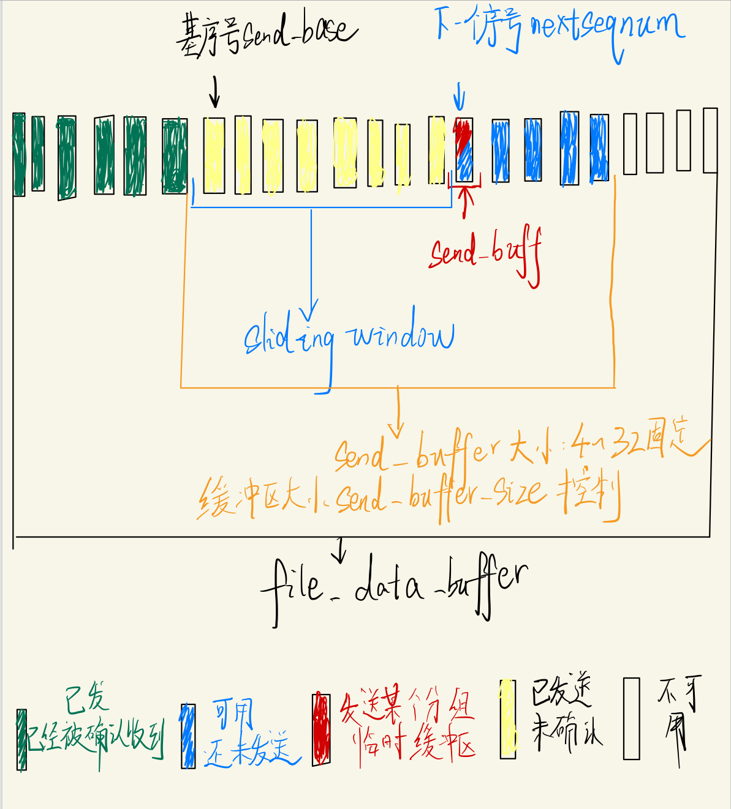

   
#### 4.2 握手和挥手

1. 客户端和服务器端的握手部分和之前Lab03-01没有任何改变，不再赘述，详见上次报告。

2. 客户端和服务器端的挥手部分都只有一个变化，即引入了next_seq_number作为发送FIN的序列号：

   ```c++
   	u_short fin_seq=send_buffer.get_next_seq_num();
   	Header fin_header(fin_seq, 0, FIN, 0, 0, sizeof(Header));
   ```

3. **超时传输：**就像我们前面介绍过的，在握手和挥手过程中出现的**超时重传机制无需改动，只需要非阻塞模式+while(true)+recv_from即可，原因就是它们在等待时候不需要进行发送。所以无需多线程实现这部分**：

   ```c++
   //non-block mode
   	u_long mode = 1;
   	ioctlsocket(clientSocket, FIONBIO, &mode);
   	sockaddr_in tempAddr;
   	int temp_addr_length = sizeof(sockaddr_in);
   	//Recv
   	Header recv_header;
   	//Start clock
   	clock_t start = clock();
   	//Wait for ACK
   
   	/*
   	* Same case while shaking hands
   	* There is no pipeline protocol while waving hands
   	* So there is no need to implement multi-threading
   	* While sentence is enough
   	*/
   	while (true) {
   		while (recvfrom(
   			clientSocket,
   			recv_buff,
   			sizeof(recv_header),
   			0,
   			(sockaddr*)&tempAddr,
   			&temp_addr_length
   		) <= 0) {
   			if (clock() - start > 1.2 * udp_2msl) {
   				if (max_retries_times <= 0) {
   					cout << "Reached max times on resending FIN." << endl;
   					cout << "Waving Hands Failed!" << endl;
   					cout << "-----------Stop Waving Hands-----------" << endl;
   					mode = 0;
   					ioctlsocket(clientSocket, FIONBIO, &mode);
   					return;
   				}
   				log = sendto(
   					clientSocket,
   					send_buff,
   					sizeof(fin_header),
   					0,
   					(sockaddr*)&serverAddr,
   					sizeof(sockaddr_in)
   				);
   ```

#### 4.3 数据传输

1. **客户端（发送方）：**

   * **void send_data(string file_path)：**和之前一样是通过文件路径获取文件内容，写入file_data_buffer中，不过这次**为了引入多线程等机制进行了一些改动**，具体而言：

     * **CreateThread启动recv_thread_main接受线程和log_thread_main日志线程。**
     * while等所有数据都被ack
     * **send_over = true通知接收线程和日志线程退出，多线程通信**
     * **WaitForSingleObject**：阻塞当前线程，等到那两个线程都结束了，再去后续处理和挥手。

     ```c++
     void send_data(string file_path){
         /*...blablabla...*/
         //Start receving thread
     	HANDLE recv_handle = CreateThread(NULL, 0, recv_thread_main, NULL, 0, NULL);
     	//Start log thread
     	HANDLE log_handle = CreateThread(NULL, 0, log_thread_main, NULL, 0, NULL);
          /*...blablabla...*/
     	while (curr_pos < total_length) {
     		int pkg_length = total_length - curr_pos >= MSS ? MSS : total_length - curr_pos;
     		bool last = total_length - curr_pos <= MSS ? true : false;
     		rdt_send(file_data_buffer + curr_pos, pkg_length, last);
     		curr_pos += MSS;
     	}
         //这时候已经都发完了，但是还需要等到滑动窗口大小变为0，即把没有ack的都ack才能退出，保证没有剩余数据包没到client了
         while (send_buffer.get_slide_window().size() != 0) {
     		continue;
     		//Wait for all the remaining pkg to be sent,then you can leave
     	}
         //Communicate with recv_thread to make sure it's finished
     	send_over = true;
     
     
     	//Block current thread to wait for recv_thread to finish
     	WaitForSingleObject(recv_handle, INFINITE);
     	//the same for log_thread
     	WaitForSingleObject(log_handle, INFINITE);
     	/* blablabla */
     }
     ```

   * **void rdt_send(char* data_buff, int pkg_length, bool last_pkg)**

     利用每个分段后的数据报进行传输发送的函数，**也进行了一些改动**，具体而言：

     * **如果此时的next_seq_num大于等于send_base+缓冲区大小，则代表缓冲区满了，利用while阻塞；**
     * send_buffer.get_next_seq_num()设置seq，Datagram* datagram = new Datagram(send_header, data_buff)设置数据报文。
     * **如果此时next_seq_num等于send_base（此时还没前沿滑动），启动计时器，因为对于GBN来说只需要为最老的滑动窗口分组设置计时器，此时该要发送的正好是最老的。**之前都被ack完踢出去了。
     * 前沿滑动：调用接口front_edge_slide。
     * sendto发送datagram
     * **输出一些有关发送的数据报文的消息，包括显示发送缓冲区状态**。不过我前面说过我最后采用了**打印日志线程**的方式解决。所以我这里实际上不是直接cout到控制台，而是先lock_guard`<mutex>`锁住语句块，然后**通过log_queue.push_back的方式将输出的string字符串push到消息队列的末端。**

     ```c++
     void rdt_send(char* data_buff, int pkg_length, bool last_pkg){
         
         /* blablabla */
         //block the thread if the send_buffer is full
     	while (send_buffer.get_next_seq_num() >= send_buffer.get_send_base() + send_buffer_size) {
     		continue;
     	}
     	
         Header send_header(send_buffer.get_next_seq_num(), 0, flag, 0, pkg_length, sizeof(Header));
     	//Inititalize datagram with header and data
     	Datagram* datagram = new Datagram(send_header, data_buff);
         
         //Only start timer for the oldest pkg from the slide window
     	if (send_buffer.get_send_base() == send_buffer.get_next_seq_num())
     		client_timer.start();
         
         //Slide window front edge slides
     	send_buffer.front_edge_slide(datagram);
         /* blablabla */
         log = sendto(
     			clientSocket,
     			(char*)datagram,
     			pkg_length + sizeof(send_header),//total length
     			0,//no flags
     			(sockaddr*)&serverAddr,
     			sizeof(sockaddr_in)
     		);
     
     		if (log == SOCKET_ERROR) {
     			//重复五次，然后发送RST，结束...
     		}
         
         //打印一些消息，包括显示发送缓冲区状态
         {
     			lock_guard<mutex> lock(log_queue_mutex);
     			log_queue.push_back("-----New Datagram-----" + string("\n"));
     			log_queue.push_back("Successfully sent datagram---" + to_string(send_header.get_data_length() + send_header.get_header_length()) + "Bytes in length." + string("\n"));
     			log_queue.push_back("Header---" + string("\n"));
     			log_queue.push_back("seq: " + to_string(send_header.get_seq()) + " , ack: " + to_string(send_header.get_ack()) + ", flag: " + to_string(send_header.get_flag()) + ", checksum: " + to_string(send_header.get_checksum()) + string("\n"));
     			log_queue.push_back("header length:" + to_string(send_header.get_header_length()) + ", data length:" + to_string(send_header.get_data_length()) + string("\n"));
     
     
     			log_queue.push_back("send_buffer:{ ");
     			for (int i = 0; i < send_buffer.get_slide_window().size(); i++) {
     				log_queue.push_back("[" + to_string(send_buffer.get_slide_window()[i]->header.get_seq()) + "]" + " ");
     			}
     
     			for (int i = send_buffer.get_next_seq_num(); i <= send_buffer.get_send_base() + send_buffer_size - 1; i++)
     				log_queue.push_back("[ ]" + string(" "));
     			log_queue.push_back("}" + string("\n"));
     		}
     }
     ```

   * **DWORD WINAPI recv_thread_main(LPVOID lpParameter)**

     就像我前面介绍的，需要专门使用一个**接收消息线程**，因此这里是这个线程的主函数。而由于接收线程来说，它**不需要在接收消息的同时再发送数据报（主线程在做，这也是多线程的目的），因此它只需要一个非阻塞模式+while+recv_from即可实现超时重发**。介绍一些重点：

     * u_long mode = 1：要一直开启非阻塞模式接收recv_from。
     * **while (true)大结构**：除非**send_over == true即全局的多线程沟通变量通知他发送结束了，才会退出。**
     * client_timer.is_timeout() == true判断是否超时
     * **for (auto dg : send_buffer.get_slide_window())，GBN的含义，一口气全部重发滑动窗口内部的分组。**
     * **int acked_num = recv_header.get_ack() + 1 - send_buffer.get_send_base();像我前面所介绍的，由于<font size=3, color="red">累计确认的效果，接收到ack后，每次不是接收到后沿的ack才去后沿滑动，而是可以一口气滑动多个。</font>**
     * **send_buffer.get_send_base() == send_buffer.get_next_seq_num()：**若此时已经没有未经确认的分组了，**timer暂停。**但如果不是这种情况，**即滑动窗口内部还有分组没发，timer应该为此时还没确认的最老分组重新开始计时。**

     ```c++
     DWORD WINAPI recv_thread_main(LPVOID lpParameter) {
     	/*
     	* Call from send_data
     	* only return when sending is over
     	*/
     	//Wait for ACK from server
     	// 开启非阻塞模式
     	u_long mode = 1;
     	ioctlsocket(clientSocket, FIONBIO, &mode);
     	recv_buff = new char[sizeof(Header)];
     	Header recv_header;
     
     	sockaddr_in tempAddr;
     	int temp_addr_length = sizeof(sockaddr_in);
     	while (true) {
     		/*
     		* Latency Test:Relatively
     		*/
     		client_timer.set_timeout(Latency_param * client_timer.get_timeout());
     
     
     		if (send_over == true) {
     			//All the pkg has been sent, and all the ACK has been received
     			//Recv thread can be closed
     			mode = 0;
     			ioctlsocket(clientSocket, FIONBIO, &mode);
     			delete[]recv_buff;
     			return 0;
     		}
     
     		//Timeout resent protocol
     		while (recvfrom(
     			clientSocket,
     			recv_buff,
     			sizeof(recv_header),
     			0,
     			(sockaddr*)&tempAddr,
     			&temp_addr_length
     		) <= -1) {
     			if (send_over) {
     				//Equally, it can end up here
     				mode = 0;
     				ioctlsocket(clientSocket, FIONBIO, &mode);
     				delete[]recv_buff;
     				return 0;
     			}
     			if (client_timer.is_timeout() == true) {
     				//Timeout
     				//Resend all the pkg in the slide window
     				for (auto dg : send_buffer.get_slide_window()) {
     
     					int log = sendto(
     						clientSocket,
     						(char*)dg,
     						dg->header.get_data_length() + dg->header.get_header_length(),
     						0,
     						(sockaddr*)&serverAddr,
     						sizeof(sockaddr_in)
     					);
     					if (log == SOCKET_ERROR) {
     						//重复五次，然后发送RST，结束
     					}
     					////lock printing, in case other thread interrupts it
     				}
     				lock_guard<mutex> log_queue_lock(log_queue_mutex);
     				log_queue.push_back("Timeout, resent datagram to server." + string("\n"));
     				client_timer.start();
     			}
     		}
     
     
     			//Receive ACK from server
     			memcpy(&recv_header, recv_buff, sizeof(recv_header));//only header is useful
     
     
     			{
     				lock_guard<mutex> log_queue_lock(log_queue_mutex);
     				log_queue.push_back("Successfully received datagram---" + to_string(recv_header.get_data_length() + recv_header.get_header_length()) + "Bytes in length." + string("\n"));
     				log_queue.push_back("Header---" + string("\n"));
     				log_queue.push_back("seq: " + to_string(recv_header.get_seq()) + " , ack: " + to_string(recv_header.get_ack()) + ", flag: " + to_string(recv_header.get_flag()) + ", checksum: " + to_string(recv_header.get_checksum()) + string("\n"));
     				log_queue.push_back("header length:" + to_string(recv_header.get_header_length()) + ", data length:" + to_string(recv_header.get_data_length()) + string("\n"));
     			}
     
     			//checksum is a local variable, no need to lock it
     			u_short cks = checksum(recv_buff, sizeof(recv_header));
     
     			if (
     				cks == 0 //not corruptied
     				&&
     				(recv_header.get_flag() & ACK) //ACK flag
     				) {
     				/*
     				If we sent 2, 3, 4, 5 in total
     				Then while we are wait for ack on 2
     				Instead, we got acknowledge on 4
     				As we know, the receiver(server) can only receive data in correct order in GBN protocol
     				So we can safely assume that 2,3,4 has been received by server
     				*/
     				int acked_num = recv_header.get_ack() + 1 - send_buffer.get_send_base();
     				if (acked_num <= 0) {
     					////ack on previous pkg
     					lock_guard<mutex> log_queue_lock(log_queue_mutex);
     					log_queue.push_back("Server has acknowledged on packages:None" + string("\n"));
     				}
     				else {
     
     					lock_guard<mutex> log_queue_lock(log_queue_mutex);
     					log_queue.push_back("Server has acknowledged on packages:");
     					for (int i = 0; i < acked_num; i++) {
     						if (i == acked_num - 1)
     							log_queue.push_back(to_string(send_buffer.get_send_base())+ "\n");
     						else
     							log_queue.push_back(to_string(send_buffer.get_send_base()) + " ");
     						send_buffer.back_edge_slide();
     					}
     
     				}
     
     				{
     					lock_guard<mutex> lock(log_queue_mutex);
     					log_queue.push_back("send_buffer:{ ");
     					for (int i = 0; i < send_buffer.get_slide_window().size(); i++) {
     						log_queue.push_back("[" + to_string(send_buffer.get_slide_window()[i]->header.get_seq()) + "]" + " ");
     					}
     					for (int i = send_buffer.get_next_seq_num(); i <= send_buffer.get_send_base() + send_buffer_size- 1; i++)
     						log_queue.push_back("[ ]" + string(" "));
     					log_queue.push_back("}" + string("\n"));
     				}
     
     			}
     			else if (cks == 0 //not corruptied
     				&&
     				recv_header.get_flag() & RST //server try to close connection
     				) {
     				lock_guard<mutex> log_queue_lock(log_queue_mutex);
     				log_queue.push_back("Server unexpected closed:Error in connection." + string("\n"));
     
     				//log_lock.lock();
     				//cout << "Server unexpected closed:Error in connection." << endl;
     				//log_lock.unlock();
     				delete[] file_data_buffer;
     				delete[] send_buff;
     				delete[] recv_buff;
     				closesocket(clientSocket);
     				system("pause");
     				WSACleanup();
     				return 0;
     			}
     			else if (
     				cks != 0 //ACK pkg probably corruptied during transmisssion
     				)
     				continue;//continue to send pkg to server
     
     			if (send_buffer.get_send_base() == send_buffer.get_next_seq_num()) {
     				client_timer.stop();
     			}
     			else {
     				client_timer.start();
     			}
     		}
     }
     ```

   * **DWORD WINAPI log_thread_main(LPVOID lpParameter)**

     前面我提到，**为了解决消息接收混乱的问题，我用了一个日志消息线程专门打印内容。而它也只需要为client的数据传输部分服务即可（这有这时候才涉及同时有多个线程需要打印日志的情况）。**因此在rdt_send和recv_thread_main中有想要打印的地方，直接push进消息队列，由它来不停while(true)打印消息队列中内容即可。

     同样通过send_over来通信，通知他退出。

     ```c++
     DWORD WINAPI log_thread_main(LPVOID lpParameter) {
     	while (true) {
     		if (send_over == true) 
     			return 0;
     		unique_lock<mutex> log_queue_lock(log_queue_mutex);
     			if (!log_queue.empty()) {
     			cout << log_queue.front();
     			log_queue.pop_front();
     		}
     		log_queue_lock.unlock();
     	}
     }
     ```

     

2. **服务器端（接收方）：**

   * **void rdt_rcv(char* data_buff, int* curr_pos, bool& waved)**
   
     这里也只介绍一些大改动部分。具体而言：
   
     * 由于接收方没有必要对数据报保留副本，如果不是想要的就扔了即可，因此没有定义datagram类，**发送ack时直接使用send_buff。**
     * 初始化send_buff的ack为**expected_sequence_num - 1**。即0。但后面一直保持着它的ack和expected_sequence_num的这个数量关系，**实际上就是如果收到的报文不是想要的，就“对连续收到的最大序列号进行确认”的累积确认效果。**
     * **recv_header.get_seq() == expected_sequence_num：如果是想要的窗口内报文**，Header ack_header(0, expected_sequence_num, ACK, 0, 0, sizeof(Header))设置头部。
     * **expected_sequence_num++**：窗口（缓冲区）滑动。
     * **如果不是想要的报文即序列号不是expected_sequence_num，发送send_buff**，就对连续收到的最大序列号进行确认了。
     * **校验和出错**，也发send_buff，连续收到的最大序列号进行确认。
     * 接收方对于**GBN来说，由于只有一个滑动窗口位置，所以它接收到想要的数据报后可以直接写入即上交给上层用户，一定保序，是可靠的。**
   
     ```c++
     void rdt_rcv(char* data_buff, int* curr_pos, bool& waved) {
     
         				/* blablabla */
     //Initialize
     	((Header*)send_buff)->flag = ACK;
     	((Header*)send_buff)->ack = expected_sequence_num - 1;//expected_sequence_num is 1 at first, ack on 0
     	((Header*)send_buff)->header_length = sizeof(Header);
     	((Header*)send_buff)->checksum = checksum(send_buff, sizeof(Header));
     	// non-blocking mode
     	/*
     	* Actully same case here for GBN
     	* For server, there is no need to program in mutil-thread
     	* Because it can complete it with a while sentence and a non-block mode
     	* All he have to do is wait for current window to be filled
     	* He don't need to send anything else while recvfrom(ing)
     	* For short:All he sending behavior happens after recvfrom(ed)
     	* But for client, it is different, he have to send data while recvfrom(ing)[pipeline]
     	*/
     	u_long mode = 1;
     	ioctlsocket(serverSocket, FIONBIO, &mode);
     	clock_t start = clock();
     	cout << "-----------Waiting for File or Waving hands-----------" << endl;
     
     
     
     	while (true) {
             /* blablabla */
             if (recv_header.get_seq() == expected_sequence_num){
                 cout<<"GBN expected datagram received!"<<endl;
     				//Send ACK
     				Header ack_header(0, expected_sequence_num, ACK, 0, 0, sizeof(Header));
     
     				//at the same time, send_buff has been changed
     				//And also the next time, a corruptied or unexpected pkg received, we can just send the send_buff
     				//expected_sequence_num will update later, so the ack in send_buff is still expected_sequence_num - 1
     				memcpy(send_buff, (char*)&ack_header, sizeof(ack_header));
     
     				//Update expected_sequence_num
     				expected_sequence_num++;
     				//show receiver sliding window
     				cout << "receiver buffer:{ [" << expected_sequence_num << "] }" << endl;
     				//so checksum again
     				u_short cks = checksum(send_buff, sizeof(ack_header));
     				((Header*)send_buff)->checksum = cks;
                 
                 /* blablabla */
                 memcpy(data_buff + *curr_pos, recv_buff + sizeof(recv_header), recv_header.get_data_length());
     				//后移curr_pos
     				*curr_pos += recv_header.get_data_length();
     				if (recv_header.get_flag() & LAS) {
     					finished = true;
     					start = clock();
     					cout << "Finished receiving file." << endl;
     					break;
     				}
             }
             
             
             /* blablabla */
             else {
     				//Unexpected datagram received
     				//Send ACK on last correctedly received package
     				int times = 5;
     			SendACK4:
     				log = sendto(serverSocket, send_buff, sizeof(Header), 0, (sockaddr*)&clientAddr, sizeof(sockaddr_in));
     				if (log == SOCKET_ERROR) {
     					cout << "Oops!Failed to send ACK to client on unexpected datagram." << endl;
     					cout << GetLastErrorDetails() << endl;
     					cout << "Please try again later." << endl;
     					//确保传过去了
     					if (!times) {
     						cout << "Failed to send ACK on unexpected pkg from client too many times." << endl;
     						cout << "------------Dismissed connection-----------" << endl;
     						//当然如果多次传不过去，客户端会多次超时重传，最后这边发不过去，对方还一直发，会造成死锁
     						//因此提前结束
     						mode = 0;
     						ioctlsocket(serverSocket, FIONBIO, &mode);
     						return;
     					}
     					times--;
     					goto SendACK4;
     				}
     				cout << "Received unexpected datagram, DROP it away." << endl;
     				//show receiver sliding window
     				cout << "receiver buffer:{ [" << expected_sequence_num << "] }" << endl;
     				cout << "Ack on last correctedly received package sent." << endl;
             
         }
              /* blablabla */
     	
     	
     }
     ```

#### 4.4 窗口大小与延时丢包测试

本次我对上次的程序进一步优化，**我将延时与丢包的测试封装为了可以在传输文件之前选择的形式，这样就无需使用中间路由器过渡进行处理了。**同样的窗口大小我也可以在传输之前改变。另外我结合了**我上次的Keep-Alive，现在每次重新传输都可以重新设置丢包率、延时与窗口大小。**

1. **延时部分：**为了模拟网络中的网络延迟，我使用了类似**”相对论“**的形式。由此实现越来越不耐心，相对地就等于时间越来越长了。**实现方法是将timer的timeout变量通过一个Latency_param将其不断缩小。不过我的延时只设置了对于发送方发送数据报的延时。没有对接收方ack进行延时，不过实际上和ack丢失情况可以看作一样，所以这里不再实现模拟。**

   ```c++
   //client的recv_thread_main中
   while (true) {
       /* blablabla */
   		/*
   		* Latency Test:Relatively
   		*/
   		client_timer.set_timeout(Latency_param * client_timer.get_timeout());
       /* blablabla */
   }
   
   //client的main中：
   /* blablabla */
   while (true) {
   				cout << "-----------Latency Test-----------" << endl;
   				cout << "Please input the latency of time in transfer:" << endl;
   				cout << "Slight Greater than 0:Severe Latency         1:No Latency" << endl;
   				cout << "Latency parameter(0-1]:";
   				cin >> Latency_param;
   				if (Latency_param <= 0 || Latency_param > 1) {
   					cout << "Latency paramter out of range, please input again." << endl;
   					continue;
   				}
   				else {
   					break;
   				}
   			}
   /* blablabla */
   	
   ```

2. **丢包测试：在发送报文和握手挥手都实现了丢包的测试，采用随机数的架构。同样地在数据传输过程中也支持丢包测试，对client的报文和server的ack都有丢包测试。**

   ```c++
   // 生成随机数
   //client的shake_hand，wave_hand，rdt_send中
   //server的rdt_recv中
   	int randomNumber = rand() % 100; //确保数字在0-99范围内
   
   	if (randomNumber <= Packet_loss_range) {
   		lock_guard<mutex> log_queue_lock(log_queue_mutex);
   		log_queue.push_back("------------DROP PACKAGE ON PURPOSE!-----------"+ string("\n"));
   	}
   	else {
   	//正常处理。。。
   	}
   
   
   //client和server的main中：
   cout << "-----------Packet Loss-----------" << endl;
   			cout<<"Please input the loss of packet in transfer:"<<endl;
   			cout<<"Less than 0:No loss         Greater than 99:All loss" << endl;
   			cout << "Packet loss rate:";
   			cin >> Packet_loss_range;
   ```

3. **窗口大小可调：**

   ```c++
   //clinet的main中
   int new_buffer_size;
   			while (true) {
   				cout << "-----------Buffer Size-----------" << endl;
   				cout<<"Please input the size of send buffer:"<<endl;
   				cout << "Size range[4-32]:";
   				cin >> new_buffer_size;
   				if (new_buffer_size < 4 || new_buffer_size > 32) {
   					cout << "Size out of range, please input again." << endl;
   					continue;
   				}
   				else {
   					send_buffer_size = new_buffer_size;
   					break;
   				}
   			}
   ```

#### 4.5 实验探索与思考

1. **日志混乱问题：**在最开始使用**全局的日志锁的情况下，我还是出现了日志混乱的问题，具体表现为顺序混乱，但不会出现打断的情况。**仔细思考这还是**程序控制流**的问题，即使我试图将他们前后锁起来，不过如果打印的消息太多，还是会出现线程控制流运行速度不一致的情况。导致日志混乱。

   **<font size=3, color="red">因此最后我选择使用消息队列+打印线程的方式进行了解决。</font>**

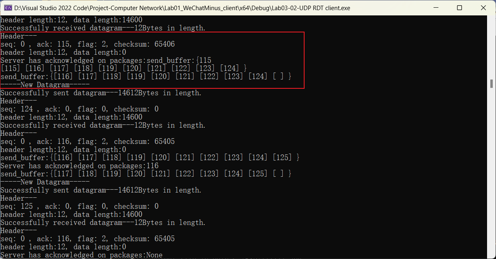

2. **“灵异事件”：**在最开始的测试中，我发现我存在着一个deque empty before pop的错误，日志消息显示我客户端先接收到了某个序列号的ack，然后才是成功发送。第一次看到确实很灵异。

   不过仔细一想，我最终得以解决，根本原因是发送方的GBN的有限状态机是先去发送报文，再将报文加入到滑动窗口中。这样可能导致的问题就是发送报文了，结果还没到把报文加入到滑动窗口那一步，接收方已经回复了ack，并且ack已经回来了，导致接收线程想要去pop那个序列号，结果发现那个由于在另一个线程的程序控制流中还没到将报文加入到滑动窗口中那里，导致问题。

   **<font size=3, color="red">所以最后我的解决方式是修改状态机，改为先将报文加入到滑动窗口中，再去发送他，这样就解决了问题。</font>**

### 5 实验结果展示

#### 5.1 正常传输

1. **握手：**进来直接开始握手：可以看到三个阶段成功实现，握手成功！
   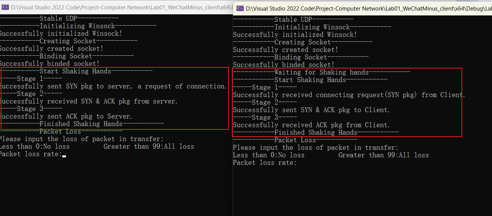
   
2. **传输数据：**这里由于为了模拟正常传输，**所以进入选择数据报文丢失率和延时都设置为没有，发送缓冲区大小（即实验要求写的窗口大小）由于为了测试4-32大小的四个测试文件，选择对应缓冲区大小依次为4, 13, 22, 32。依次传输四个文件**，设置如下：

   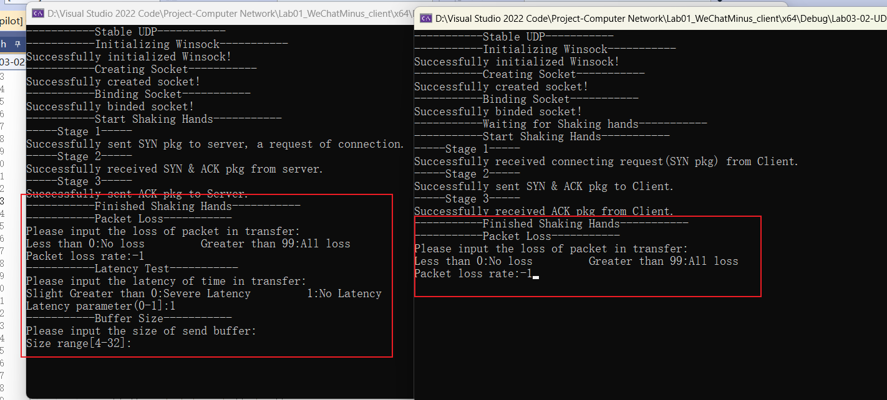

   然后**默认都输出到我的Github本次仓库位置D:\Github下**，下面展示实验的结果：

   * **测试文件1：缓冲区大小为4。**

     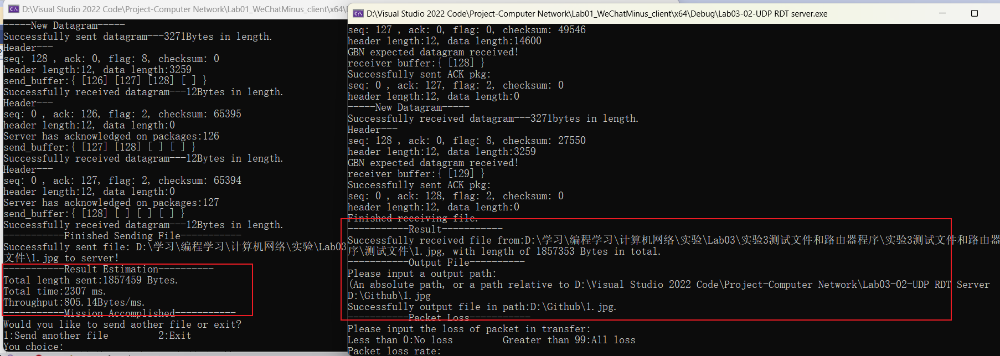

     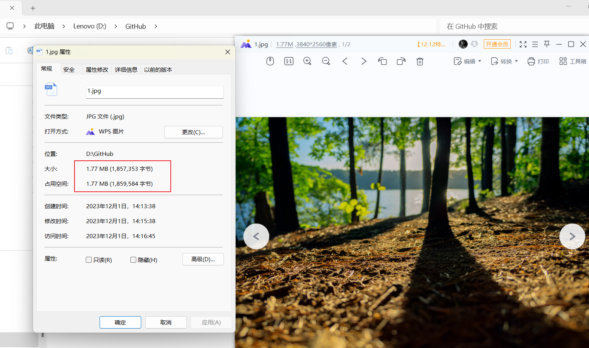

   * **测试文件2：缓冲区大小为13。**

     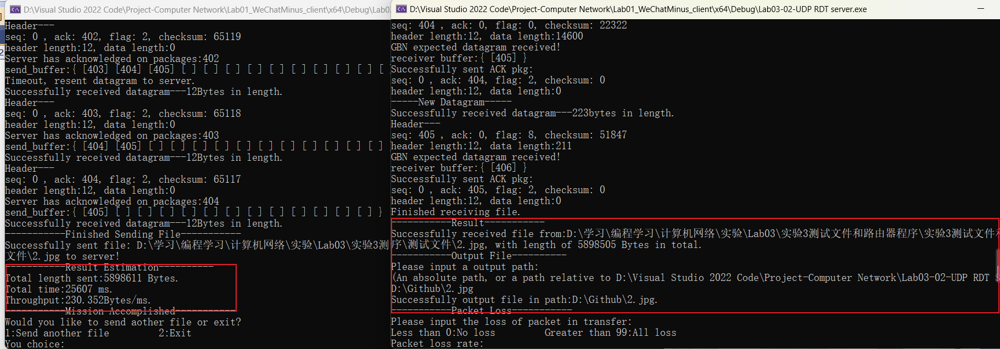

   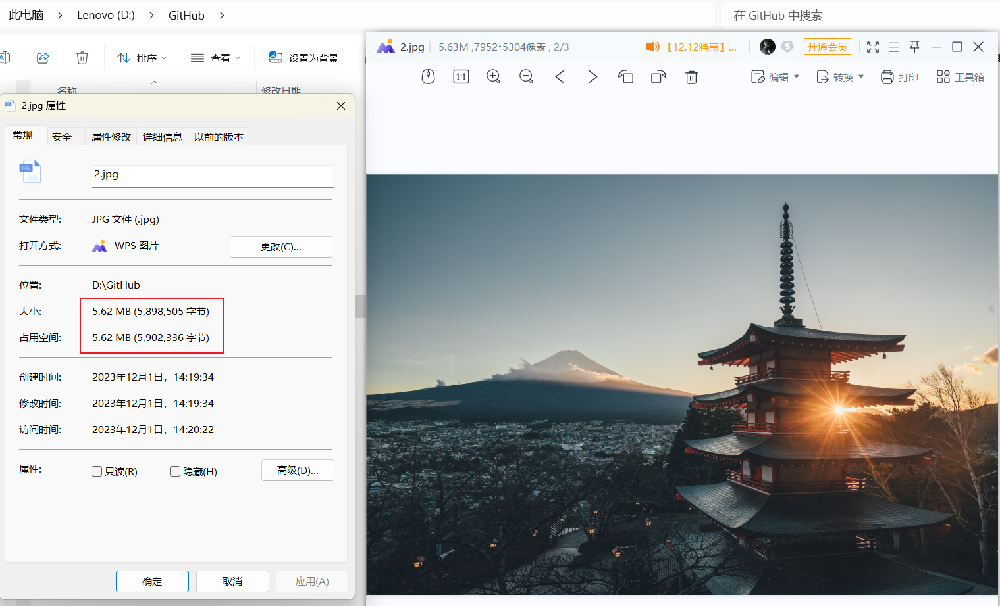

   * **测试文件3：缓冲区大小为22。**

     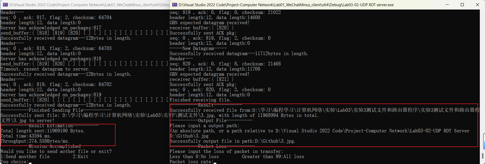

     

   * **测试文件4：缓冲区大小为32。**

     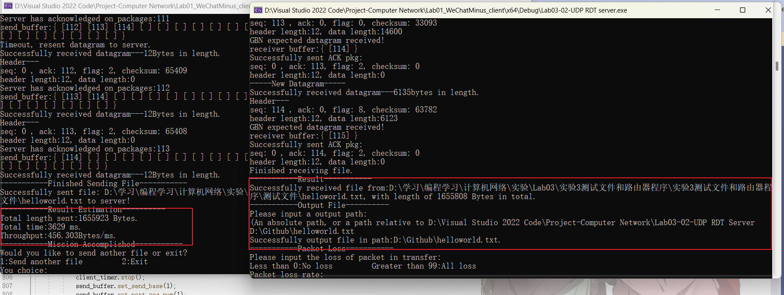

     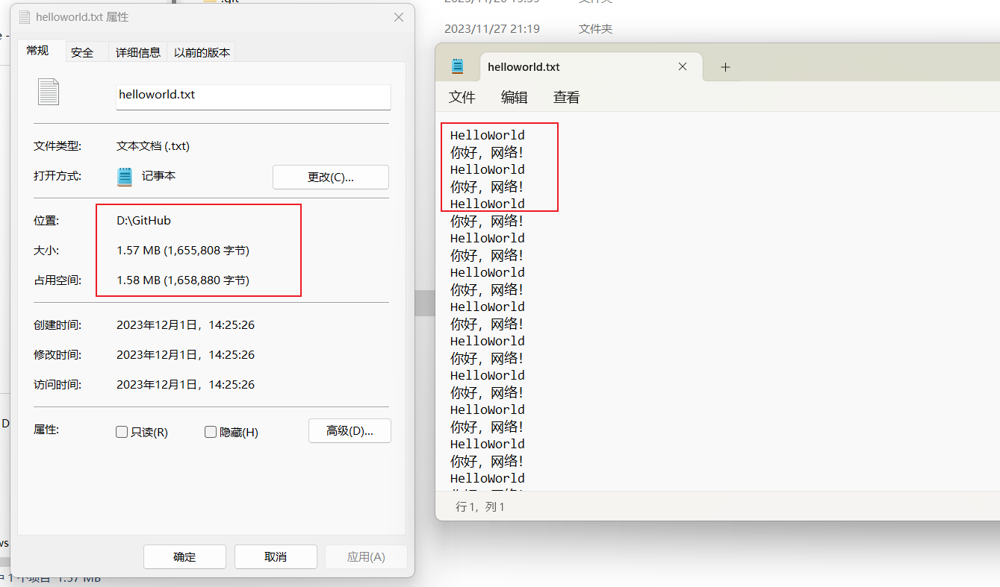


**<font size=3, color="red">可以看到所有文件全部能够在没有丢包和延时的条件下传输成功，图片能够正常显示画面，txt能够显示中英文，并且大小字节也和给定图片相同。</font>**

2. 延时传输：通过之前说的**相对论**方式测试，**选择参数设置为Latency Paramter0.2，丢包率设置为-1即没有，选择缓冲区大小即18，选取测试文件2进行测试**，设置如下：

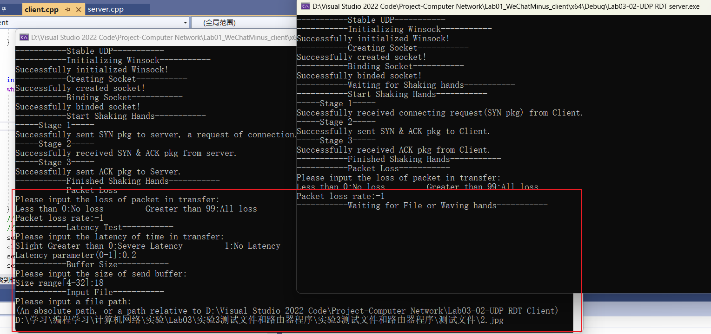

不过**这次传输的文件命名为22.jpg，还在地址D:\Github下**，结果如下：

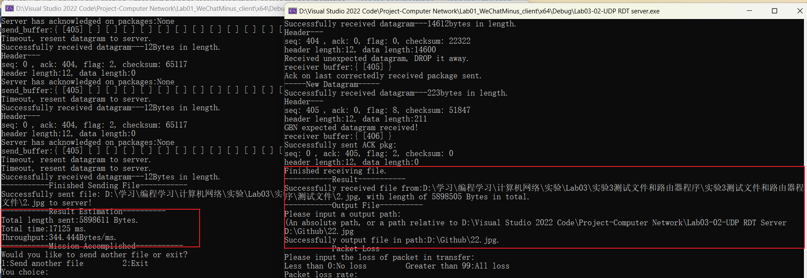

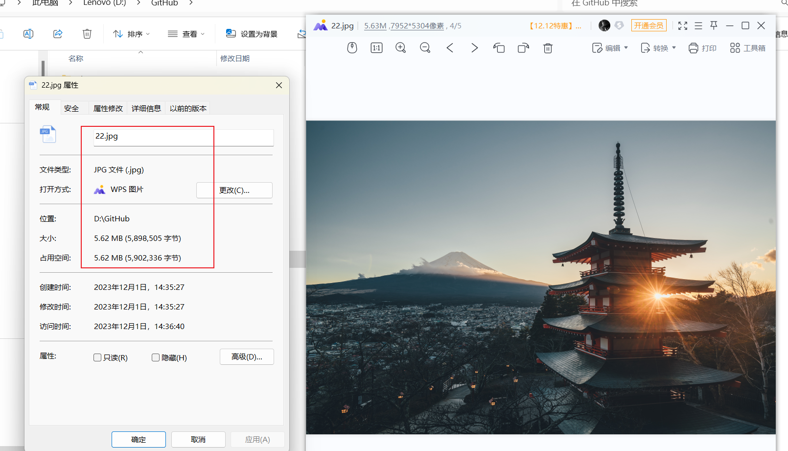

**可以看到成功实现了传输，文件大小内容没有变化，且图片也能够正常显示。现在我们看看传输过程中的细节：**

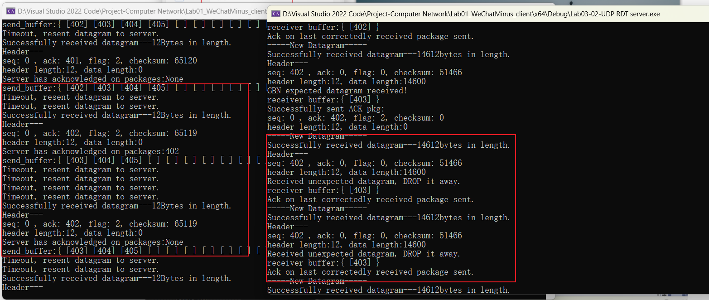

我们抽取其中的一个超时重传过程，可以看到：

* **发送方（客户端）：**send_buffer中403，404，405都没有被传过去，而是一直接收到402包的ack。所以403包最后超时，触发重传（**可以看到提示Timeout, resent datagram to server**）。

* **接收方（服务器端）：**recv_buffer中一直都是403，看到此时它一直收到的都是402的包，不是他期望的，都被扔掉了，并且不停回复403的包。这是因为在403之前，客户端已经不停地在重发400，401，402等包，刚刚来到服务器端，而400，401，402之所以被不停重发，**本质原因是我的延时测试是一个累积的效果**，我在每次收到新的包后都会把timeout设置为原来的0.2，**所以超时时间会越来越短，相当于延时越来越严重，导致的结果。**

  **不过最后403包还是重传到了服务器端，解决问题了。**

**<font size=3, color="red">到此可以看到，延时测试非常成功！</font>**

**3.丢包：同样地，此时测试丢包，因此设置延时为不存在（1），然后设置丢包率（握手+客户端数据报+服务器端ack+挥手）为Packet_loss=4，即5%。选择缓冲区大小为18，选取测试文件2进行测试。**设置如下：


不过**这次传输的文件命名为222.jpg，还在地址D:\Github下**，结果如下：

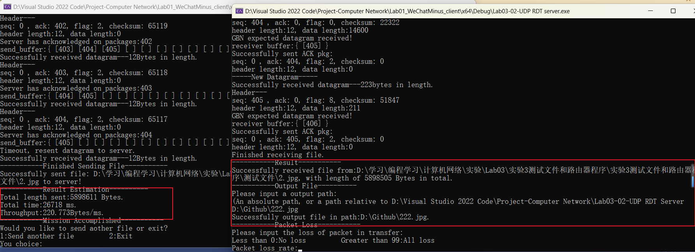

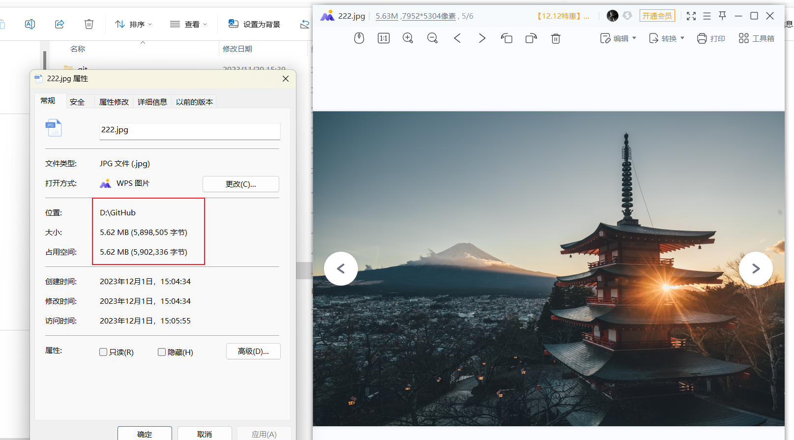

**可以看到成功实现了传输，文件大小内容没有变化，且图片也能够正常显示。现在我们看看传输过程中的细节：**

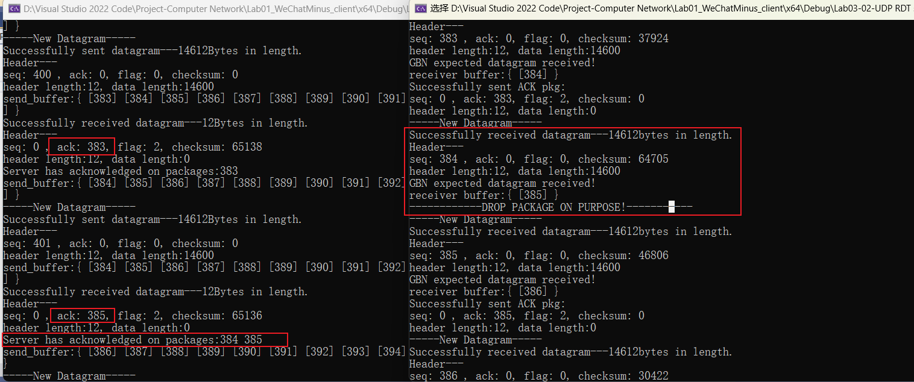

我们抽取其中的一个丢包过程，可以看到：

* **接收方（服务器端）**：在接收到384序列号后，本来打算回复385的ack，**结果被丢包了（可以看到提示DROP PACKAGE ON PURPOSE）。**
* **发送方（客户端）：**看到收到383的ack后接下来收到的就是385的ack，384的gap了。**但是没有影响，因为累积确认的效果**，所以一口气可以把384和385都踢出窗口，这是因为如果接收方没接收到384的包，不可能发385的ack。**可以放心进行ack丢失的错误处理。**

**<font size=5, color="red">综上所诉，对所有功能都进行了测验，均证明实现非常成功！</font>**

#### 5.4 测试结果总结

**在这里总结本次实验使用流水线协议的多序号流量控制+GBN累积确认，使用发送窗口大小变化，没有延时和丢包的情况下对四个测试文件的传输数据总大小（我这里包括了文件路径）、时延以及吞吐率的结果**，以表格形式呈现，具体截图在前面可以找到：

| Test File/Result | Buffer Size | Total length(Bytes) | Total time(ms) | Throughoutput(Bytes/ms) |
| ---------------- | ----------- | ------------------- | -------------- | ----------------------- |
| 1                | 4           | 1857459             | 2307           | 805.14                  |
| 2                | 13          | 5898611             | 25607          | 230.352                 |
| 3                | 22          | 11969100            | 43594          | 274.558                 |
| 4                | 32          | 1655923             | 3629           | 456.303                 |

### **6 实验反思与总结	**

#### 6.1 实验总结

**本次实验我通过在Lab03-01的基于停等机制的RDT3.0传输上进一步完善其可靠性即保序性，实现了流量控制机制，提高了链路利用率。**具体而言实现了：

* **流水线协议：流量控制与多个序列号**
* **累积确认：Go Back N**
* 可以交互改变的**窗口大小、延时与丢包测试**
* **多线程**实现数据传输与保序的日志输出
* **锁机制**避免竞争
* **Keep-Alive**一次握手多次传输

#### 6.2 实验改进方向

虽然**本次实验非常完整地实现了所有的功能，甚至额外实现了一些更好地交互与封装，实现了传输的更加可靠**，不过通过我的观察，我还是发现了一些隐藏的小瑕疵，暂时我还没有解决，有待完善。

1. 实际上丢包我一直比较幸运，**如果传输过程中接收方回复的最后一个ack丢失，会出现类似于死锁的情况。**这是因为发送方没收到最后一个包的ack，会一直重传最后一个包，但是此时接收方已经收到了带有特殊标志位LAS的最后一个包已经准备去将接收到的文件写入到磁盘了，因此会出现死锁。**暂时考虑到解决方案**是双方一直对最后一个包进行反复ack，即server必须接收到它ack的ack才能去等待挥手。不过如果这样一直丢ack，~~会造成套娃，离谱。~~因此**另外的解决方案**是直接client超时重传较多次不行**直接报异常结束**。这样就不会死锁了，不过代价较高。

   **而实际上这种情况出现的概率极低，并且由于我是Keep-Alive机制**，我的接收方在接受到最后一个LAS后不会去挥手，而是直接写入文件。我的挥手只发生在我客户端也就是发送方进行选择主动挥手结束时。**所以即使发生这种情况，发送端也可以放心地结束，因为接收端已经收到了全部文件了**（虽然发送方不知道），所以**这时候只需要接收方正常写入磁盘即可。唯一的影响就是没法正常挥手结束，但文件还是可以正常传输。**

2. HTTP协议的状态码：可以考虑加入类似于HTTP1.1中更多的OK那种状态码。

3. 数据包格式中加入IP和端口号等。

4. Keep-Alive机制必须得服务器端输出完文件后才能进行挥手，否则有问题。

#### 6.3 实验总结与收获

总的来说，**本次实验通过亲自在RDT3.0上进一步实现流水线协议的流量控制与GBN的累积确认，对其中过程和很多错误处理机制都进行了实现，还进一步完善了很多功能。让我收获颇丰。**

通过和助教学长的讨论也让我再次明白了很多，**感谢助教学长与吴英老师，我会继续努力学习本课程，并在基础上发挥自己的创造力，探索更多可能性。**
