# Computer Network2023

## Lab03-03 **基于滑动窗口的流量控制机制+选择确认**

#### 学号：2111408	专业：信息安全	姓名：周钰宸

### 1 实验原理

​	之前在Lab03-02中我们基于对滑动窗口上的流量控制和累积确认GBN在提高了链路利用率的同时，实现了保序的传输。不过**累积确认存在一个问题**就是当窗口和带宽的时延都较大时，单个分组的差错可能会引起**GBN重传大量的分组**，然后许多本来不用重传的分组会充斥在信道中，造成**资源浪费。**

​		因此本次我们会进一步实现滑动窗口中的另一个特殊机制，**即在接收端滑动窗口（缓冲区）大于1的情况下，实现选择确认。**这可以让让发送方仅重传那些丢失和受损的分组而**避免不必要的重传。**

#### 1.1 滑动窗口

上次实验中，已经介绍过了滑动窗口协议，**这里不再赘述细节，我会强调一些本次实验会用到的重点。**

1. 发送缓冲区：
   
   * 发送端的滑动窗口：其本质是发送缓冲区内容的一个子集，那些已发送但是未经确认分组的序号构成的空间。**本次实验实现过程也是遵循这个概念，即我的发送缓冲区是有固定大小的，而滑动窗口大小是会变化的。**

2. 接收缓冲区：
   * 接收端的滑动窗口：对于接收者来说，接收缓冲区就等于接收端的滑动窗口。**即二者大小一致。**
   * ==**接收窗口尺寸Wr>1时 ，则可以乱序接收（SR）。但提交给上层的分组，要按序。即本次实验需要着重考虑交付上层的顺序，因为接收端的滑动窗口本次可以进行缓存了。**==
   * 接收端滑动窗口的滑动和发送确认：
     * 滑动：
       * **低序号的分组到来，接收窗口移动；（所有机制！包括本次的SR）**
       * 高序号分组乱序到，**缓存但不交付（因为要实现RDT，不允许失序。即RDT的可靠要保证交付时的有序！），不滑动 （SR）。**
     * 发送确认：
       * 接收窗口尺寸>1 时， 收到分组，发送那个分组的确认。==**也就是说不论是否在接收端的滑动窗口范围内，都要发送对应的ACK，并且反馈的ACK不再具有累积确认的意义。是非累计确认！**==
   
3. 总结：计算机网络领域的滑动窗口协议本质上是一个更为通用的协议，而根据发送方和接受方的滑动窗口大小的不同情况，进一步分化出了停等机制、流水线协议（GBN与SR）。具体而言：

   * SW=1, RW=1:停等机制，RDT3.0；
   * SW>1, RW=1:流水线协议的累积确认GBN；
   * **SW>1, RW>1:流水写协议的选择性重发SR。**

   **由于本次实验进一步实现了流水线机制中的SR，后面只会简单说下流水线协议，再介绍下SR。**

#### 1.2 流水线协议

1. 流水线：允许发送方在未得到对方确认的情况下一次发送多个分组，允许在发送方和接收方之间并行处理多个数据单元。
2. 特点：

   * 多个序列号：上次提到过，使用多个序列号的目的是增加一些保序功能和容错机制，进一步保证RDT的可靠性。
   * 在发送方/接收方要有缓冲区：
   
     * 发送方缓冲：未得到确认，可能需要重传；
     * 接收方缓存：上层用户取用数据的速率≠接收到的数据速率；==**本次实验要加入接收方的缓存。因为接收到的数据可能乱序，排序交付（保证RDT的可靠！）**==
3. 两种同样的流水线协议：回退N步(GBN)和**选择重传(SR)。**

#### 1.3 SR（Selected Repeat）选择确认协议

简单来说，**<font size=3, color="red">SR和GBN的最大区别我认为其实就在一处，那就是SR的接收窗口尺寸大于1。</font>**这进一步的导致了它们之间的更多区别，包括SR即选择重传的由来。

1. **GBN和SR的区别：**
   * GBN：接收窗口尺寸=1。因此导致接收端只能够顺序接收，这实际上也就带来了累计确认的效果。因为接收方只有一个窗口大小，因此不在窗口内（尤其是提前到来的）的都不能被接收，故接收方的ACK带有了所谓的“之前的包我都收到了”的累积确认效果。
   * **SR：接收窗口尺寸大于1。**因此使得**接收端可以缓存提前到来的数据报而不是直接丢弃**，节省网络空间中的资源。但此时接收端回复的ACK自然就不再具有“前面的包我都收到了”的含义了，==**因为它可以提前收到一些乱序的包！**==这样的性质也进一步优化了发送端，**因此此时发送端只需要选择性重发对应的包就行，而不是全部重发。==即选择重发的由来。==**

2. **SR发送和接受双方：**
   * 发送端：
     * 发送端最多在流水线中有N个未确认的分组
     * 发送方为==**每个未确认的分组都要保持一个定时器，而不是一个唯一的全局定时器。**==当超时定时器到时，**只对那些没有收到ACK的分组进行重发。**
     * 发送窗口的最大值（发送缓冲区）限制发送未确认分组的个数。
   * 接收端：
     * 接收方对**每个到来的分组（只要校验和正确，只要不是大于最大窗口前沿。包括窗口内和窗口前的）单独确认==individual ack （非累计确认）==。**
     * 可以**缓存乱序的分组，最终将分组按顺序交付给上层。**

### 2 实验要求

*实验3-3：在实验3-1的基础上，将停等机制改成基于滑动窗口的流量控制机制，发送窗口和接收窗口采用相同大小，支持选择确认，完成给定测试文件的传输。*

### 3 前期准备

#### 3.1 UDP报文设计

```
 0              7 0             7 0                            15
+---------------------------------------------------------------+
| 				          Sequence Number                       |
+---------------------------------------------------------------+
|                       Acknowledgment Number                   |
+---------------------------------------------------------------+
|                              Flags   							|
+---------------------------------------------------------------+
|                             Checksum							|
+---------------------------------------------------------------+
|                          	Data  Length                        |
+---------------------------------------------------------------+
|                           Header Length                       |
+---------------------------------------------------------------+
|                                                               |
|							  	                                |
|                               Data                            |
|								                       	        |
|                                                               |
+---------------------------------------------------------------+
```

本次实验的UDP报文由于需要保证16位的对齐和一些数值类型转换，出于时间原因，设计的比较简单。其中各个字段含义不再赘述，只说明一下：

1. Sequence Number：序列号（u_short 16位）。
2. Acknowledgment Number：ACK值（u_short 16位）。
3. Flags：标志位（u_short 16位），暂时只是仿照了TCP设计了低五位，未来会继续拓展。具体而言：
   * SYN：0x1，
   * ACK：0x2
   * FIN：0x4，
   * LAS：0x8
   * RST：0x16，
4. Checksum：校验位（u_short 16位）
5. Data  Length：数据段长度（u_short 16位）
6. Header Length：报文头部长度（u_short 16位）

#### 3.2 协议设计

#### 3.2.1 三次握手（建立连接）

**这里和Lab03-01没有丝毫变化，可以跳过。详见我Lab03-01报告。**

这里建立连接的时候我采用的就是仿照TCP的三次握手进行设计，不过没有使用其中随机的客户端和服务器端的数据包序列号生成和ACK=序列号+1的验证机制。未来有待完善。

1. 客户端想要与服务器建立连接, 于是向服务器发送SYN报文请求连接。服务器知道客户端能够发送。
2. 服务器收到客户端的连接请求之后, 服务器向客户端发送确认报文ACK及请求连接报文SYN。让客户端知道服务器能够接收并且能够发送。
3. 客户端收到服务器的连接请求, 向服务器发送确认报文ACK。在服务器接收到ACK之后,服务器知道了客户端能够发送。

至此实现了客户端和服务器端都确认了彼此可以正常发送和接收数据，然后就可以开始正常通信了。**不过在这个过程中也可能存在超时或者丢包的情况，实际上都进行了多种异常情况的处理，具体处理详见我上次报告Lab03-01的4.3.2部分。**

#### 3.2.2 数据传输

这部分是本次修改的重点，**保持基于滑动窗口的流量控制机制，从支持GBN改为支持SR的选择确认。**

1. **滑动窗口：**
   * 客户端（发送方）：客户端的**发送缓冲区大小一次传输过程中固定（4-36）**，而**滑动窗口大小**即sendbase与nextseqnum之前部分，可以变化。
   * 服务器端（接收方）：服务器端的**发送缓冲区（滑动窗口）大小也是一样在一次传输过程中固定（4-36），==和客户端一样可以提前设定成二者发送缓冲区（也就是实验要求说的窗口）大小相同。不过由于实验要求是二者相同，因此后面我的一些错误处理也是暂时针对二者窗口大小相同设计的。==**

2. **SR选择确认：**

   * **客户端（发送方）：**

     |                             事件                             |                             动作                             |
     | :----------------------------------------------------------: | :----------------------------------------------------------: |
     | 从上层收到数据：当从上层接收到数据后，发送方检查下一个可用于该分组的序号。 |           若序号在发送方窗口内，则将数据打包并发送           |
     |                                                              |             否则：以后再传，等待窗口滑动将其罩住             |
     |               **超时：每个分组有自己的定时器**               |                 **超时后只能发送一个分组。**                 |
     | 收到ACK：将被确认的分组**标记为已接收(若该分组序号在窗口内)。** | 如果该分组的序号等于发送基序号send_base，*则窗口基序号向前移动到具最小序号的未确认分组处。* |
     |                                                              |    窗口移动后，仍有序号落在窗口内的未发送分组，继续发送。    |

     具体实现过程中，进一步采用了**多线程的机制。详见下面的多线程介绍。**

   * **服务器端（接收方）**

     |                           失序分组                           | 先被缓存，直到所有丢失分组（序号更小的分组）被收到为止，==才可将一批分组按序交付给上层。== |
     | :----------------------------------------------------------: | :----------------------------------------------------------: |
     | 序号在接收窗口内的分组被正确接收（没出现位错误）：收到的分组落在`[rcv_base，rcv_base+N-1]`内 | **接收并回发一个ACK。该分组以前没收到过：缓存**；否则直接丢弃。 |
     |                该分组的**序号等于接收基序号**                | 则该**==分组及已缓存的连续序号（一定得连续！）的分组交付==**（起始于基序号）给上层。接收窗口**按交付的分组数量向前移动。** |
     |     **收到序号在接收基序号以前**或者最大窗口以后的分组：     | 该分组是接收方以前已确认过的分组。**生成一个ACK， 并回发给发送方。** 如果接收方不确认，发送方窗口不能向前滑动。 |
     |                 其他情况（包括校验和出错等）                 |                          忽略该分组                          |

     实际上==**本次实验中由于要求设计接收方和发送方窗口大小一致，因此设计的即使接收到的序列号大于窗口以后（实际上在窗口大小相同情况下不可能发生）也发送ACK。**==不过如果遇到**真实的接收方和发送方窗口大小不同，则当收到大于接收窗口后端序列号的包时，不应该回复对应的ACK，因为没有进行缓存！**

3. **<font size=4, color="red">多线程：</font>**

   本次实验进一步采取了多线程的方式进行编程。==**其中包括双发的主线程在内，发送方一共具有四个线程，接收方一共具有三个线程。新加入的线程我会用亮体标出。具体而言：**==

   * **发送方（客户端）：**
     * **主线程（发送线程）：**握手挥手，send_data与rdt_send。数据传输中主要做的就是依次从最大的文件缓冲区file_data_buffer中依次取出数据分包发送。并进行窗口滑动。启动和回收另外三个线程。
     * **接收线程：**接受来自接收端的ACK，并进行窗口滑动。
     * **==超时重传线程：==**上次实验中，超时重传就是在接收线程中实现的。这是因为上次实验中只有一个超时定时器，因此每次判断是否超时只需要O（1）的时间，而本次遍历查看所有数据报的定时器则最大会需要O（n）级别的时间。**为了避免这样大量的时间在接收线程中浪费（遍历时没有进行recv_from，socket只会暂时缓存部分数据报）导致接收线程接收ACK的情况出现不稳定的变化，本次额外设定了这个超时重传线程。主要做的就是不停地遍历发送窗口中的数据报，重发超时的那个，并重新计时。**
     * **日志线程：**和Lab03-02一样，为了避免对cout或者说是控制台这个全局变量的竞争，采用消息队列的方式依次发送消息。
   * **接收方（服务器端）：**
     * **主线程（接收线程）：**握手挥手和rdt_rcv。主要用于不停的recv_from发送端发送的数据报，并根据数据报的校验和以及序列号等执行接下来的动作，包括**缓存数据报，上交数据报给应用层以及通知发送线程要发送的下一个序列号**等（实际上也是通过一个需要ACK的序号队列实现，详见代码部分）。
     * ==**发送线程：**==本次实验新增加的。主要根据需要ACK的序号队列，不停地发送对应的ACK。因为上次实验中接收方实际上是一个类似的停等机制，接收到一个序列号再发送对应的ACK即可，即处理完一个再看下一个（这其实是因为上次实验接收方不需要乱序接收的原因）**。不过由于本次对于一些乱序达到的数据报也需要接收。因此通过多线程将发送和接受分离开来，有利于及时处理达到的数据报（不这么做的话，send ACK时候不能recv_from，只能交给socket缓存），提高效率。**
     * **==日志线程：==**这个和Lab03-02不同。由于上次的接收方只有一个线程，因此不会出现对cout或者说控制台资源的竞争，不过本次也沿用了发送方的消息队列输出日志。
   
4. **<font size=4, color="red">锁机制：</font>**

   本次实验中由于和上次一样，同样使用了多线程来进行编程，也无比避免地涉及到对全局变量的一些操作。**为了使它们不同时对其进行读写。因此本次实验中设计采用了更为复杂的锁机制来避免竞争。不仅是日志线程的锁，甚至设计双锁机制，具体详见我的代码部分。**


#### 3.2.3 两次挥手（关闭连接）

**这里和Lab03-02也没有任何变化，可以直接跳过。详见我Lab03-02报告。**

对TCP的四次挥手进行了改进，只保留了两次挥手。

除此之外，在发送端和接收端都知道发送完毕（接收端通过最后一个包的LAS标志位）准备开始挥手后：

1. 第一次挥手：客户端（发送方）向服务器端（接收方）发送FIN=1，seq=nextseqnum的数据包，即“假装”此数据包放在了发送方的滑动窗口的新位置，是最后一个发送的数据包序列号+1；
2. 第二次挥手：服务器端（接收方）接收到了客户端（发送方）的FIN报文后，回复ACK=1，ack=nextseqnum+1的数据包，回应对方自己收到了刚才的FIN报文。挥手结束。

#### 3.2.4 Keep-Alive

基于HTTP应用层的Keep-Alive机制，即**一次连接多次传输**。

### 4 实验过程及代码讲解

**<font size=3, color=red>由于Lab03-02已经搭好了大部分的框架，因此本次在此处只重点介绍改动的核心部分（加粗）。</font>**

#### 4.1 头文件

在头文件中，我包含了一些对特殊类和宏常量等的处理，接下来结合代码详细说明，**这里同样只重点说明改动部分：**

1. 宏常量：Flags标志位的对应常量值，只使用低五位。**这里没有变化。**

   ```c++
   //Flags currently using the last six spots
   #define SYN 0x1
   #define ACK 0x2
   #define FIN 0x4
   #define LAS 0x8
   #define RST 0x10
   ```

2. 一些特殊的宏常量，**相比于上次也没有任何变化。**

   * MSS：即仿照TCP的数据段的最大长度进行设计，用于分组传输文件。MSS的值为14600字节，这意味着每个 TCP 数据段的数据部分的最大长度为14600字节。
   * UDP_SHAKE_RETRIES 10：即握手过程中超时重传最大次数，默认为10。
   * UDP_WAVE_RETRIES 10：即挥手过程中超时重传的最大次数，默认为10。
   * MSL：即仿照TCP报文的最大生命周期进行设计，一个来或者回的过程。使用计量单位是CLOCKS_PER_SEC宏常量，即每秒钟的时钟周期数。
   * PATIENCE CLOCKS_PER_SEC * 1000：用于客户端出现异常太久没有发来消息不论是挥手还是新的文件数据报文（可能是在输入文件路径）。为了避免死锁，服务器端主动结束。

3. Header类：包含了所有需要用到报文头部的分段，包含构造函数和获取函数等。**同样没有变化，就不上代码。**

4. **Datagram类：**

   之前只在发送方具有这个类，因为只有发送方才需要缓存数据报。**不过本次由于接收方可以乱序接收，因此也需要定义此类。同时在发送方，额外加入每一个数据报的计时器`Timer dg_timer`和是否被ack过的`bool is_acked`。**接收方和上次的Datagram相同即可不需要新加东西。

   ```c++
   //align 1Byte same as Header
   #pragma pack(push)
   #pragma pack(1)
   //Datagram = Header + data
   class Datagram {
   private:
   	Header header;
   	char data[MSS];
   	Timer dg_timer;
   	//For SR, if the datagram is acked, is_acked=true
   	bool is_acked;
   public:
   	Datagram() {};
   	Datagram(Header header, char* data) :header(header) {
   		memcpy(this->data, data, header.data_length);
   		is_acked = false;
   	}
   	Header& get_header() {
   		return header;
   	}
   	char* get_data() {
   		return data;
   	}
   	Timer& get_dg_timer() {
   		return dg_timer;
   	}
   	bool& get_is_acked() {
   		return is_acked;
   	}
   	void set_is_acked(bool is_acked) {
   		this->is_acked = is_acked;
   	}
   
   };
   #pragma pack(pop)
   //Resume 4Byte align
   ```

5. **ReceiveBuffer类：**

   **在接收方（服务器端）显式地定义了一个类叫做接收缓冲区类**，用来保存receive_base等变量，同时保存滑动窗口，还使用了一个锁，具体而言：

   * 成员变量：
     * **u_short receive_base：**即滑动窗口后沿，也是接收缓冲区的后沿。
     * **vector<Datagram*> slide_window：**这里考虑到在**SR中由于接收方可以乱序接收，因此需要一个数据结构来缓存到来的数据报**，这里选择的就是vector。可以看出我的接收方滑动窗口大小在实现上是会变化的，其实没有大碍，把它理解为一个缓存数据报的结构即可。
     * **u_short receive_end：**即滑动窗口后沿的数据报位置。与receive_base之差就是缓冲区大小。
     * **mutex buffer_lock：**和发送方缓冲区一样，引入锁机制用于防止多线程对全局变量接收缓冲区的唯一实例的竞争。

   * 成员函数：

     * Receivebuffer()：和发送方保持一致，*即初始化receive_base=1，receive_end大小为1 + receive_buffer_size - 1。*
     
     * **Datagram* window_edge_slide()**：由于**接收方（服务器端）的窗口滑动只发生在接收线程（主线程rdt_rcv）检测到收到的数据报序列号和receive_base相同。**并且前端和后端同时滑动（保证窗口大小不变）。

       因此和SendBuffer不同，将窗口滑动封装为了一个函数，其**同时实现窗口后沿滑动即receive_base++和后沿滑动receive_end++的行为。同时由于窗口滑动了证明可以保序交付上刚刚滑动后被删除出缓存的数据报，**因此返回头的数据报深拷贝副本Datagram*，然后交付给上层应用层。
     
     * **void buffer_datagram(Datagram* datagram):**由于SR可以乱序接收的特性，因此用于接收线程（主线程rdt_rcv）检测到刚来的数据报位于滑动窗口范围内，并且之前没有缓存过该序列号的数据报，将其**缓存push_back**进vector。
     
       但是其序列号和本来已经在vector中的大小关系未知，**因此为了保证最后交付给上层用户时候我可以直接按序通过window_edge_slide()获取正确顺序序列号的报文，这里在它push进后，==需要进行一次对序列号从小到大的排序，由此实现最终交付时候的保序，保证RDT的可靠！==**
     
     **<font size=3, color="red">以上所有操作前后均需要加锁和解锁。</font>**

   ```c++
   class Receivebuffer {
   private:
   	u_short receive_base;
   	//SR for server(receiver), sliding window has the size as the buffer
   	vector<Datagram*> slide_window;
   	u_short receive_end;
   	mutex buffer_lock;
   public:
   	Receivebuffer() {
   		receive_base = 1;
   		receive_end = 1 + receive_buffer_size - 1;
   	}
   	u_short get_receive_base() {
   		return receive_base;
   	}
   	void set_receive_base(u_short receive_base) {
   		buffer_lock.lock();
   		this->receive_base = receive_base;
   		buffer_lock.unlock();
   	}
   	vector<Datagram*>& get_slide_window() {
   		return slide_window;
   	}
   	void front_edge_slide() {
   		/*
   		* Actually, it's the accpectable range getting bigger
   		*/
   		buffer_lock.lock();
   		receive_end++;
   		buffer_lock.unlock();
   	}
   	Datagram* window_edge_slide() {
   		buffer_lock.lock();
   		receive_base++;
   		// Create a copy of the first datagram in slide_window
   		Datagram* datagram = new Datagram(*slide_window[0]);
   		slide_window.erase(slide_window.begin());
   		receive_end++;
   		buffer_lock.unlock();
   		// Return the first datagram in slide_window to give it to application layer
   		return datagram;
   	}
   	Datagram* back_edge_slide() {
   		buffer_lock.lock();
   		receive_base++;
   		//return the first datagram in slide_window to give it to application layer
   		Datagram* datagram = slide_window[0];
   		slide_window.erase(slide_window.begin());
   		buffer_lock.unlock();
   		return datagram;
   	}
   	void set_receive_end(u_short receive_end) {
   		buffer_lock.lock();
   		this->receive_end = receive_end;
   		buffer_lock.unlock();
   	}
   	u_short get_receive_end() {
   		return receive_end;
   	}
   	void buffer_datagram(Datagram* datagram) {
   		buffer_lock.lock();
   		slide_window.push_back(datagram);
   
   		//Sort the slide_window by sequence number every time a new datagram is put in
   		sort(slide_window.begin(), slide_window.end(), [](Datagram* a, Datagram* b) {
   			return a->get_header().get_seq() < b->get_header().get_seq();
   		});
   		buffer_lock.unlock();
   	}
   
   };
   ```

6. **Timer类：**

   设置在接收方每个数据报内的计时器。**和上次也没有任何变化就不上代码了**。使用一个锁在操作成员变量前加锁和解锁，避免竞争。内容较简单，唯一值得注意的是我初始化设定：timeout = 2 * MSL，即一个来回。

7. **全局变量：**

   * Client端：只新添加了一个**mutex send_buffer_mutex互斥量**加锁发送缓冲区，具体原因**详见我4.5实验探索与思考部分**。
   * **Server端：为了实现SR添加了一些新的变量。**
     * **int receive_buffer_size：**接收缓冲区（接收窗口）大小，在一次传输过程中固定，可以提前设定。
     * deque<string> log_queue和mutex log_queue_mutex：引入了日志线程后的消息队列和对应的锁。
     * **deque<u_short>ack_deque和mutex ack_deque_mutex**：为了实现接收方主线程（接收线程）和发送线程之间的通信，**==加入的ack队列，主要用于主线程将可以发送ack的序列号压入队列，在发送线程中依次取出序列号发送。==**当然还有对应的锁。
     * u_short ack_seq_num = -1：每次压入ack_deque的序列号，初始化为-1。
     * **bool receive_over = false：用于通知另外两个线程结束的全局变量。**
   
8. **发送端缓冲区：**由于我理解的滑动窗口和实验要求中的存在一定区别，但实际上没有任何影响，依然是可靠的。这里还是再次强调下——

   * file_data_buffer：即文件数据缓冲区，存在整个文件内容加上文件名的全部。
   
   * send_buffer：即发送缓冲区，具有固定大小（4到32），由全局变量send_buffer_size控制，并且落入其中的数据包分为两个部分：已发送但是未确认的以及可用但还没发送的。
   
   * sliding window：即滑动窗口，其中前沿是send_base，后沿的下一个是next_seq_number。其中包含的数据包都是那些已发送但是未确认的，大小会不断变化。
   
   * send_buff：用于发送某个分组时候的临时缓冲区。
   
     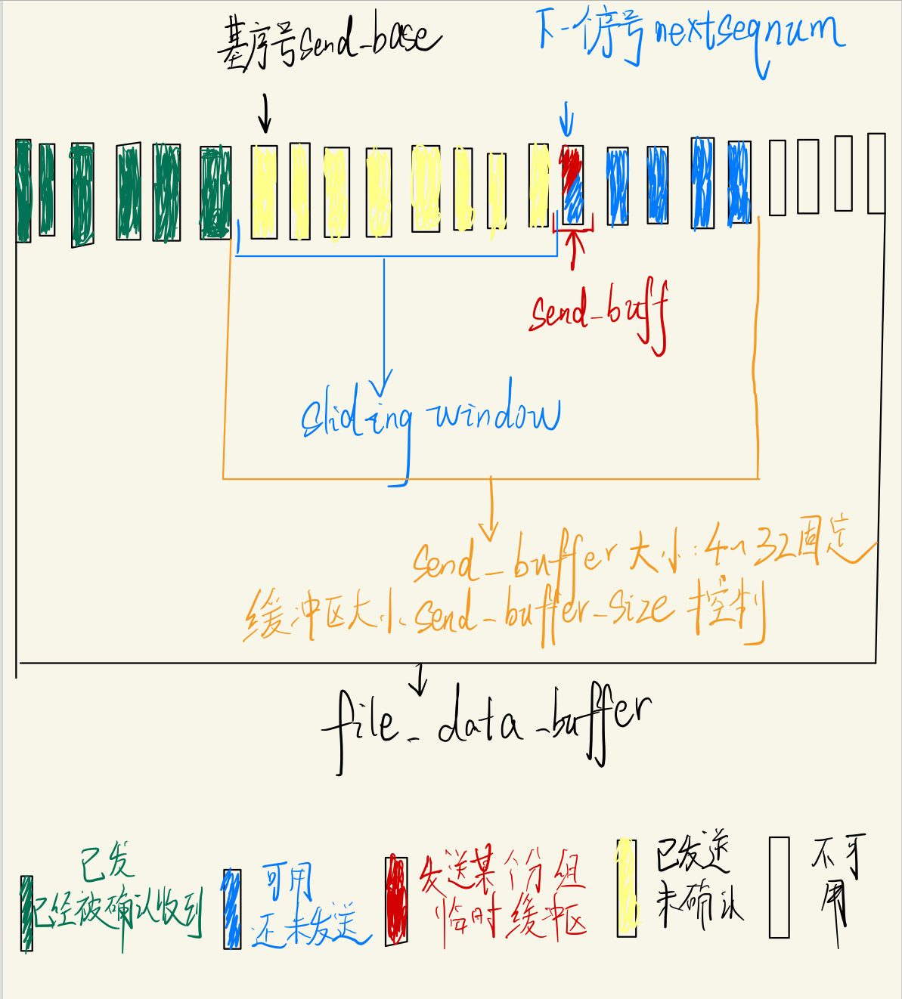

#### 4.2 握手和挥手

客户端和服务器端的握手和挥手部分都和之前Lab03-02没有任何改变，不再赘述，详见上次报告。

#### 4.3 数据传输

本次将重点结合发送方的四个线程和接收方的三个线程进行介绍代码实现（具体线程介绍和设计详见3.2.2的3），也是只会说明我相比于Lab03-02重点修改的部分。

* **客户端（发送方）：**

  * **主线程（发送线程）**：主要由以下函数组成，其中**只有第三个和第四个有较大的修改。**

    * int shake_hand()：握手和之前无变化。

    * void wave_hand()：挥手也无变化。

    * **void send_data(string file_path)**：依次从最大的文件缓冲区file_data_buffer取出数据报分段发送以及输出延时和吞吐率等性能指标。这次唯一修改的就是多了个线程的启动和回收：

      ```c++
      //void send_data(string file_path)中
      							/* blablabla */
      //Start receving thread
      HANDLE recv_handle = CreateThread(NULL, 0, recv_thread_main, NULL, 0, NULL);
      //Start log thread
      HANDLE log_handle = CreateThread(NULL, 0, log_thread_main, NULL, 0, NULL);
      //Start timeout resend thread
      HANDLE timeout_resend_handle = CreateThread(NULL, 0, timeout_resend_thread_main, NULL, 0, NULL);
      							/* blablabla */
      //Communicate with recv_thread to make sure it's finished
      send_over = true;
      //Block current thread to wait for recv_thread to finish
      WaitForSingleObject(recv_handle, INFINITE);
      //the same for log_thread
      WaitForSingleObject(log_handle, INFINITE);
      //the same for timeout_resend_thread
      WaitForSingleObject(timeout_resend_handle, INFINITE);
      CloseHandle(recv_handle);
      CloseHandle(log_handle);
      CloseHandle(timeout_resend_handle);
      				/* blablabla */
      ```

    * **void rdt_send(char* data_buff, int pkg_length, bool last_pkg)为了实现和GBN不同的选择重发。主要改动为：**

      * 为每个数据报**启动对应的超时计时器**：因为和GBN的全局唯一的client_timer不同。在初始化了每个数据报文后（进入rdt_send发送这个报文），开启这个报文对应的定时器。
      * 然后就send_to接收端，窗口前沿滑动缓存进数据报即可，其它处理交给另外的线程。

      ```c++
      //void rdt_send(char* data_buff, int pkg_length, bool last_pkg)
      							/* blablabla */
      Header send_header(send_buffer.get_next_seq_num(), 0, flag, 0, pkg_length, sizeof(Header));
      //Inititalize datagram with header and data
      Datagram* datagram = new Datagram(send_header, data_buff);
      /*
      * Different case from GBN, SR client(sender) has to start timer for every datagram
      */
      datagram->get_dg_timer().start();
      //front_edge_slide
      	{
      		lock_guard<mutex> send_buffer_lock(send_buffer_mutex);
      		//Slide window front edge slides
      		send_buffer.front_edge_slide(datagram);
      	}
      
      ```

    * int main():和Lab03-02相比也没有变化，主要用于输入一些起始的文件信息，窗口大小，丢包率和延时等。包括为了Keep-Alive的一些全局变量初始化。

  * **接收线程：DWORD WINAPI recv_thread_main(LPVOID lpParameter)也是本次重点修改的地方之一，具体改动有以下几点：**

    * **去掉超时重传的实现**，交给超时重传线程。

    * **收到对应的ACK**且校验和没有错误后，如果计算接收到的ack值与send_base的差即**recv_header.get_ack() - send_buffer.get_send_base()**

      * 如果acked_num在0和get_next_seq_num之外，直接忽视。

      * ==**如果acked_num在0和get_next_seq_num之内。**==首先**标注滑动窗口对应的下标即acked_num位置的数据报的为已经被acked即set_is_acked(true)，然后停下对应的计时器。输出信息。**

        此时如果**acked_num正好是0**，说明收到了对发送窗口后沿的最早数据报的ack，**==应当一口气滑动窗口内所有连续的被标记为已acked的数据报，将他们都删除==**。

    ```c++
    //DWORD WINAPI recv_thread_main(LPVOID lpParameter)
    										/* blablabla */
    while (recvfrom(clientSocket,recv_buff,sizeof(recv_header),0,(sockaddr*)&tempAddr,&temp_addr_length) <= -1) {/* 去掉超时重传实现 */ }
    											/* blablabla */
    
    if (
    	cks == 0 //not corruptied
    	&&
    	(recv_header.get_flag() & ACK) //ACK flag
    	) {
        {
    				lock_guard<mutex> send_buffer_lock(send_buffer_mutex);
    				int acked_num = recv_header.get_ack() - send_buffer.get_send_base();
    				if (acked_num < 0 || acked_num >= send_buffer.get_next_seq_num()) {
    					//ack on previous OR later pkg
    					//Ignore
    					{
    						lock_guard<mutex> log_queue_lock(log_queue_mutex);
    						log_queue.push_back("Server has acknowledged on packages:None" + string("\n"));
    					}
    				}
    				else {
    					// 0 =< acked_num < send_buffer.get_next_seq_num
    					//ack on the pkg in the range of the slide window
    					//mark the pkg as acked
    					send_buffer.get_slide_window()[acked_num]->set_is_acked(true);
    					//Stop corresponding timer
    					send_buffer.get_slide_window()[acked_num]->get_dg_timer().stop();
    					{
    						lock_guard<mutex> log_queue_lock(log_queue_mutex);
    						log_queue.push_back("Server has acknowledged on package:" + to_string(recv_header.get_ack()) + string("\n"));
    					}
    
    					if (acked_num == 0) {
    						//acked_num = 0, which means the ack_num is just the same as send_base
    						//slide window to the last not_acked
    						while (send_buffer.get_slide_window().empty() == false
    							&&
    							send_buffer.get_slide_window()[0]->get_is_acked() == true) {
    							send_buffer.back_edge_slide();
    						}
    					}
    				}
    }
    		
        
        
    }
    ```

  * **==超时重发线程：==DWORD WINAPI timeout_resend_thread_main(LPVOID lpParam)前面提到了，由于本次超时重发需要遍历所有窗口内数据报的计时器，因此额外设计一个线程来处理。具体实现细节如下：**

    * 外层While(true)只有send_over等于true，才结束。
    * **遍历此时send_buffer的滑动窗口缓存的所有数据报，一旦发现某个数据报超时了，就重发对应的数据报，然后重启对应的计时器。**

    ```c++
    DWORD WINAPI timeout_resend_thread_main(LPVOID lpParamter) {
    	while (true) {
    		if (send_over == true)
    			return 0;
    		/*
    		* SR:Different from GBN, timeout resent protocol happens for every possible pkg in the slide window
    		*/
    		{
    			lock_guard<mutex> send_buffer_lock(send_buffer_mutex);
    			for (int i = 0; i < send_buffer.get_slide_window().size(); i++) {
    				if (send_buffer.get_slide_window()[i]->get_dg_timer().is_timeout() == true) {
    					int log = sendto(
    						clientSocket,
    						(char*)send_buffer.get_slide_window()[i],
    						send_buffer.get_slide_window()[i]->get_header().get_data_length() + send_buffer.get_slide_window()[i]->get_header().get_header_length(),
    						0,
    						(sockaddr*)&serverAddr,
    						sizeof(sockaddr_in)
    					);
    					if (log == SOCKET_ERROR) {
    						//重复五次，然后发送RST，结束
    					}
    					//Reset timer
    					send_buffer.get_slide_window()[i]->get_dg_timer().start();
    					{
    						lock_guard<mutex> log_queue_lock(log_queue_mutex);
    						log_queue.push_back("Timeout, resent datagram with seq:" + to_string(send_buffer.get_slide_window()[i]->get_header().get_seq()) + " to server." + string("\n"));
    					}
    					
    				}
    			}
    		}
    
    	}
    	
    }
    ```

  * 日志线程：DWORD WINAPI log_thread_main(LPVOID lpParam)。和上次相同，就不再过多介绍。

    ```c++
    DWORD WINAPI log_thread_main(LPVOID lpParameter) {
    	while (true) {
    		if (send_over == true)
    			return 0;
    		unique_lock<mutex> log_queue_lock(log_queue_mutex);
    		if (!log_queue.empty()) {
    			cout << log_queue.front();
    			log_queue.pop_front();
    		}
    		log_queue_lock.unlock();
    	}
    }
    ```

* **服务器端（接收方）：**

  * **主线程（接收线程）：主要由以下两个函数组成，其中只有第二个函数有进行大的修改：**

    * int shake_hand()：握手没有大的修改。

    * **void rdt_rcv(char* data_buff, int* curr_pos, bool& waved)：<font size=3, color="red">是主要进行大改的地方，也是本次实验的核心之一。</font>**

      * 作为主线程启动另外的两个线程。在**接收到最后一个数据报（即带有LAS）后**，此时已经进行了其它操作。**标记receive_over = true，并阻塞当前进程等待另外两个进程的结束。**然后函数返回。

        ```c++
        					/*blablabla*/
        /*
        * Different case for SR
        * For server, there is alse need to implement in mutil-thread
        * Because it need to send ACK to client(For the correctly received pkg) while receving other packages
        * for GBG, it is easy, for it is a stop-and-wait protocol(Server do not need to send anything whle receving, sending happens after the receving behavior)
        * For client, he also need to implement in multi-thread[pipeline]
        */
        //Start sending thread
        HANDLE send_handle = CreateThread(NULL, 0, send_thread_main, NULL, 0, NULL);
        //Start log thread
        HANDLE log_handle = CreateThread(NULL, 0, log_thread_main, NULL, 0, NULL);
        				/*blablabla*/
        
        				/* 其它处理都已经完成后判断 */
        //Check if it is the last datagram, it can arrive early and then get buffed in buffer
        if (datagram->get_header().get_flag() & LAS) {
        				//Last datagram
        				{
        					lock_guard<mutex> log_lock(log_queue_mutex);
        					log_queue.push_back("Last datagram given to application layer." + string("\n"));
        					log_queue.push_back("Finish receiving file." + string("\n"));
        				}
        				//Wait for send_thread to finish
        				receive_over = true;
        				//Following steps are waving hands, while doing so, there is no need to implete mutil-thread
        				//Because waving hands follow stop-and-wait protocol, which is a single thread protocol
        				WaitForSingleObject(send_handle, INFINITE);
        				WaitForSingleObject(log_handle, INFINITE);
        				CloseHandle(send_handle);
        				CloseHandle(log_handle);
        				start = clock();
        				//getout the while(true) to output file(Keep-Alive), just return 
        				mode = 0;//阻塞模式
        				ioctlsocket(serverSocket, FIONBIO, &mode);
        				return;
        }
        	
        ```

      * 如果**收到了没有校验和错误，也不是RST或者FIN（我的接收端挥手写在rdt_rcv内部）则代表收到了正确的报文。**

        输出日志消息后，首先**进行判断recv_header.get_seq()是否在receive_buffer的base和end之间。**如果满足条件，则做以下几件事：

        * 将**对应的序列号推入ack_deque中，即通知发送线程别忘了发送对应序列号的ACK。**

          ```c++
          //Log
          {
          	lock_guard<mutex> log_lock(log_queue_mutex);
          	log_queue.push_back("-----New Datagram-----" + string("\n"));
          	log_queue.push_back("Successfully received datagram---" + to_string(recv_header.get_data_length() + recv_header.get_header_length()) + "bytes in length." + string("\n"));
          	log_queue.push_back("Header---" + string("\n"));
          	log_queue.push_back("seq: " + to_string(recv_header.get_seq()) + " , ack: " + to_string(recv_header.get_ack()) + ", flag: " + to_string(recv_header.get_flag()) + ", checksum: " + to_string(recv_header.get_checksum()) + string("\n"));
          	log_queue.push_back("header length:" + to_string(recv_header.get_header_length()) + ", data length:" + to_string(recv_header.get_data_length()) + string("\n"));
          }
          
          //Check sequence number is in receiver sliding window range
          if (recv_header.get_seq() <= receive_buffer.get_receive_end() 
          	&&
          	recv_header.get_seq() >= receive_buffer.get_receive_base()
          	) {
          	//acceptable datagram received
          		{
          			lock_guard<mutex> log_lock(log_queue_mutex);
          			log_queue.push_back("Acceptable datagram in range received!" + string("\n"));
          		}
          		//和发送线程沟通，压入对应序列号
          		{
          			lock_guard<mutex> ack_lock(ack_deque_mutex);
          			ack_deque.push_back(recv_header.get_seq());
          		}
          
          ```

        * 判断以下**此时的接收缓存区receive_buffer中是否已经存过了这个序列号的报，如果没有则调用receive_buffer.buffer_datagram将数据报缓存起来。**

        ```c++
        				//Check if the datagram has been buffered before
        				bool is_there = false;
        				
        				{
        					lock_guard<mutex> receive_buffer_lock(receive_buffer_mutex);
        					for(int i = 0;i < receive_buffer.get_slide_window().size();i++)
        						if (receive_buffer.get_slide_window()[i]->get_header().get_seq() == recv_header.get_seq()) {
        							is_there = true;
        							break;
        						}
        				}
        
        if (!is_there) {
        				//That is a new datagram which has not been buffered before
        				//Put it in the buffer
        				Datagram* datagram = new Datagram(recv_header, recv_buff + sizeof(recv_header));
        				receive_buffer.buffer_datagram(datagram);
        				lock_guard<mutex> log_lock(log_queue_mutex);
        				log_queue.push_back("Buff new datagram in receive_buffer." + string("\n"));
        }
        ```

        * 然后判断**这个数据报的序列号即recv_header.get_seq()是否等于接收缓冲区的base即receive_buffer.get_receive_base()**。如果满足条件，则代表此时收到的正好是窗口最末端的，**因此是按序收到了。**

          ==**滑动窗口（前后都滑），然后可以把此时存在receive_buffer的数据报只要是序号连续的都一口气交付给上层应用层。**==

          ```c++
          				if (recv_header.get_seq() == receive_buffer.get_receive_base()) {
          					/*
          					* If the sequence number of the received datagram is the same as the base of the receive window
          					* The just now we put it in the receiver buffer,and now it should be sorted at the front of the buffer
          					* Front/Back Edge Slide!!!
          					* Then pop up and give the continusly sequence of datagrams to the application layer
          					* Until the receiver buffer is empty or the sequence number of the datagram is not the same as the base of the receive window
          					* 					
          					*/
          					while (
          						receive_buffer.get_slide_window().empty() == false //When the buffer is not empty
          						&&
          						receive_buffer.get_slide_window()[0]->get_header().get_seq() == receive_buffer.get_receive_base()//When the first datagram in the buffer has the same sequence number as the base of the receive window
          						) {
          						////Back Edge Slide
          						//Datagram* datagram = receive_buffer.back_edge_slide();
          						////Front Edge Slide
          						//receive_buffer.front_edge_slide();
          						Datagram* datagram = receive_buffer.window_edge_slide();
          						//从data_buff + *curr_pos位置开始继续写data_buff
          						memcpy(data_buff + *curr_pos, datagram->get_data(), datagram->get_header().get_data_length());
          						//后移curr_pos
          						*curr_pos += datagram->get_header().get_data_length();
          						{
          							lock_guard<mutex> log_lock(log_queue_mutex);
          							log_queue.push_back("-----Given Application Layer-----"+string("\n"));
          							log_queue.push_back("New datagram with sequence number of "
          								+ to_string(datagram->get_header().get_seq())+
          								" has been given to application layer." + string("\n"));
          						}
          
          					/* 之前说过了的LAS的操作 */
          ```

        * 如果此时的序列号不等于get_receive_base（但也在base和end之间），则**代表是乱序收到的**，输出对应的日志消息。

          ```c++
          else {
          				/*
          				* Other case: if the sequence number of the received datagram is not the same as the base of the receive window
          				* The it is the datagram received in disorder
          				*/
          				lock_guard<mutex> log_lock(log_queue_mutex);
          				log_queue.push_back("Datagram received in DISORDER." + string("\n"));
          }
          ```

        * **最后输出此时的接收端滑动窗口范围**，注意和发送方不同，不是展示的缓存的数据报。

          ```c++
          				//Show the receive buffer
          				{	
          					lock(log_queue_mutex, receive_buffer_mutex);
          					lock_guard<mutex> lock(log_queue_mutex, adopt_lock);
          					lock_guard<mutex> receive_buffer_lock(receive_buffer_mutex, adopt_lock);
          					log_queue.push_back("receive_buffer:{ ");
          					int index = 0;
          					for (u_short i = receive_buffer.get_receive_base(); i <= receive_buffer.get_receive_end(); i++) {
          						if (receive_buffer.get_slide_window().empty() == true)
          							goto ShowLabel;
          						else {
          						ShowLabel:
          							log_queue.push_back("[" + to_string(i) + +"]" + " ");
          						}
          
          					}
          					log_queue.push_back("}" + string("\n"));
          				}
          ```

        * 如果序列号不在base和end之间，**也推入序列号到ack队列**。然后只展示此时的滑动窗口范围后结束。==**但是实际上如果接收方和发送方缓冲区大小不一样，则对于序列号大于end的情况不应该发送ack，这里由于实验要求就是大小一致，所有暂时没管。有待改进。**==

          ```c++
          else {
          	/*
          	* Unexpected datagram received,could be larger than receiver sliding window range or less than
          	* Send Corresponding ack and then drop it away
          	*/
          
          	{
          		lock_guard<mutex> ack_lock(ack_deque_mutex);
          		ack_deque.push_back(recv_header.get_seq());
          	}
              	//Show the receive buffer
          	{
          		lock(log_queue_mutex, receive_buffer_mutex);
          		lock_guard<mutex> log_lock(log_queue_mutex, adopt_lock);
          		lock_guard<mutex> receive_buffer_lock(receive_buffer_mutex, adopt_lock);
          		log_queue.push_back("Received unexpected datagram, DROP it away." + string("\n"));
          		log_queue.push_back("receive_buffer:{ ");
          		int index = 0;
          		for (int i = receive_buffer.get_receive_base(); i <= receive_buffer.get_receive_end(); i++) {
          			if(receive_buffer.get_slide_window().empty()==true)
          				goto ShowLabel2;
          			else {
          				ShowLabel2:
          				log_queue.push_back("[" + to_string(i) + +"]" + " ");
          			}
          
          		}
          		log_queue.push_back("}" + string("\n"));
          	}
          ```

  * **==发送线程：DWORD WINAPI send_thread_main(LPVOID lpParameter)==前面提到过，为了保证效率新加入的发送线程，主要工作有以下：**

    * 最外层还是大的while(true)，receive_over等于true才退出。

    * 判断此时的ack队列是否为空，如果为空，则继续回到开始循环；**如果不为空，则取出ack队列的队头位置的seq值，然后发送报文即可。**

      ```c++
      DWORD WINAPI send_thread_main(LPVOID lpParamter) {
      	/*
      	* Call from rdt_rcv function
      	* only return when receive_over == true
      	* In multi-thread, receiver(server) need to send ACK to sender(client)
      	* Main thread is used to receive data from sender(client)
      	*/
      
      	int log;
      	send_buff = new char[sizeof(Header)];
      	while (true) {
      		//If rdt_recv(Main Thread) received a LAS pkg, receive_over is changed
      		//cout << "Server的send线程我还活着！" << endl;
      		if (receive_over == true) {
      			//Send Thread finished
      			delete[] send_buff;
      			return 0;
      		}
      		{
      			lock_guard<mutex> ack_lock(ack_deque_mutex);
      			if (ack_deque.empty() == false)
      				ack_seq_num = ack_deque.front();
      			else {
      				//cout << "我在这！" << endl;
      				continue;
      			}
      			ack_deque.pop_front();
      		}
      
      			Header ack_header(0, ack_seq_num, ACK, 0, 0, sizeof(Header));
      			memcpy(send_buff, (char*)&ack_header, sizeof(ack_header));
      			//checksum
      			u_short cks = checksum(send_buff, sizeof(ack_header));
      			((Header*)send_buff)->checksum = cks;
      			/*
      			* 测试丢包
      			*/
      
      			// 生成随机数
      			int randomNumber = rand() % 100; // %100 确保数字在 0-99 范围内
      
      			if (randomNumber <= Packet_loss_range) {
      				lock_guard<mutex> log_lock(log_queue_mutex);
      				log_queue.push_back("------------DROP PACKAGE ON PURPOSE!-----------" + string("\n"));
      			}
      			else {
      
      				int times = 5;
      			SendACK:
      				log = sendto(serverSocket, send_buff, sizeof(ack_header), 0, (sockaddr*)&clientAddr, sizeof(sockaddr_in));
      				//这里也可能出现socketerror的错误
      				if (log == SOCKET_ERROR) {
      					{
      						lock_guard<mutex> log_lock(log_queue_mutex);
      						log_queue.push_back("Oops!Failed to send ACK to client on datagram." + string("\n"));
      						log_queue.push_back(GetLastErrorDetails() + string("\n"));
      						log_queue.push_back("Please try again later." + string("\n"));
      					}
      					//尽可能发给
      					if (!times) {
      						lock_guard<mutex> log_lock(log_queue_mutex);
      						log_queue.push_back("Failed to send ACK for pkg from client." + string("\n"));
      						log_queue.push_back("------------Dismissed connection-----------" + string("\n"));
      						//当然如果多次传不过去，客户端会多次超时重传，最后这边发不过去，对方还一直发，会造成死锁
      						//因此提前结束程序
      						closesocket(serverSocket);
      						WSACleanup();
      						system("pause");
      						exit(0);
      					}
      					times--;
      					goto SendACK;
      				}
      				{
      					lock_guard<mutex> log_lock(log_queue_mutex);
      					log_queue.push_back("-----Sent ACK-----" + string("\n"));
      					log_queue.push_back("Successfully sent ACK pkg:" + string("\n"));
      					log_queue.push_back("seq: " + to_string(ack_header.get_seq()) + " , ack: " + to_string(ack_header.get_ack()) + ", flag: " + to_string(ack_header.get_flag()) + ", checksum: " + to_string(ack_header.get_checksum()) + string("\n"));
      					log_queue.push_back("header length:" + to_string(ack_header.get_header_length()) + ", data length:" + to_string(ack_header.get_data_length()) + string("\n"));
      				}
      			}
      
      	}
      	return 0;
      }
      ```

  * 日志线程：DWORD WINAPI log_thread_main(LPVOID lpParam)：和发送方一样，不再重复说明。

#### 4.4 窗口大小与延时丢包测试

和上次Lab03-02一样，我将**延时与丢包的测试封装为了可以在传输文件之前选择的形式**，这样就无需使用中间路由器过渡进行处理了。同样的窗口大小我也可以在传输之前改变。

另外我结合了**Keep-Alive，现在每次重新传输都可以重新设置丢包率（发送方的报和接收方的ACK）、延时（实际上发送方“延时”即可，会解释）与发送方和接收方双方的窗口大小（不过由于某处我的错误处理的机制，暂时只支持大小一致）。**

1. ==**"延时"部分：**==为了模拟网络中的网络延迟，我使用了类似**”相对论“**的形式。由此实现越来越不耐心，相对地就等于时间越来越长了。

   实际上根**据丢包率，随机延时**，每次延时的比例通过Latency_param控制，一口气会将缓冲区所有数据报都延时，方法就是改变他们的timeout。

   由于我的“延时”是相对的，因此我在方法方这么一让“耐心缩短”，**实际上等同于发送方的数据报和接收方的ACK都被延时了。因此只设置在发送方即可。**

   ```c++
   //client的recv_thread_main中
   while (true) {
      									 /* blablabla */
   		/*
   		* Latency Test:Relatively
   		*/
   {
   	lock_guard<mutex> send_buffer_lock(send_buffer_mutex);
   	// 生成随机数
   	int randomNumber = rand() % 100; // %100 确保数字在 0-99 范围内
   
   	if (randomNumber <= Packet_loss_range) {
   
   		lock_guard<mutex> log_queue_lock(log_queue_mutex);
   		log_queue.push_back("------------DELAY TIME!-----------" + string("\n"));
   		for (int i = 0; i < send_buffer.get_slide_window().size(); i++)
   			send_buffer.get_slide_window()[i]->get_dg_timer().set_timeout(Latency_param * send_buffer.get_slide_window()[i]->get_dg_timer().get_timeout());
   	}
   
   }
       			/* blablabla */
   }
   
   //client的main中：
   /* blablabla */
   while (true) {
   				cout << "-----------Latency Test-----------" << endl;
   				cout << "Please input the latency of time in transfer:" << endl;
   				cout << "Slight Greater than 0:Severe Latency         1:No Latency" << endl;
   				cout << "Latency parameter(0-1]:";
   				cin >> Latency_param;
   				if (Latency_param <= 0 || Latency_param > 1) {
   					cout << "Latency paramter out of range, please input again." << endl;
   					continue;
   				}
   				else {
   					break;
   				}
   			}
   /* blablabla */
   	
   ```

2. **丢包测试：**在发送报文和握手挥手都实现了丢包的测试**，采用随机数的架构。同样地在数据传输过程中也支持丢包测试**，对client的报文和server的ack都有丢包测试。

   ```c++
   // 生成随机数
   //client的shake_hand，wave_hand，rdt_send中
   //server的send_thread_main中
   	int randomNumber = rand() % 100; //确保数字在0-99范围内
   
   	if (randomNumber <= Packet_loss_range) {
   		lock_guard<mutex> log_queue_lock(log_queue_mutex);
   		log_queue.push_back("------------DROP PACKAGE ON PURPOSE!-----------"+ string("\n"));
   	}
   	else {
   	//正常处理。。。
   	}
   
   
   //client和server的main中：
   cout << "-----------Packet Loss-----------" << endl;
   			cout<<"Please input the loss of packet in transfer:"<<endl;
   			cout<<"Less than 0:No loss         Greater than 99:All loss" << endl;
   			cout << "Packet loss rate:";
   			cin >> Packet_loss_range;
   ```

3. **窗口大小可调：**

   ```c++
   //clinet的main中
   int new_buffer_size;
   			while (true) {
   				cout << "-----------Buffer Size-----------" << endl;
   				cout<<"Please input the size of send buffer:"<<endl;
   				cout << "Size range[4-32]:";
   				cin >> new_buffer_size;
   				if (new_buffer_size < 4 || new_buffer_size > 32) {
   					cout << "Size out of range, please input again." << endl;
   					continue;
   				}
   				else {
   					send_buffer_size = new_buffer_size;
   					break;
   				}
   			}
   ```

#### 4.5 实验探索与思考

1. **双重锁机制：**本次实验可以注意到由于不仅像是Lab03-02的窗口只滑动即可，本次**实验还多次涉及到需要对窗口内数据报进行遍历的情况**。又由于我的接收方和发送方缓冲区都是全局变量，加上双方都使用了更为复杂的多线程机制，==因此本次实验对锁机制的使用要求更高。==

   具体而言，我通过引入了mutex receive_buffer_mutex和send_buffer_mutex保护二者在被遍历时候不被竞争。不过我在实验过程中仍然遇到了**死锁的情况**，就是双方都停止了，但不报错，一度非常诡异。。。

   **最终查明原因是典型的“生产者和消费者问题”**，在两个或多个线程都在等待对方释放锁，从而陷入无限等待的状态。例如，线程A持有锁L1并等待锁L2，而线程B持有锁L2并等待锁L1。

   最后解决的方法是使用了==**使用 lock获取多个锁**==。如果确实需要同时锁定多个互斥量，可以使用 `lock`，它提供了一种安全的方式来同时锁定多个互斥量，而不引发死锁。

   ```c++
   {
       std::lock(log_queue_mutex, send_buffer_mutex);
       lock_guard<mutex> log_lock(log_queue_mutex, std::adopt_lock);
       lock_guard<mutex> send_buffer_lock(send_buffer_mutex, std::adopt_lock);
       // ... 后续的代码操作
   }
   
   ```

   这样的做法会先锁定所有必需的互斥量，然后 `lock_guard` 接管这些互斥量的锁定状态。这可以确保在锁定多个互斥量时不会发生死锁。

### 5 实验结果展示

#### 5.1 正常传输

1. **握手：**进来直接开始握手：可以看到三个阶段成功实现，握手成功！
   
   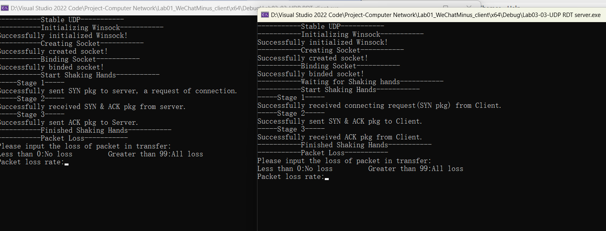
   
2. **传输数据：**这里由于为了模拟正常传输，**所以进入选择数据报文丢失率和延时都设置为没有，发送和接收缓冲区大小（即实验要求写的窗口大小）由于为了测试4-32大小的四个测试文件，选择对应缓冲区大小依次为4, 13, 22, 32，并保持一致。依次传输四个文件**，设置如下：

   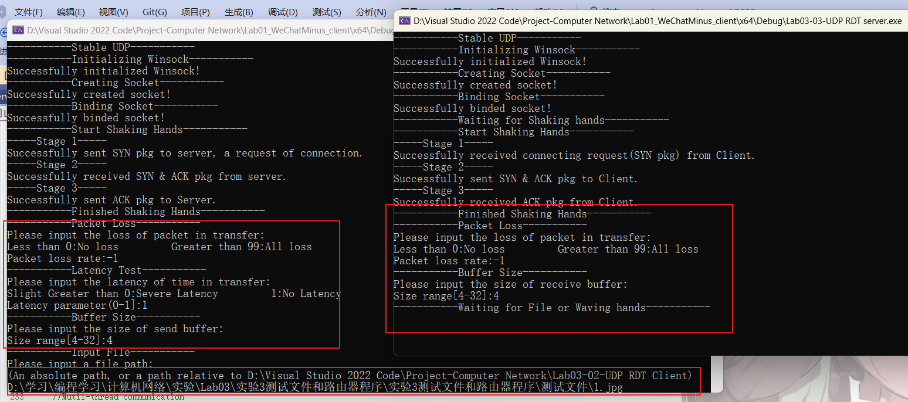

   然后**默认都输出到我的Github本次仓库位置D:\Github下**，下面展示实验的结果：

   * **测试文件1：缓冲区大小为4。**

     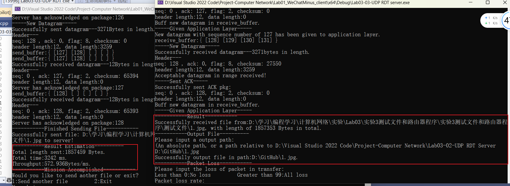

     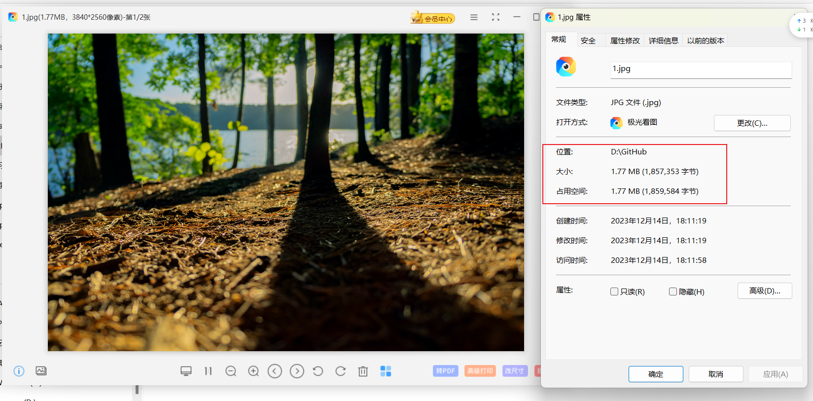
   
   * **测试文件2：缓冲区大小为13。**
   
     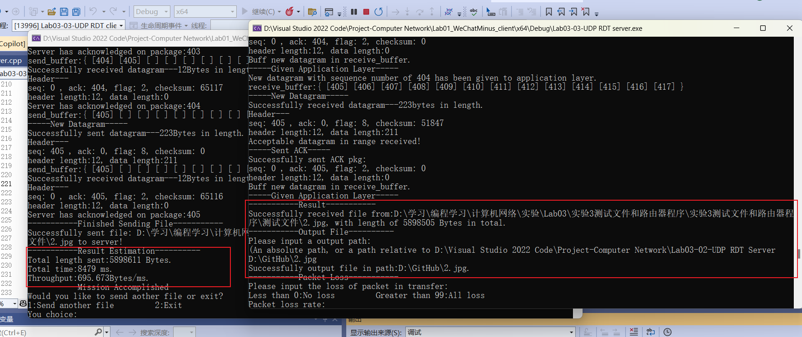
   
     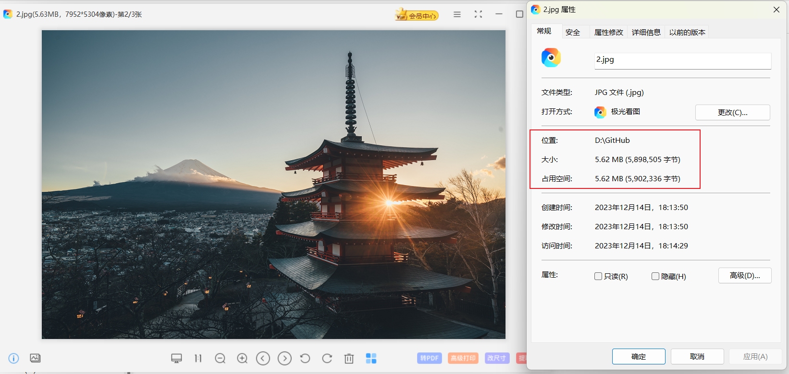
   
   * **测试文件3：缓冲区大小为22。**
   
     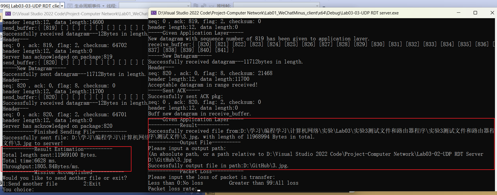
   
     
   
   * **测试文件4：缓冲区大小为32。**
   
     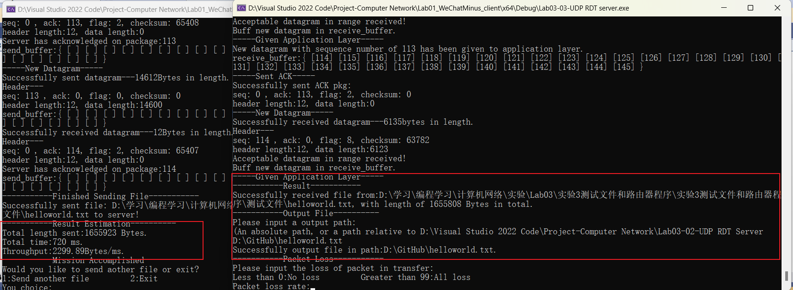

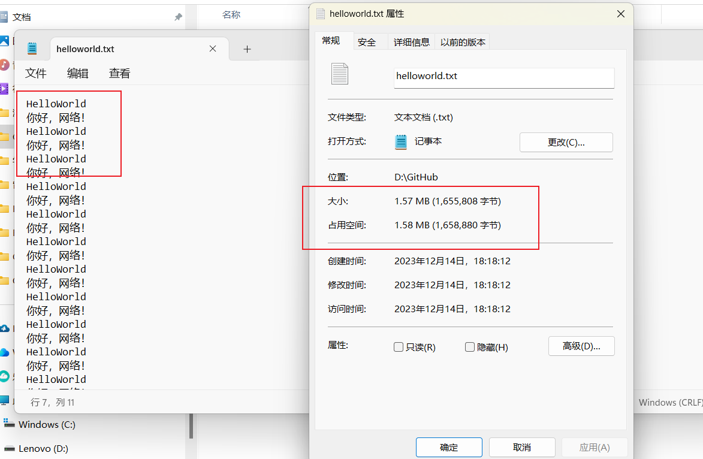

**<font size=3, color="red">可以看到所有文件全部能够在没有丢包和延时的条件下传输成功，图片能够正常显示画面，txt能够显示中英文，并且大小字节也和给定图片相同。</font>**

2. **<font size=3, color="red">延时传输与丢包测试：</font>**通过之前说的**相对论**方式测试，**选择参数设置为Latency Paramter0.6，发送方和接收方的丢包率都设置为9即有10%的概率触发延时与发送方丢包。选择缓冲区大小即18，选取测试文件2进行测试**，设置如下：

   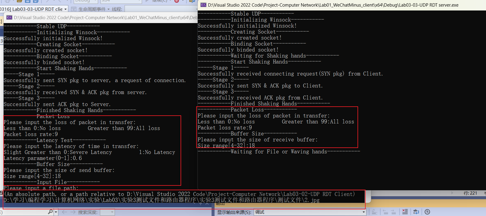

不过**这次传输的文件命名为222.jpg，还在地址D:\Github下**，结果如下：

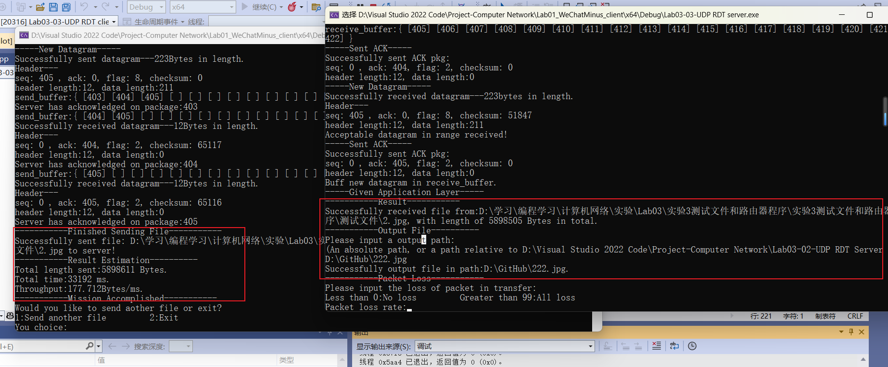

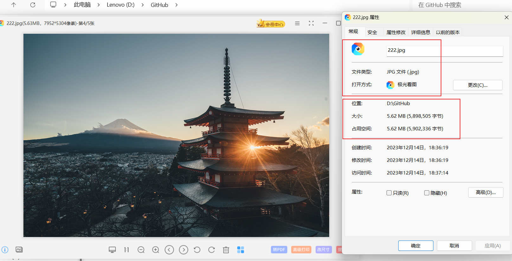

**可以看到成功实现了传输，文件大小内容没有变化，且图片也能够正常显示。现在我们看看传输过程中的细节：**

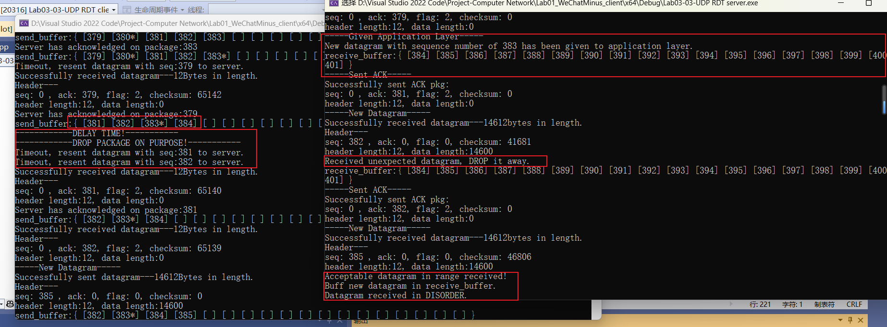

我们抽取其中的一个丢包与延时过程，可以看到：

* **发送方（客户端）：**可以看到在发送方打算发送384报文时候，**同时触发了延时和丢包（可以看到提示DELAY TIME和DROP PACKAGE ON PURPOSE）。**同时这时候发送缓冲区内可**以看到381和382报文都没有被ack（很有可能是因为接收方对它们的ack被丢包了）==这里能够看到我的日志将那些已经被ack的数据报后面加上了一个*在后面表示已经被acked==。最后触发了381和382的超时重传。**
* **接收方（服务器端）**：此时的接收方在等待384序列号往后的数据报文，因此当它收到重发的382报文时候，**它显示了(Received unexpected datagram, DROP it away)，不过还是回复了382的ACK**。然后在后面它又提前收到了385序列号的报文，但是它正在等待的最老的是384。因此将**385缓冲进了其中，并显示（Buff new datagram in receive_buffer和Datagram received in DISORDER）代表乱序收到，之后也会回复385的ACK。**

然后我调整窗口大小继续进行了测试，不过没有展示传输截图，**会在5.2中总结结果。**

**<font size=5, color="red">综上所诉，对所有功能都进行了测验，均证明实现非常成功！下面会总结正常传输与延时丢包测试结果。</font>**

#### 5.2 测试结果总结

**==在这里总结本次实验使用流水线协议的多序号流量控制+SR选择确认的测试结果。==**

1. **==正常传输==：首先是发送（接收）窗口大小变化，没有延时和丢包的情况下对四个测试文件的传输数据总大小（我这里包括了文件路径）、时延以及吞吐率的结果**，以表格形式呈现，具体截图在前面可以找到：

| Test File/Result | Buffer Size | Total length(Bytes) | Total time(ms) | Throughoutput(Bytes/ms) |
| ---------------- | ----------- | ------------------- | -------------- | ----------------------- |
| 1                | 4           | 1857459             | 3242           | 572.936                 |
| 2                | 13          | 5898611             | 8479           | 695.673                 |
| 3                | 22          | 11969100            | 6628           | 1805.84                 |
| 4                | 32          | 1655923             | 720            | 2299.89                 |

2. **<font size=4, color="red">延时与丢包测试：</font>接下来我来总结下我==设置发送（接收）窗口大小变化（同样是4-32），时延设置为0.6参数（0为最高，1为最低），丢包率为10%的情况下对测试文件2==的传输数据总大小（我这里包括了文件路径）、时延以及吞吐率的结果**，以表格形式呈现，**缓冲区大小为18的截图可以在上面5.1的2中找到**，其它截图省略：
| Test File/Result | Buffer Size | Total length(Bytes) | Total time(ms) | Throughoutput(Bytes/ms) |
| ---------------- | ----------- | ------------------- | -------------- | ----------------------- |
| 2                | 4           | 5898611             | 49773          | 118.51                  |
| 2                | 13          | 5898611             | 34370          | 171.621                 |
| 2                | 18          | 5898611             | 33192          | 177.712                 |
| 2                | 22          | 5898611             | 37426          | 157.607                 |
| 2                | 32          | 5898611             | 29582          | 199.399                 |

出现了一些意料之外的情况，会在下次实验Lab03-04中详细分析。

### **6 实验反思与总结	**

#### 6.1 实验总结

**本次实验我通过在Lab03-02的基于多序号流水线协议上进一步实现了选择重传协议。避免了GBN带来的大量重传的资源浪费。**具体而言实现了：

* 流水线协议：流量控制与多个序列号
* **选择确认：Selected Repeat**
* 可以交互改变的**双方窗口大小、改进的延时与丢包测试**
* **发送方和接收方都设置多线程**实现数据传输与保序的日志输出
* **更为复杂的锁机制**避免竞争
* **Keep-Alive**一次握手多次传输

#### 6.2 实验改进方向

虽然**本次实验非常完整地实现了所有的功能，甚至额外实现了一些更好地交互与封装，实现了传输的更加可靠**，不过通过我的观察，我还是发现了一些隐藏的小瑕疵，暂时我还没有解决，有待完善。

1. 和Lab03-02中一样，由于发送方发送的最后的数据报上带有LAS报文，如果这个报文接收方收到了但是回复的ACK丢失了。会造成接收方能够正式结束，但是发送方无法正常结束的问题。**但是就像我上次说的一样，实际上这在我的Keep-Alive机制下显得微不足道，**因为我只要接收方完成了接收，就可以正常将文件输出出来，完成传输，并不需要握手后才能完成传输。**因此无伤大雅，但是还是有待改进。**
2. 由于**本次实验要求中明确说明发送方和接收方的窗口大小相同**，因此我在处理接收方接收到序号大于receive_end的数据报时候也采用的是回复ACK的方式，实际上如果双方窗口大小不一致时，遇到这种情况不应该回复ACK。**不过对于本次实验来说足够了。有待改进为只对数据报小于等于receive_end的数据报回复ACK。**
3. HTTP协议的状态码：可以考虑加入类似于HTTP1.1中更多的OK那种状态码。
4. 数据包格式中加入IP和端口号等。
4. Keep-Alive机制必须得服务器端输出完文件后才能进行挥手，否则有问题。

#### 6.3 实验总结与收获

总的来说，**本次实验通过亲自在流水线协议的基础上将Lab03-02的GBN累积确认优化为了SR选择确认，对其中过程和很多错误处理机制都进行了实现，还进一步完善了很多功能。让我收获颇丰。**

通过和助教学长的讨论也让我再次明白了很多，**感谢助教学长与吴英老师，我会继续努力学习本课程，并在基础上发挥自己的创造力，探索更多可能性。**
