# Computer Network2023

## Lab03-04 **性能测试对比**

#### 学号：2111408	专业：信息安全	姓名：周钰宸

### 1 实验要求

基于给定的实验测试环境，**通过改变延时和丢包率，** 完成下面3组性能对比实验：

* 停等机制与滑动窗口机制性能对比；

* 滑动窗口机制中不同窗口大小对性能的影响（累计确认和选择确认两种情形）；

* 滑动窗口机制中相同窗口大小情况下，累计确认和选择确认的性能比较。

### 2 测试环境介绍

在本次的Lab03的前三次作业中，我们已经分别实现了二元序号的停等机制，多序号的流水线协议进行流量控制。在此基础上的累积确认的回退N帧协议GBN和选择确认协议SR。并且实现了窗口大小自动调整控制和不通过路由器的测试。在进行测试前，进行简单的总结和回忆。

#### 2.1 停等机制

**Lab03-01中我的停等机制的实现具有如下特点：**

* **发送方：客户端；接收方：服务器端**

* **未经过多线程**，超时重传机制的实现是通过while(true)+recv_from+非阻塞模式实现的。
* 以**RDT3.0为蓝本的二元序号**的停等机制（只使用了0和1）。
* 差错检测、接收确认

* Keep-Alive一个握手多次传输
* 三次握手和两次挥手模拟TCP建立连接

#### 2.2 流水线协议下的GBN和SR

1. **流水线协议GBN：**Lab03-02中我实现了流水线协议流量控制和累积确认GBN，实现具有如下特点：
   * **流水线协议：流量控制与多个序列号**
   * **发送方窗口大小>1，接收方窗口大小=1。累积确认：Go Back N**
   * 可以交互改变的**窗口大小、延时与丢包测试**
   * **发送方的多线程（主线程发送+接收线程+日志线程）**实现数据传输与保序的日志输出，接收方仍然采用单线程
   * **锁机制**避免竞争
2. **流水线协议SR：**Lab03-03中我实现了同样基于流水线协议流量控制的选择重传SR，实现具有如下特点：
   * **发送方（客户端）：**窗口大小大于1，一共使用了**四个线程。**
     * **主线程（发送线程）：**握手挥手，send_data与rdt_send。后两者用于发送文件。
     * **接收线程：**接受来自接收端的ACK，并进行窗口滑动。
     * **超时重传线程**
     * 日志线程：消息队列发送消息。
   * **接收方（服务器端）：**窗口大小大于1，一共使用了**三个线程。**
     * **主线程（接收线程）：**握手挥手和rdt_rcv。后者用于接收文件。其它包括缓存数据报，上交数据报给应用层以及通知发送线程要发送的下一个序列号等
     * **发送线程**：专门用于回复ACK的线程
     * 日志线程：与发送方同样。

#### 2.3 ==测试机制==

这里介绍一下我的测试机制的实现（以Lab03-03的SR为例）。**<font size=3, color="red">由于我没有经过给定的路由器，自己实现的延时与丢包</font>**，因此有必要进行介绍和说明。延时与丢包的测试封装可以在传输文件之前选择。

1. **==延时部分：==**

   * **绝对延时：通过Sleep实现，本次实验主要使用。**

     * **发送方（客户端）：延时发送的数据报。单位为ms，可选择范围为0-3000ms。**

       ```c++
       //main(Main Thread)
       //Input Latency in mill seconds
       while (true) {
       	cout << "-----------Latency Test Absolute-----------" << endl;
       	cout << "Please input the latency of time in transfer(ms):" << endl;
       	cout << "0:No Latency       3000:3000ms(3s)" << endl;
       	cout << "Latency mill seconds[0-3000]:";
       	cin >> Latency_mill_seconds;
       	if (Latency_mill_seconds < 0 || Latency_mill_seconds > 3000) {
       		cout << "Latency mill seconds out of range, please input again." << endl;
       		continue;
       	}
       	else {
       		break;
       	}
       }
       //rdt_send(Main Thread)
       	/*
       	* Latency test for Packet(Absolute)
       	*/
       	if (Latency_mill_seconds) {
       		Sleep(Latency_mill_seconds);
       	}
       
       ```
       
     * **接收方（服务器端）：延时回复的ACK。单位为ms，可选择范围为0-3000ms。**
       
       ```c++
       //Main Thread has the same codes with client
       //DWORD WINAPI send_thread_main(LPVOID lpParamter)中
       	/*
       	* Latency test for Packet(Absolute)
       	*/
       	if (Latency_mill_seconds) {
       		Sleep(Latency_mill_seconds);
       	}
       ```
     
   * **相对延时：**用了类似”相对论“的形式。由此实现越来越不耐心，相对地就等于时间越来越长了。
   
     实际上根据丢包率，随机延时，每次延时的比例通过Latency_param控制，一口气会将缓冲区所有数据报都延时，方法就是改变他们的timeout。
   
     由于我的“延时”是相对的，因此我在方法方这么一让“耐心缩短”，实际上等同于发送方的数据报和接收方的ACK都被延时了。因此只设置在发送方即可。**本次实验中不会主要用到。**
   
2. **==丢包部分：==**在发送报文和握手挥手都实现了丢包的测试**，采用随机数的架构。同样地在数据传输过程中也支持丢包测试**，对client的报文和server的ack都有丢包测试。

   ```c++
   // 生成随机数
   //client的shake_hand，wave_hand，rdt_send中
   //server的send_thread_main中
   	int randomNumber = rand() % 100; //确保数字在0-99范围内
   
   	if (randomNumber < Packet_loss_range) {
   		lock_guard<mutex> log_queue_lock(log_queue_mutex);
   		log_queue.push_back("------------DROP PACKAGE ON PURPOSE!-----------"+ string("\n"));
   	}
   	else {
   	//正常处理。。。
   	}
   
   
   //client和server的main中：
   cout << "-----------Packet Loss-----------" << endl;
   			cout<<"Please input the loss of packet in transfer:"<<endl;
   			cout<<"Less than 1:No loss         Greater than 99:All loss" << endl;
   			cout << "Packet loss rate:";
   			cin >> Packet_loss_range;
   ```

3. **超时重传时间设置：**不论是停等，累积确认还是选择重传，全部的超时时间都设置为1.2*2倍的CLOCKS_PER_SEC/20，即0.12秒（120ms）。
```c++
// MSL estimation 
#define MSL CLOCKS_PER_SEC/20

//Timer
Timer() {
	started = false;
	timeout = 1.2 * 2 * MSL;//before udp_2msl is set, use default 2 seconds
}
```
4. **==测试标准：==**
   
   * **控制变量法**：对比时控制单一变量（算法、窗口大小、延时、丢包率）
   * **延时、丢包率对比设置：**设置**梯度**（例如30ms,50ms, …；5%，10%，…）
   * **测试文件：将主要采用测试文件2，即总文件大小（包括文件路径）为5898611Bytes。**
   * **性能测试指标：时延、吞吐率，会采用图表进行分析。**
   
   **PS：**后面我的延时和丢包率设置的梯度变化较大，这是因为我在最开始设置丢包率较低时，差异非常小，几乎没有区别。**==为了让实验结果更为明显，因此我决定将梯度放大==。**不过这也带来了一些我没有观察到的现象，后面会解释。

### 3 停等机制与滑动窗口机制性能对比

首先这里测试Lab03-01中的停等机制和Lab03-02的滑动窗口机制进行性能对比。

#### 3.1 实验设置

1. **测试文件：测试文件2**，即总文件大小（包括文件路径）为5898611Bytes。
2. 滑动窗口：GBN和SR机制
3. **丢包率梯度设置**（即控制延时为0时）：0%，20%，40%，60%，80%
4. **延时梯度设置**（即控制丢包率为0时）：0ms，120ms，240ms，360ms，480ms

#### 3.2 控制延时为0，改变丢包率，对比停等机制和滑动窗口GBN与SR的性能

对于两种机制，延时都设置为0，丢包率梯度变化为0%，20%，40%，60%，80%。**滑动窗口固定大小为18**，传输测试文件1。**下面控制算法变量进行两组实验。**

1. **滑动窗口协议选择为GBN累积确认**，与停等机制实验结果如下图表所示。

   * **时延（单位为ms）**为性能指标：

     | Algorithm/PacketLossRate | 0%    | 20%   | 40%    | 60%    | 80%    |
     | ------------------------ | ----- | ----- | ------ | ------ | ------ |
     | Time-And-Wait            | 9087  | 57727 | 192516 | 316184 | 635557 |
     | GBN                      | 20608 | 20198 | 18935  | 23945  | 27711  |

   * **吞吐率（单位为Bytes/ms）**为性能指标：

     | Algorithm/PacketLossRate | 0%      | 20%     | 40%     | 60%     | 80%     |
     | ------------------------ | ------- | ------- | ------- | ------- | ------- |
     | Time-And-Wait            | 649.126 | 102.181 | 30.639  | 18.655  | 9.281   |
     | GBN                      | 286.229 | 292.039 | 311.519 | 246.339 | 212.861 |

   * **结果分析：**

     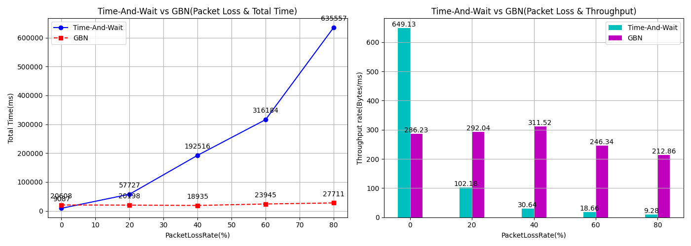
     
     从图表结果中可以分析得出：
     
     * **丢包率为0：**我的停等机制的传输效率（不论是时延还是吞吐率）是要优于GBN累积确认的。甚至停等机制此时的吞吐率是GBN的两倍。**这一点很奇怪，实际上和理论相悖**，因为理论上滑动窗口机制通过采用多个序列号提高了链路利用率，理论上是GBN性能会高于停等机制。
     
       **==因此我推测这和我的具体实现有关。==**在流水线的GBN中，我加入了较多的修改，包括日志线程的引入，剩余窗口内容的显示（这个需要遍历整个容器）。以及涉及了**多线程后**我为了避免死锁问题，加入的计时器Timer类和Buffer类在操作前后都会**加锁**。因此我推测是我较复杂的实现机制带来的特殊之处。而停等机制的实现当初非常简洁，RDT3.0和双序列号加上较少的日志输出和单线程编程，或许才是其胜出的原因。
     
     * **丢包率不断增大：**在丢包率不断增大时，可以看到此时局势发生了逆转，GBN的性能高于了停等并且差异不断增大，整体一直维持在较稳定的水平。**这一点其实也和理论结果相悖。**因为理论是GBN的特点是一旦出现重传**会将所有数据报进行重传，会导致大量资源的浪费，随着丢包率增大，应该会性能明显下降才对。此时简洁的停等应该占上风。**
     
       **这次推测原因还是和我的实现有关，同时也与巧合有关。**实际上在丢包率较高时，由于测试较为耗时，我都只进行了一组测试，因此具有较高的巧合性。实现方法而言由于停等机制没有采用多线程，因此对于超时重传的处理可能会比较缓慢（采用的是while(true)+非阻塞模式+recv_from），而对于超时重传实现采用了多线程的GBN来说，当超时重传多次出现，可能会带来优势。不过仍有待进一步探究。

2. **滑动窗口协议选择为SR选择确认**，与停等机制实验结果如下图表所示：

   * **时延（单位为ms）**为性能指标：

     | Algorithm/PacketLossRate | 0%   | 20%   | 40%    | 60%    | 80%    |
     | ------------------------ | ---- | ----- | ------ | ------ | ------ |
     | Time-And-Wait            | 9087 | 57727 | 192516 | 316184 | 635557 |
     | SR                       | 9850 | 12816 | 13255  | 16177  | 20949  |

   * **吞吐率（单位为Bytes/ms）**为性能指标：

     | Algorithm/PacketLossRate | 0%      | 20%     | 40%     | 60%     | 80%     |
     | ------------------------ | ------- | ------- | ------- | ------- | ------- |
     | Time-And-Wait            | 649.126 | 102.181 | 30.639  | 18.655  | 9.281   |
     | SR                       | 598.844 | 460.253 | 445.010 | 364.629 | 281.570 |
     
   * **结果分析：**
   
     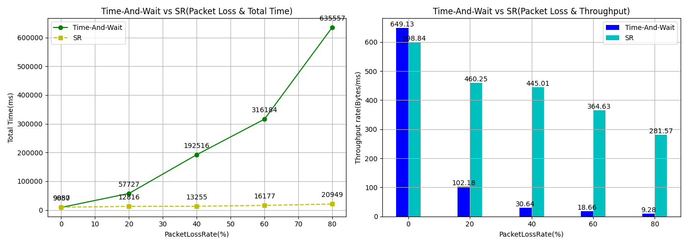
     
     从图表结果中可以分析得出：
     
     * **丢包率为0：**停等机制的性能还是略微高于选择重传SR，不过这次差距不那么明显了。**虽然这一点仍然和理论相悖**。毕竟流水线理应带来停等没有的高链路利用率才对。
     
       **同样还是和我的实现有关。**不过这次可能是因为在我的SR中将选择重传的过程进一步解耦了出去，实现了单独的超时重传线程，同时我的接收方的接收和回复ACK甚至也被我解耦为了两个多线程，这样的处理使得它可以同时接收和方法**。估计是这些原因弥补了更多的锁机制和较复杂的实现带来的性能劣势，使得和理论结果比较靠拢。**
     
     * **丢包率不断增大：**可以看到此时的SR性能远高于停等机制。**==这是和理论结果符合的。==**因为停等机制弥补了GBN的劣势，即不需要每次都超时重传全部的数据报**，只需要对超时的数据报进行重传即可。**在弥补了这个短板下，一旦超时重传成为了传输过程中的主旋律，SR性能远大于停等是可以预料到的。

#### 3.2 控制丢包率为0，改变延时，对比停等机制和滑动窗口GBN与SR的性能

对于两种机制，丢包率都设置为0，延时梯度变化为0ms，120ms，240ms，360ms，480ms。滑动窗口固定大小为18，传输测试文件1。**下面控制算法变量进行两组实验。**

1. **滑动窗口协议选择为GBN累积确认**，与停等机制实验结果如下图表所示：

   * **时延（单位为ms）**为性能指标：

     | Algorithm/Latency(ms) | 0     | 120    | 240    | 360    | 480    |
     | --------------------- | ----- | ------ | ------ | ------ | ------ |
     | Time-And-Wait         | 9087  | 114685 | 210901 | 305242 | 457197 |
     | GBN                   | 20608 | 75993  | 116861 | 164867 | 239361 |

   * **吞吐率（单位为Bytes/ms）**为性能指标：

     | Algorithm/Latency(ms) | 0       | 120     | 240     | 360     | 480     |
     | --------------------- | ------- | ------- | ------- | ------- | ------- |
     | Time-And-Wait         | 649.126 | 51.4332 | 27.9686 | 19.3244 | 12.9016 |
     | GBN                   | 286.229 | 77.620  | 50.4754 | 35.778  | 24.643  |

   * **结果分析：**

     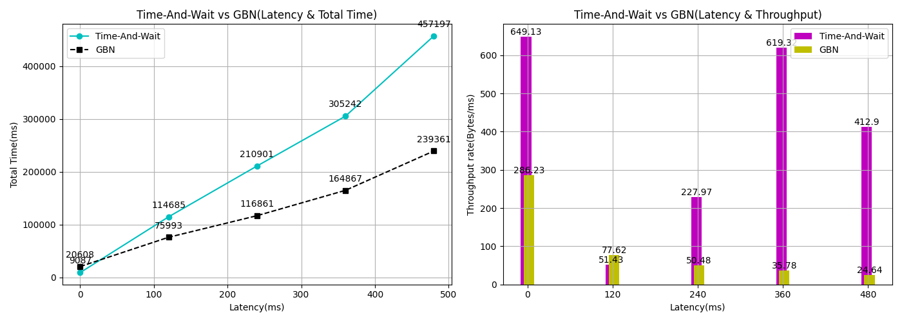
     
     * **时延为0：**在时延为0时因为丢包率也为0，因此情况和之前分析的一样，不再赘述。
     
     * **时延不断增大：**在时延不断增大时，可以看到停等机制的性能高于GBN，并且差距愈发明显，**==这一点和理论分析相吻合。==**正如我之前说的，在大量出现超时重传时，GBN需要一口气将所有的数据报重传，**必然是宽带资源浪费，另一方面可能会再次丢包**，而相比较而言更为简洁实现重传的停等就占了上风。
     
       同时由于**GBN协议需要按顺序确认数据包**，因此如果窗口中的第一个数据包丢失，后续到达的数据包也会被丢弃，导致需要重传整个窗口的数据包，会对GBN的性能产生严重影响。

2. **滑动窗口协议选择为SR选择确认**，与停等机制实验结果如下图表所示：

   * **时延（单位为ms）**为性能指标：

     | Algorithm/Latency(ms) | 0    | 120    | 240    | 360    | 480     |
     | --------------------- | ---- | ------ | ------ | ------ | ------- |
     | Time-And-Wait         | 9087 | 114685 | 210901 | 305242 | 457197  |
     | SR                    | 9850 | 208940 | 585331 | 998322 | 1511263 |

   * **吞吐率（单位为Bytes/ms）**为性能指标：

     | Algorithm/Latency(ms) | 0       | 120     | 240     | 360     | 480     |
     | --------------------- | ------- | ------- | ------- | ------- | ------- |
     | Time-And-Wait         | 649.126 | 51.4332 | 27.9686 | 19.3244 | 12.9016 |
     | SR                    | 598.844 | 28.2311 | 10.0774 | 5.9085  | 3.9031  |
     
   * **结果分析：**
   
     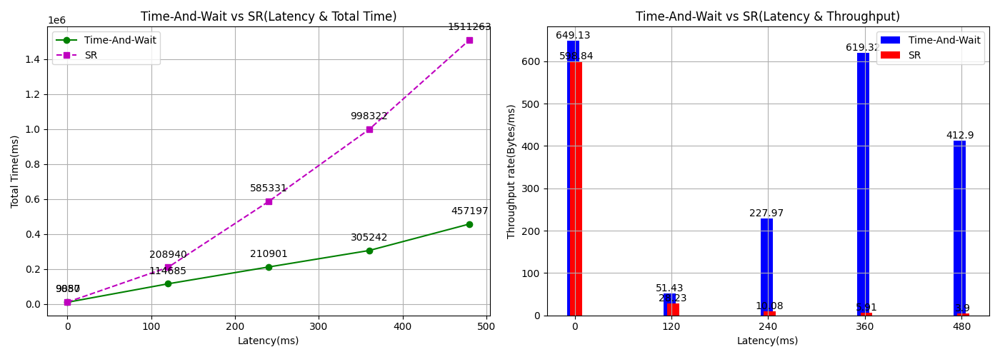
     
     * **时延为0：**在时延为0时因为丢包率也为0，因此情况和之前分析的一样，不再赘述。
     
     * **时延不断增大：**可以发现对于SR来说。随着时延的增大，停等机制的性能要高于SR，**这一点也和理论想违背。**因为理论上来说SR会弥补GBN超时重传全部数据报带来的资源浪费。所以SR应该在时延不断增大时应该能够性能大于停等机制。
     
       **同样我个人还是认为这里和我的具体实现密不可分。**由于我的**SR实现起来也是多了很多相比停等复杂的机制**。其中涉及对全局缓冲区和日志等多地方的加锁。同时这次我还**对接收方的缓冲区一直在遍历**，也是输出了对应的窗口内容即接受范围。在进行这些独立的操作时，对应的全局变量不论是接收缓冲区还是发送缓冲区都会因为被互斥量锁住而只能单线程遍历结束其它才能够去操作。
     
       **<font size=3, color="red">因此我觉得上面这么多和理论相违背，最大的问题就出在我频繁地使用锁身上。</font>**延时的加重会导致我的**超时重传线程**反复地占据接收缓冲区的互斥量去操作缓冲区中的内容而让一些其它正常接收和发送内容的线程被阻塞。导致了一些性能的降低。
     
       ```c++
       //超时重传线程
       DWORD WINAPI timeout_resend_thread_main(LPVOID lpParamter) {
       	while (true) {
       		if (send_over == true)
       			return 0;
       
       		//Release the lock for 30ms in case of dead lock
       		Sleep(30);
       		/*
       		* SR:Different from GBN, timeout resent protocol happens for every possible pkg in the slide window
       		*/
       		{
       			lock_guard<mutex> send_buffer_lock(send_buffer_mutex);
       			for (int i = 0; i < send_buffer.get_slide_window().size(); i++) {
       				if (send_buffer.get_slide_window()[i]->get_dg_timer().is_timeout() == true) {
       				//一直在遍历，如果出现了超市情况，会一直占据着mutex不放
       }
       ```
     
       **我想到的==改进思路是根据延时的大小通过Sleep更长时间来进一步缓解锁带来的问题==。有待改进和尝试。**

### 4 滑动窗口不同窗口大小测试

#### 4.1 实验设置

在这里我们测试一下**不同滑动窗口大小的滑动窗口协议**累积确认GBN与SR选择确认会带来的变化。部分已经重复测试过的数据会直接沿用。

1. **测试文件：测试文件2**，即总文件大小（包括文件路径）为5898611Bytes。
2. 滑动窗口：GBN和SR机制
3. **滑动窗口大小梯度设置**：4，13，18，22，32
4. **丢包率梯度设置**（即控制时延为0时）：0%，20%，40%，60%，80%
5. **时延梯度设置**（即控制丢包率为0时）：0ms，120ms，240ms，360ms，480ms

#### 4.2 累积确认GBN

1. **延时和丢包率均为0**，对比不同滑动窗口大小的传输时间与吞吐率

   | Evaluation/Window Size    | 4       | 13      | 18     | 22      | 32      |
   | ------------------------- | ------- | ------- | ------ | ------- | ------- |
   | Total time(ms)            | 7005    | 20549   | 15647  | 19301   | 20902   |
   | Throughput rate(Bytes/ms) | 842.057 | 287.051 | 376.98 | 305.612 | 282.203 |

   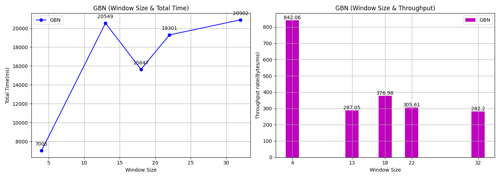

   可以分析得出：

   * **在窗口较小时性能较高，而窗口较大时性能较低：**这一点再次与理论结果相悖。因为理论上来说，没有丢包率时候，影响GBN的非必要重传很少发生，因此GBN的性能由于流水线机制随着窗口大小的增加而有更多数据报落入窗口可以被发送而增加。

     **同样推测还是和我的实现细节有关**，是因为我的GBN窗口越大，每次还需要对其进行**遍历输出窗口内容**（即输出窗口内的数据报）也越多，在这种没有意义的事情上花费的时间越多，同样此时占据着缓冲区锁的时间也越来越久。因此带来的反差。不过也可能和巧合以及别处的锁机制有关。毕竟波动较大。

   * 窗口较大时，性能波动较明显：这一点我认为纯属巧合，也是因为我多次测量结果没有明显规律可言。

2. **控制延时为0，改变丢包率**，对比不同滑动窗口大小的传输时间与吞吐率

   * **时延：Total time(ms)**

     | Window Size/PacketLossRate | 0%    | 20%   | 40%   | 60%   | 80%   |
     | -------------------------- | ----- | ----- | ----- | ----- | ----- |
     | 4                          | 7005  | 13972 | 21078 | 23904 | 26216 |
     | 18                         | 15647 | 20198 | 18935 | 23945 | 27711 |
     | 32                         | 20902 | 23824 | 20775 | 21454 | 21834 |

   * **吞吐率：Throughput rate(Bytes/ms)**

     | Window Size/PacketLossRate | 0%      | 20%     | 40%     | 60%     | 80%     |
     | -------------------------- | ------- | ------- | ------- | ------- | ------- |
     | 4                          | 842.057 | 422.174 | 279.847 | 246.763 | 225     |
     | 18                         | 376.98  | 292.039 | 311.519 | 246.339 | 212.861 |
     | 32                         | 282.203 | 247.591 | 283.928 | 274.942 | 270.157 |

   * **结果分析：**

     **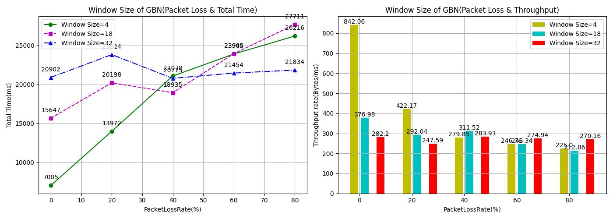**
     
     可以由图表分析得出：
     
     * 可以观察到**当丢包率较小时（20%左右）时，窗口越大，性能越低。**
     
       **==由于我为了让实验结果更为明显，因此我的丢包率梯度设置的很高一下就达到了20%==，这样的差异实际上跳过了一个阶段**，即窗口大小增大的正常收益。虽然我这里没有记录到，不过理论分析是可以分析到的，**即当丢包率较小（可能是在0-20%），影响GBN的非必要重传很少发生，因此GBN的性能由于流水线机制会随着窗口大小的增加而提升。**
     
       不过由于我一开始设置的就较大，因此没有观察到这个。却发现了别的现象，即随着丢包率的上升，**窗口大小带来的收益逐渐反转。==多次的超时重传会因为窗口内的数据报也很多（即窗口越大）因此带来的开销也愈大==，即性能变差。**
     
     * 当丢包率超级大（80%）左右时，差异变小。三者趋于平稳。

3. **控制丢包率为0，改变延时**，对比不同滑动窗口大小的传输时间与吞吐率

   * **时延：Total time(ms)**

     | Window Size/Latency(ms) | 0     | 120   | 240    | 360    | 480    |
     | ----------------------- | ----- | ----- | ------ | ------ | ------ |
     | 4                       | 7005  | 78564 | 131655 | 170806 | 216186 |
     | 18                      | 15647 | 75993 | 116861 | 164867 | 239361 |
     | 32                      | 20902 | 73571 | 113870 | 164078 | 212326 |

   * **吞吐率：Throughput rate(Bytes/ms)**

     | Window Size/Latency(ms) | 0       | 120     | 240     | 360     | 480     |
     | ----------------------- | ------- | ------- | ------- | ------- | ------- |
     | 4                       | 842.057 | 75.0803 | 44.8035 | 34.533  | 27.2849 |
     | 18                      | 376.98  | 77.620  | 50.4754 | 35.778  | 24.643  |
     | 32                      | 282.203 | 80.1758 | 51.8013 | 35.9500 | 27.7809 |
     
   * **结果分析：**
   
     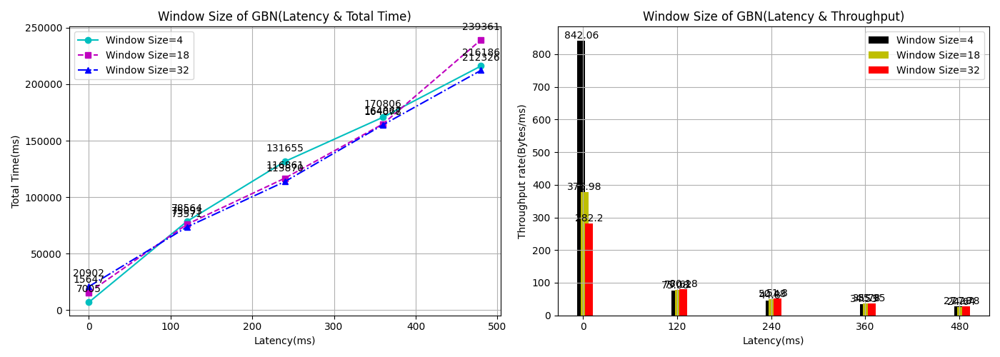
     
     可以由图表分析得出：
     
     * **随着延时增大，大量的超时重传，导致三个窗口大小范围的GBN都会因为内大量重传而性能不断恶化。并且三者差异不大，都处于较低水平。窗口大小即使增大带来的以此多发数据报也没有办法挽救过多的超时重传。**

#### 4.3 选择确认SR

1. **延时和丢包率均为0**，对比不同滑动窗口大小的传输时间与吞吐率

   | Evaluation/Window Size    | 4       | 13      | 18      | 22      | 32      |
   | ------------------------- | ------- | ------- | ------- | ------- | ------- |
   | Total time(ms)            | 8708    | 9061    | 9850    | 11085   | 10118   |
   | Throughput rate(Bytes/ms) | 677.378 | 650.989 | 598.844 | 532.125 | 582.982 |

   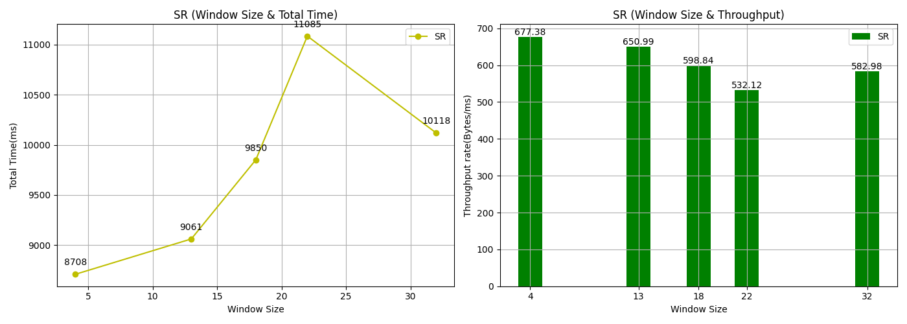

   可以分析得出：

   * **窗口大小增大，但是性能并没有出现较大的差异，只有略微的下降。**这一点可以结合GBN时候的分析。我刚才说过，因为我的流水线协议设计的较为复杂，各种锁机制使得较大的窗口可能也会带来较长的占用关键资源。不过由于我在SR中将超时重传等线程解耦为单独线程，因此在这种没有延时和丢包的情况下（如果超时重传被多次触发，还是会出现锁机制带来的问题）。缓解了我复杂实现带来的性能劣势。

     因此虽然实现复杂了（遍历和锁等），使得性能降低，**不过由于我的改进等，使得性能越来越和真实理论结果符合了。**

     顺便一提，**理论上的结果应该是随着窗口大小增大，性能先提升再下降。**这是因为最开始窗口增大，所以发送端可以发送多个包，使得吞吐率提升。不过如果继续增窗口，可能会造成网络阻塞，即接收端来不及接收，导致丢包和延时，不断发重复的包导致性能下降。

2. **控制延时为0，改变丢包率**，对比不同滑动窗口大小的传输时间与吞吐率

   * **时延：Total time(ms)**

     | Window Size/PacketLossRate | 0%    | 20%   | 40%   | 60%   | 80%    |
     | -------------------------- | ----- | ----- | ----- | ----- | ------ |
     | 4                          | 8708  | 15588 | 25814 | 49067 | 99905  |
     | 18                         | 9850  | 12816 | 13255 | 16177 | 20949  |
     | 32                         | 10118 | 11364 | 15688 | 29334 | 100597 |

   * **吞吐率：Throughoutput(Bytes/ms)**

     | Window Size/PacketLossRate | 0%      | 20%     | 40%     | 60%     | 80%     |
     | -------------------------- | ------- | ------- | ------- | ------- | ------- |
     | 4                          | 677.378 | 378.407 | 228.504 | 120.215 | 59.042  |
     | 18                         | 598.844 | 460.253 | 445.010 | 364.629 | 281.570 |
     | 32                         | 582.982 | 519.061 | 375.995 | 201.084 | 58.636  |
     
   * **结果分析：**

     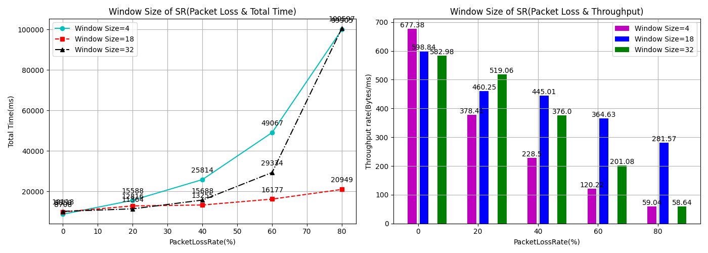
     
     可以由图表分析得出：
     
     * 当丢包率**较低时**，不同窗口大小的传输时间和性能**差异不大**。
     
     * 当丢包率不断提升时，首先不同的窗口大小都因为大量超时重传而下降。**不过呈现了一个窗口大小适中的性能最好，而窗口大小较大和较小的性能较差的现象。并且随着丢包率增大更加明显。==这一点前半部分与理论相符合==，后半部分和理论有出入。**
     
       **从4-18性能增大的原因是**：随着丢包率增大，窗口越小的发送方会因为迟迟接收不到接收方的ACK而不断阻塞，但是如果窗口增大，则会带来有更多的空间能够容纳数据报缓存。并且随着超时重传变多而窗口大的优势就愈发明显。
     
       **从18-32性能下降的原因我推测还是和我的个人实现有关**。窗口增大导致的遍历操作，和我提到的一个重传会导致我的SR超时重传线程一直占用重要资源等，导致性能下降。

3. **控制丢包率为0，改变延时**，对比不同滑动窗口大小的传输时间与吞吐率

   * **时延：Total time(ms)**

     | Window Size/Latency | 0     | 120    | 240    | 360     | 480     |
     | ------------------- | ----- | ------ | ------ | ------- | ------- |
     | 4                   | 8708  | 243896 | 637712 | 1329770 | 2044172 |
     | 18                  | 9850  | 208940 | 585331 | 998322  | 1511263 |
     | 32                  | 10118 | 180483 | 529900 | 960056  | 1473370 |

   * **吞吐率：Throughoutput(Bytes/ms)**

     | Window Size/Latency | 0       | 120     | 240     | 360     | 480    |
     | ------------------- | ------- | ------- | ------- | ------- | ------ |
     | 4                   | 677.378 | 24.1849 | 9.24964 | 4.43581 | 2.8855 |
     | 18                  | 598.844 | 28.2311 | 10.0774 | 5.9085  | 3.9031 |
     | 32                  | 582.982 | 32.6824 | 11.131  | 6.1440  | 4.0034 |
     
   * **结果分析：**
   
     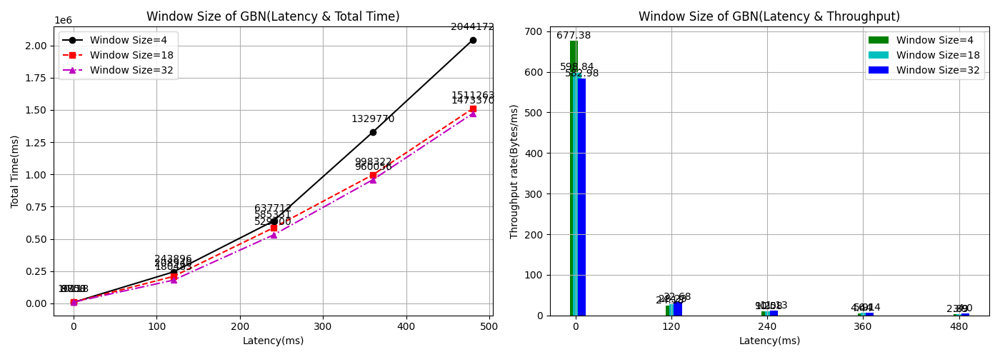
     
     从图表结果可以分析得出：
     
     * 当延时**较低时**，不同窗口大小的传输时间和性能**差异不大**。
     * 当延时不断增大时，**同样呈现了一个窗口大小适中的性能最好，而窗口大小较大和较小的性能较差的现象。**原因和前面一样，这里分析我就不再赘述。

### 5 窗口大小一致下的GBN与SR性能对比测试

#### 5.1 实验设置

在这里我们测试一下在**窗口大小一致的情况下对比下滑动窗口协议中的累积确认GBN和选择确认SR的性能。部分已经重复测试过的数据会直接沿用。**

1. **测试文件：测试文件2**，即总文件大小（包括文件路径）为5898611Bytes。
2. 滑动窗口：GBN和SR机制
3. **滑动窗口大小固定设置：18**
4. **丢包率梯度设置**（即控制时延为0时）：0%，20%，40%，60%，80%
5. **时延梯度设置**（即控制丢包率为0时）：0ms，120ms，240ms，360ms，480ms

#### 5.2 控制延时为0，改变丢包率下的GBN与SR性能对比

1. **时延：Total time(ms)**

   | Algorithm/PacketLossRate | 0%    | 20%   | 40%   | 60%   | 80%   |
   | ------------------------ | ----- | ----- | ----- | ----- | ----- |
   | GBN                      | 20608 | 20198 | 18935 | 23945 | 27711 |
   | SR                       | 9850  | 12816 | 13255 | 16177 | 20949 |

2. **吞吐率：Throughoutput(Bytes/ms)**

   | Algorithm/PacketLossRate | 0%      | 20%     | 40%     | 60%     | 80%     |
   | ------------------------ | ------- | ------- | ------- | ------- | ------- |
   | GBN                      | 286.229 | 292.039 | 311.519 | 246.339 | 212.861 |
   | SR                       | 598.844 | 460.253 | 445.010 | 364.629 | 281.570 |

3. **结果分析：**

   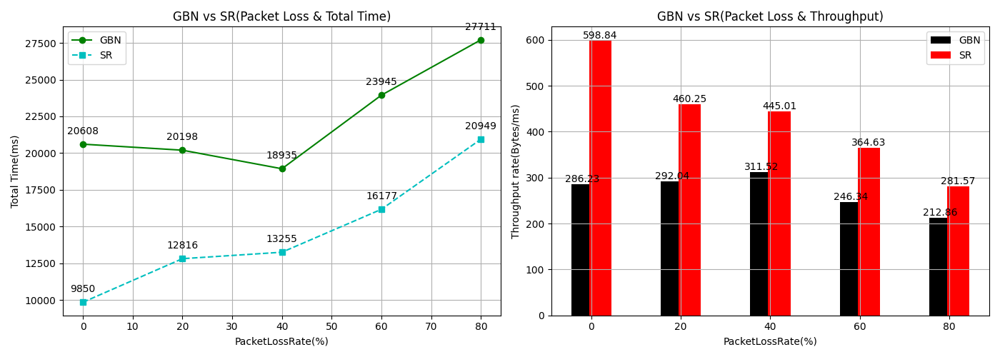

   由图表结果可以分析得出：

   * **当丢包率较低（0%）时，SR性能远高于GBN。**这一点也和理论上符合，也和我的实现有关。因为窗口大小毕竟只有18，那么窗口大小满了后导致的延时等情况对于GBN而言就要全部超时重传，而SR只需要超时重传部分即可。因此带来了性能的优异。同时我的SR实现中由于解耦了超时重传线程和接收方的接收线程，也进一步通过并行提高了效率和吞吐量。使得接收发可以同时发送ACK和接收报文。

   * **随着丢包率增大，SR性能和GBN性能之间的差异却反而减小。**总体来说**应该也和我的实现有关，导致与理论不符。**

     我推测是**因为丢包相比于延时更为严重**（因为丢了就永远不会到了，只能重传），因此重传现象也会更加明显。**进一步导致了重传现象明显后我的超时重传线程和之前所述，一直在处理重发，占据着关键资源导致的其它正常处理发送数据报的线程被阻塞。**

#### 5.3 控制丢包率为0，改变延时下的GBN与SR性能对比

1. **时延：Total time(ms)**

   | Algorithm/Latency(ms) | 0     | 120    | 240    | 360    | 480     |
   | --------------------- | ----- | ------ | ------ | ------ | ------- |
   | GBN                   | 20608 | 75993  | 116861 | 164867 | 239361  |
   | SR                    | 9850  | 208940 | 585331 | 998322 | 1511263 |

2. **吞吐率：Throughoutput(Bytes/ms)**

   | Algorithm/Latency(ms) | 0       | 120     | 240     | 360    | 480    |
   | --------------------- | ------- | ------- | ------- | ------ | ------ |
   | GBN                   | 286.229 | 77.620  | 50.4754 | 35.778 | 24.643 |
   | SR                    | 598.844 | 28.2311 | 10.0774 | 5.9085 | 3.9031 |

3. **结果分析：**

   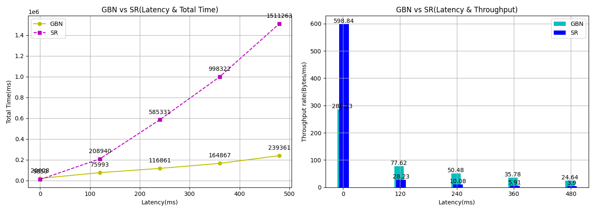

   由图表分析可以得出：

   * 当延时较低时，SR性能远高于GBN。这点和上面同理，不再赘述。
   * **当延时增大时，SR相比于GBN的性能优势之处愈发明显。**从最开始的2倍关系到最5倍甚至最后的接近10倍关系。**==这一点也和理论相符合。==**这是因为SR相比于GBN最大的改变就是选择重传，即当出现了严重的延时需要重传时候，SR只需要重传对应的数据报即可，而GBN需要重传所有窗口内报文，毫无疑问是浪费了宽带资源。==**因此当延时增大导致超时重传成为主旋律，SR就可以省下更多的资源，实现更为合理的重传。**==

### 6 实验探索

#### 6.1 不同窗口大小的GBN和SR对比

我注意到在之前的实验中，有要求分别测试对于滑动窗口机制中不同窗口大小对性能的影响（累计确认和选择确认两种情形）；也有滑动窗口机制中相同窗口大小情况下，累计确认和选择确认的性能比较。

最后在这里再补充对比一下**一般情况下不同窗口大小下的GBN与SR的性能对比**，可以直接利用之前的数据。

1. **实验设置：**

   * **测试文件：测试文件2**，即总文件大小（包括文件路径）为5898611Bytes。
   * 滑动窗口：GBN和SR机制
   * **滑动窗口大小梯度设置**：4，13，18，22，32

2. **测试结果：**

   * **时延：Total time(ms)**
   
     | Evaluation/Window Size | 4    | 13    | 18    | 22    | 32    |
     | ---------------------- | ---- | ----- | ----- | ----- | ----- |
     | GBN                    | 7005 | 20549 | 15647 | 19301 | 20902 |
     | SR                     | 8708 | 9061  | 9850  | 11085 | 10118 |
   
   * **吞吐率：Throughoutput(Bytes/ms)**
   
     | Evaluation/Window Size | 4       | 13      | 18      | 22      | 32      |
     | ---------------------- | ------- | ------- | ------- | ------- | ------- |
     | GBN                    | 842.057 | 287.051 | 376.980 | 305.612 | 282.203 |
     | SR                     | 677.378 | 650.989 | 598.844 | 532.125 | 582.982 |

3. **结果分析：**

   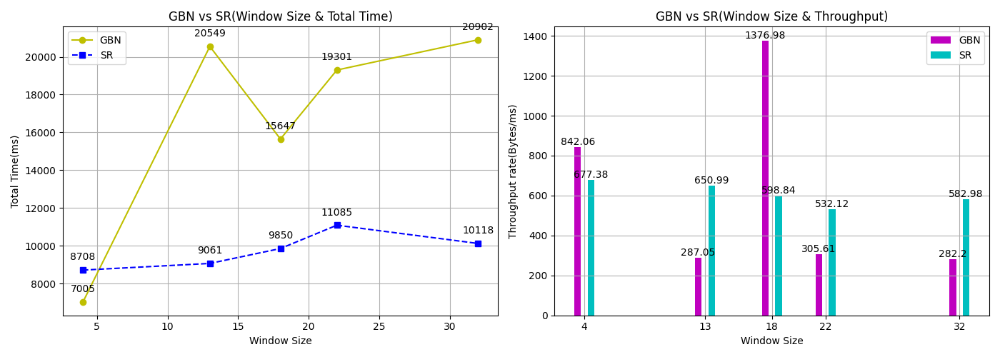

   由图表可以得出：**相比于GBN，SR对于窗口大小的增加反应并不是那么激烈。几乎保持平稳。而GBN变化差异较大。这一点和理论相符合。**

   **首先是我的实现**，因为SR的窗口大小增大，由于SR解耦了超时重传线程的实现，使得流水线的优势和理论结果相靠近。

   **同样也有理论支持**，因为窗口较大时，容易造成网络阻塞，即接收端来不及回复ACK导致丢包和延时。最终超时重传，不过SR的实现使得重传只需要重传部分，**因此SR比GBN更好的解决了窗口过大导致的网络阻塞重传问题。**

### **7 实验反思与总结	**

#### 7.1 实验总结

本次实验中**，我通过自己写好的试验测试环境，通过改变延时和丢包率，完成了以下三组性能测试对比实验，并由图表给出了完整且全面的分析：**

* **停等机制与滑动窗口机制（**窗口大小不变），不同的延时和丢包下的性能对比；
* 滑动窗口机制中**不同窗口大小**，在一般情况以及不同的延时和丢包情况下，对性能的影响（累计确认和选择确认两种情形）；
* 滑动窗口机制中相同窗口大小情况下，不同的延时和丢包情况下，**累计确认和选择确认**的性能比较。

#### 7.2 实验改进方向

不过本次实验中，**==我发现了多处实际和理论不相符合的情况。我总结了以下原因==**：

1. **实际测试的巧合**：有些延时较大和丢包率较大的情况，由于一次测试的时间开销较大，我都只进行了一次测试。因此实际结果可能带来一些巧合导致与理论不符合。

2. **<font size=3, color="red">实现的差异：这是我认为导致的最重要原因。即理论分析实际上是没有考虑最终的实现的。</font>**

   在我的实现过程中，为了达到多序号流水线的效果，我不得不采用多线程的编程方式。多线程的编程中出现需要线程之间沟通的全局变量，又涉及到为了避免竞争，**不得不使用的锁机制。**对于我而言，最终SR的发送方四个线程，接收发三个线程，甚至都包含的日志线程。派生锁都被我用上了。还包括我的超时重传线程解耦后带来的一些影响。

   **==正是这越来越复杂的实现机制，导致了理论结果的差异。对于出现差异的地方我也结合我的实现具体方式给出了我对原因的猜想与分析。不过这也为我带来了很多可以改进的方向和指引。==**

#### 7.3 实验总结与收获

本次实验中，可以说我收获颇丰，不仅是进一步改进程序以便测试，还包括实际测试时候的种种与理论不符合的情况。分析这些现象后，不仅加深了我对这部分知识点的理解，更让我对自己的实现有了更多的思考，找到了更多改进的方向。

对于与理论结果的差异，在仔细思考后，我认为这非常正常，在实际的工程中，与理论结果不相符合的情况也比比皆是。**我们作为工科生，理应发挥自己的创造力，去实现伟大，去创造伟大，遇到和理论不相符合的问题，就去解决，不就完事了吗！**

这一学期下来，和学长的每次答辩展示也让我收获良多，学长认真的态度也让我钦佩。未来我会更加努力实现我心目中的所爱，坚持自己。

**==再次感谢吴英老师的精彩讲授和学长的认真指点，有缘再见！==**

